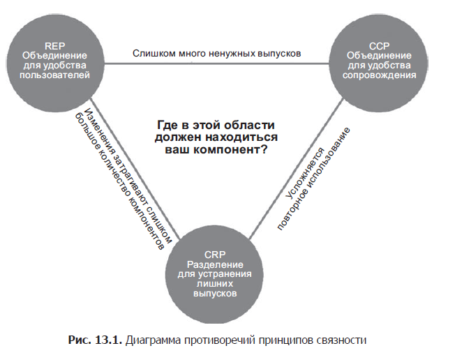
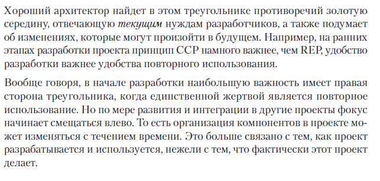

# Связанность компонентов

 - REP: Reuse/Release Equivalence Principle - принцип эквивалентности повторного 
использования и выпусков;

 - CCP: Common Closure Principle - принцип согласованного изменения;

 - CRP: Common Reuse Principle - принцип совместного повторного использования.

## REP

С точки зрения архитектуры и дизайна этот принцип означает, что классы и 
модули, составляющие компонент, должны принадлежать связной группе. Компонент
не может просто включать случайную смесь классов и модулей; должна быть 
какая-то тема или цель, общая для всех модулей.

Все это, безусловно, очевидно. Однако есть еще один аспект, возможно, не 
такой очевидный. Классы и модули, объединяемые в компонент, должны 
выпускаться вместе. Объединение их в один выпуск и включение в общую 
документацию с описанием этой версии должны иметь смысл для автора и 
пользователей.

## CCP

    В один компонент должны включаться классы, изменяющиеся по одним причинам
    и в одно время. В разные компоненты должны включаться классы, изменяющиеся 
    в разное время и по разным причинам.

Это принцип единственной ответственности (SRP), перефразированный для 
компонентов. Так же, как принцип SRP, гласящий, что класс не должен иметь 
нескольких причин для изменения, принцип согласованного изменения (CCP) 
требует, чтобы компонент не имел нескольких причин для изменения.

Принцип CCP требует от нас собирать вместе все классы, которые может 
понадобиться изменить по одной, общей причине. Если два класса тесно связаны,
физически или концептуально, настолько, что всегда будут изменяться вместе,
они должны принадлежать одному компоненту.

Этот принцип тесно связан с принципом открытости/закрытости (Open Closed 
Principle; OCP). Фактически он означает «закрытость» в смысле принципа OCP. 
Принцип открытости/закрытости (OCP) требует, чтобы классы были закрыты для 
изменений, но открыты для расширения. Так как 100% закрытость невозможна, 
она должна носить скорее стратегический характер. Мы проектируем свои классы
так, чтобы они были закрыты для изменений, наиболее типичных из ожидаемых 
по опыту и увеличиваем вероятность, что изменение требований повлечет 
необходимость изменения минимального количества компонентов.

## CRP 

    Не вынуждайте пользователей компонента зависеть от того, чего им не требуется.

Классы редко используются по отдельности. Обычно многократно используемые 
классы взаимодействуют с другими классами, являющимися частью многократно 
используемой абстракции. Принцип CRP указывает, что такие классы должны 
включаться в один компонент. Мы надеемся увидеть в компонентах классы, имеющие
множественные зависимости друг от друга.

Простейшим примером могут служить класс коллекции и связанные с ним итераторы.
Эти классы используются вместе, потому что они тесно связаны друг с другом.
Соответственно, должны находиться в одном компоненте.

## Диаграмма противоречий

