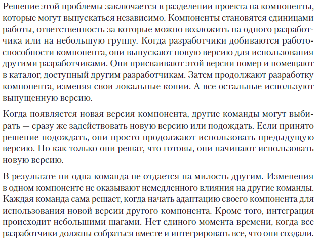
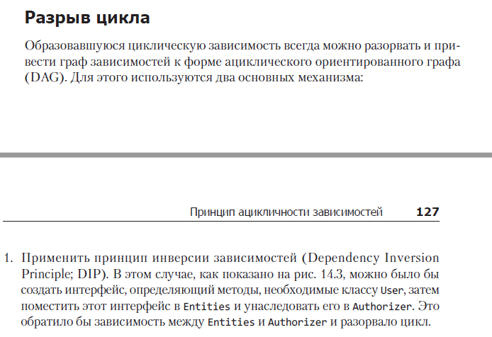
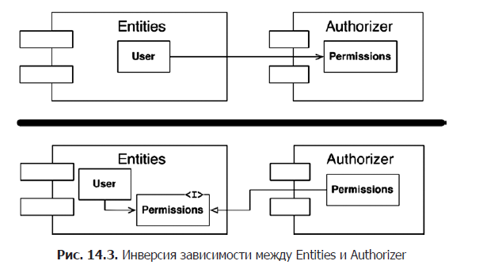
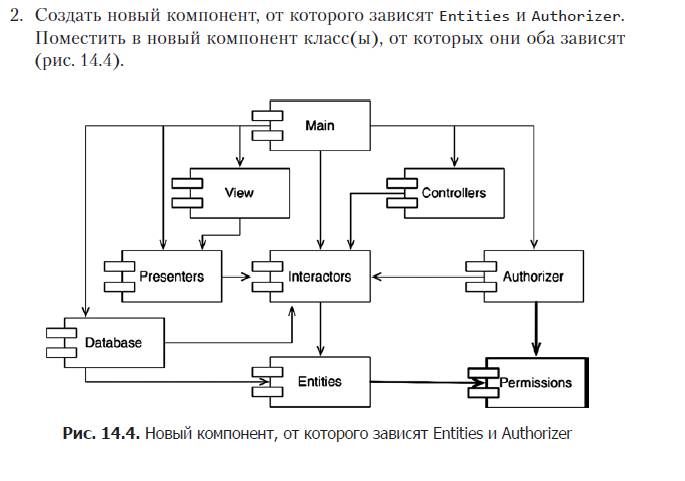
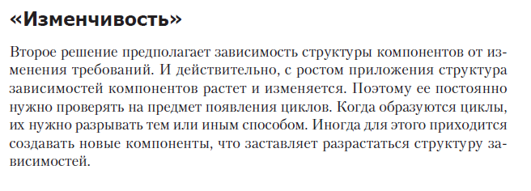
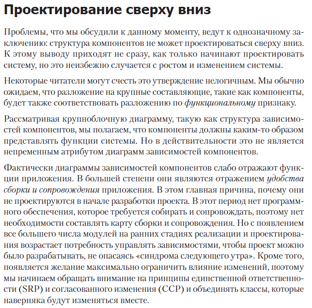

# Сочетаемость компонентов

Нередко проходят неделя за неделей, а команда все не в состоянии собрать стабильную
версию проекта. Вместо этого разработчики правят и правят свой код, пытаясь заставить
его работать с изменениями, сделанными кем-то другим.

За последние десятилетия было выработано два решения этой проблемы, и оба пришли из
телекоммуникационной отрасли. Первое: «еженедельные сборки». И второе: соблюдение
принципа ацикличности зависимостей (Acyclic Dependencies Principle; ADP).

## Еженедельные сборки 

Еженедельные сборки часто используются в проектах среднего размера. Это решение
действует так: все разработчики работают независимо первые четыре дня в неделе. 
Они изменяют собственные копии кода и не заботятся об интеграции результатов своего
труда в коллективную основу. Затем, в пятницу, они объединяют свои изменения и 
пытаются собрать систему.

К сожалению, с развитием проекта становится все сложнее завершить интеграцию в 
пятницу. Бремя интеграции продолжает расти, пока не начинает захватывать субботу.

## Устранение циклических зависимостей

## Проектирование сверху вниз

