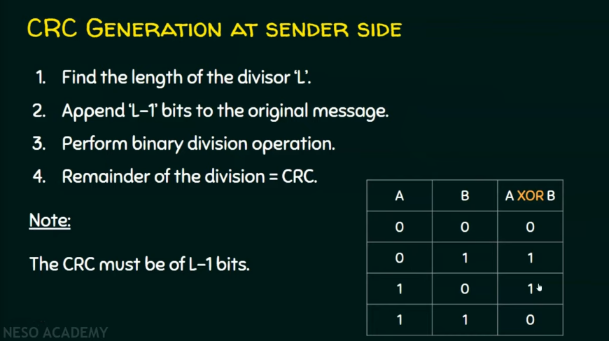
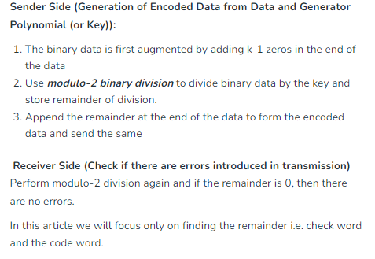

# Error Detection

## Error detection methods

## Longitudinal Redundancy Check

## Checksum

1s complement means - revert all 1 to 0.

Sender Site:

Receiver Site: 

## Cyclic Redundancy Check (CRC)

How the receiver knows that there no errors

