# Network Protocols & Communications

Data Flows

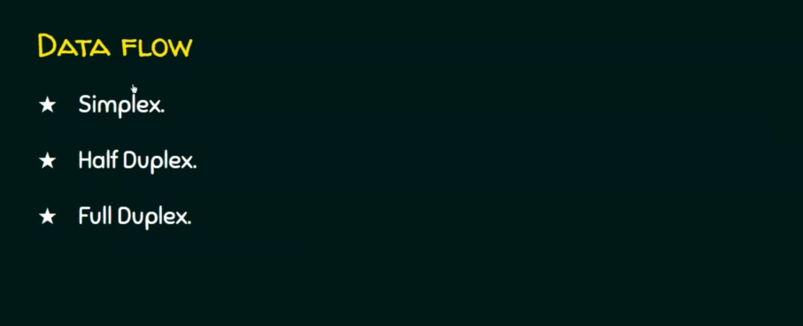

Data Flows - Simplex 

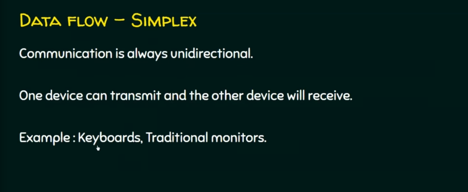

Data Flows - Half-Duplex

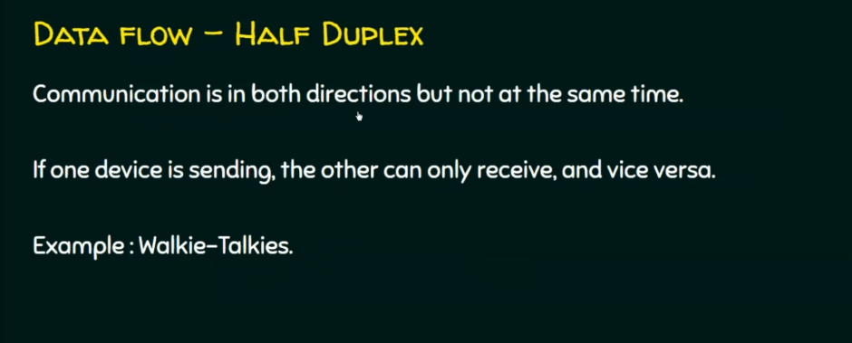

Data Flows - Full-Duplex

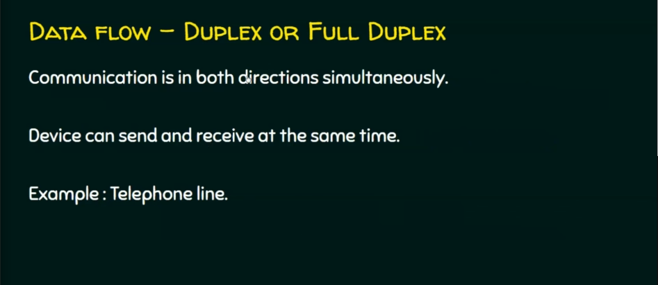

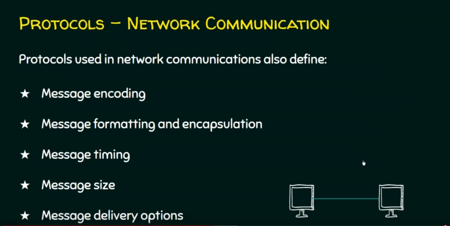

Message Encoding

Message Formatting and Encapsulation

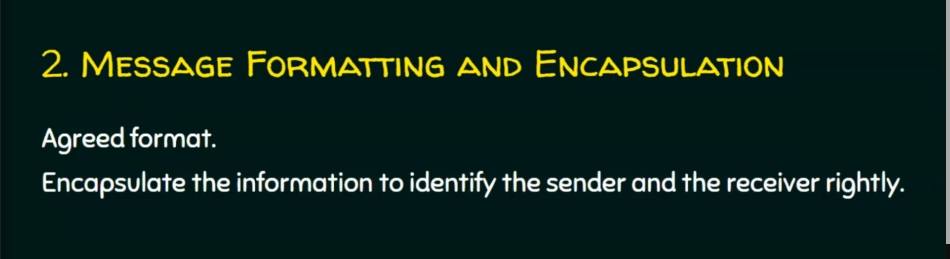

Message Delivery Option

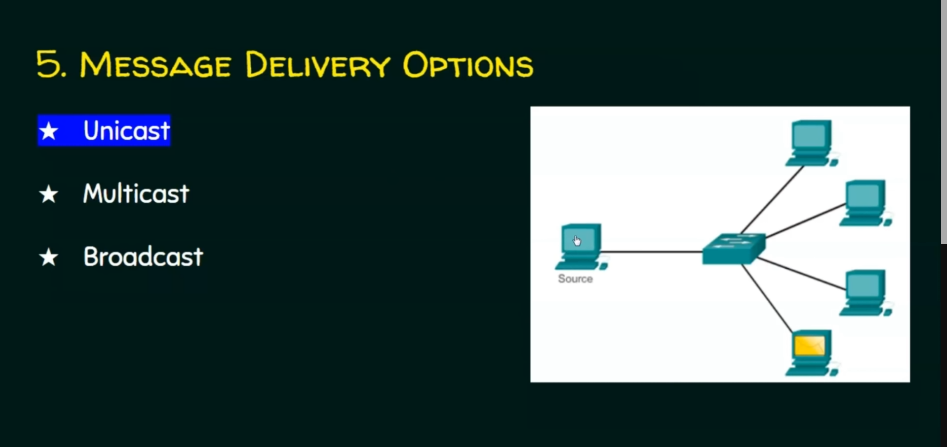

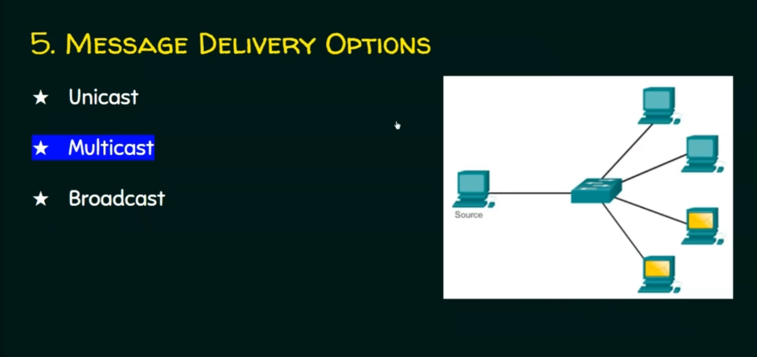

Elements of Protocol

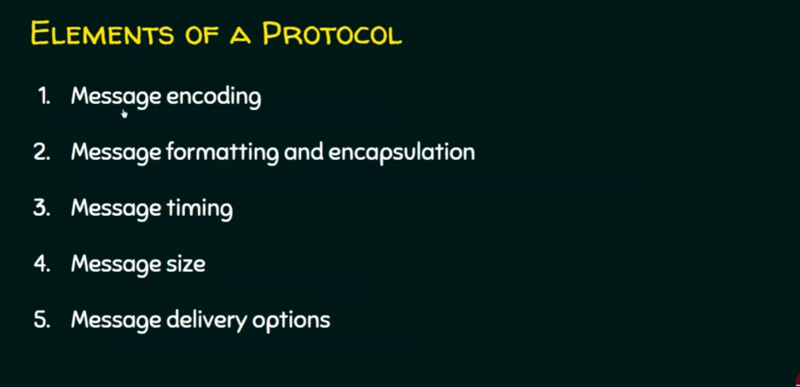

Network Types

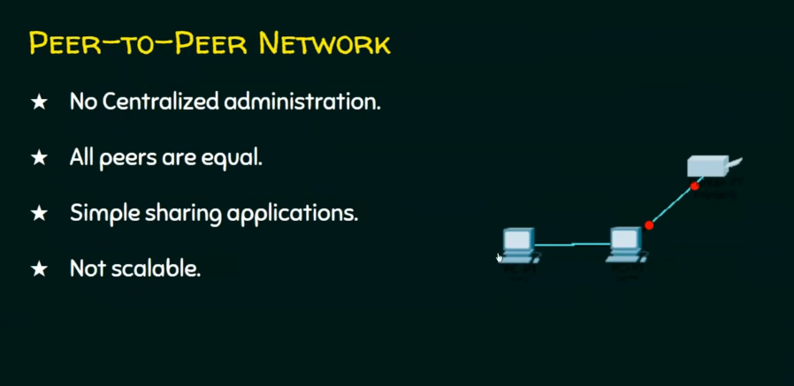

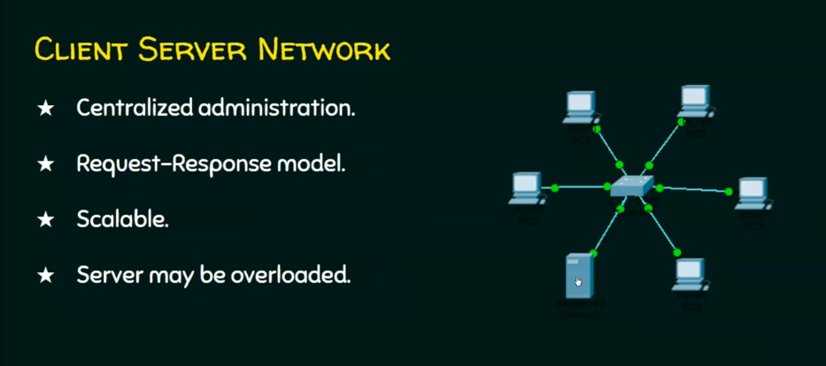

