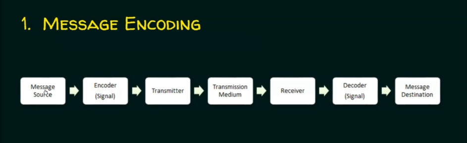
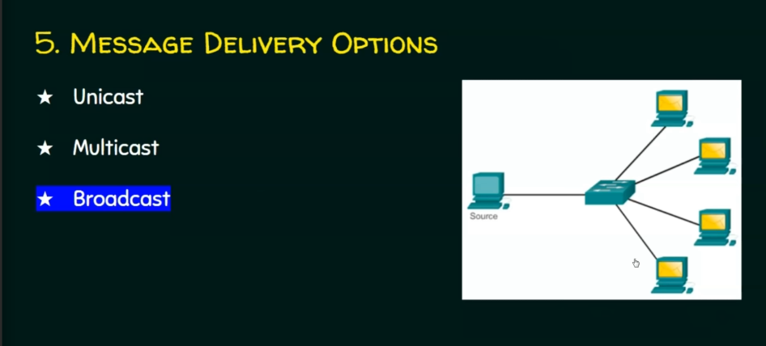

# Network Protocols & Communications

Data Flows

Data Flows - Simplex 

Data Flows - Half-Duplex

Data Flows - Full-Duplex

Message Encoding

Message Formatting and Encapsulation

Message Delivery Option

Elements of Protocol

Network Types

