# Multiple Access Protocols

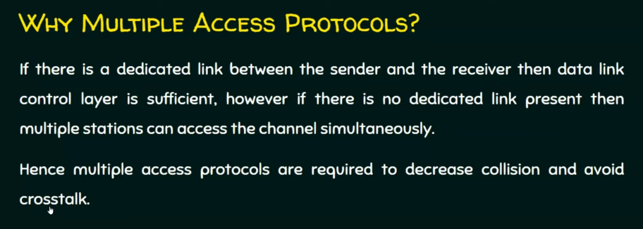
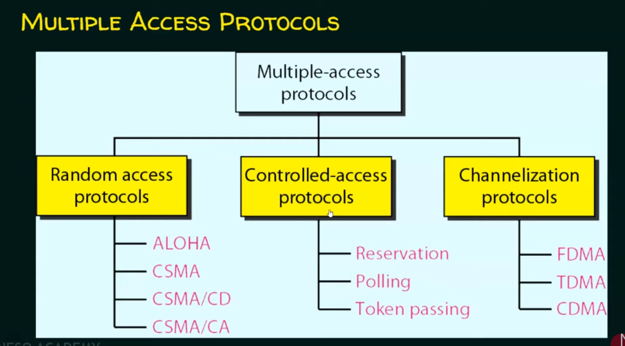

Random access protocols

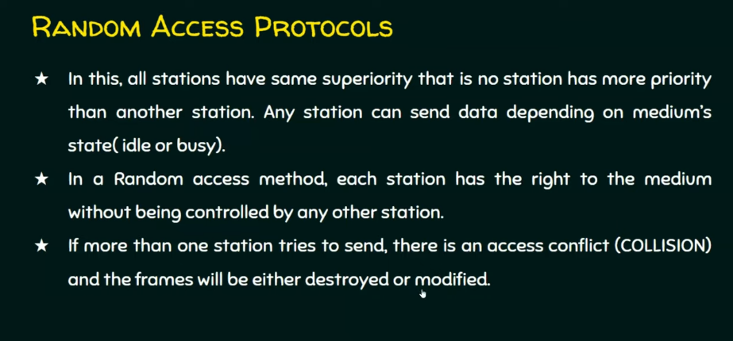
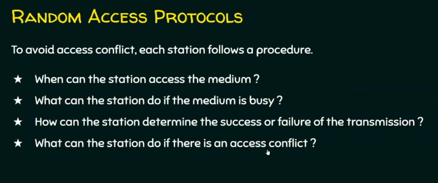

Controlled access protocols

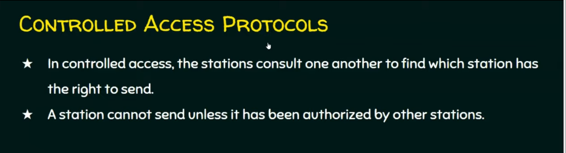

Channelization Protocols

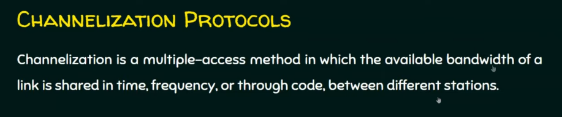

# Random Access Protocols

## ALOHA Protocol

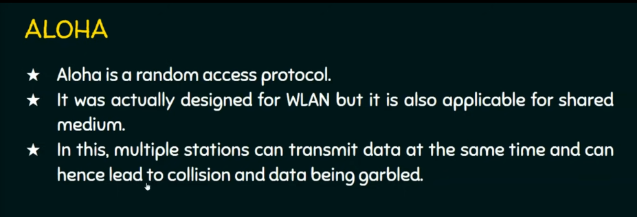

### Pure ALOHA

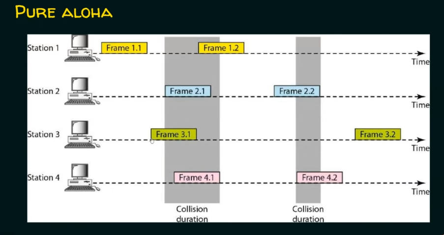
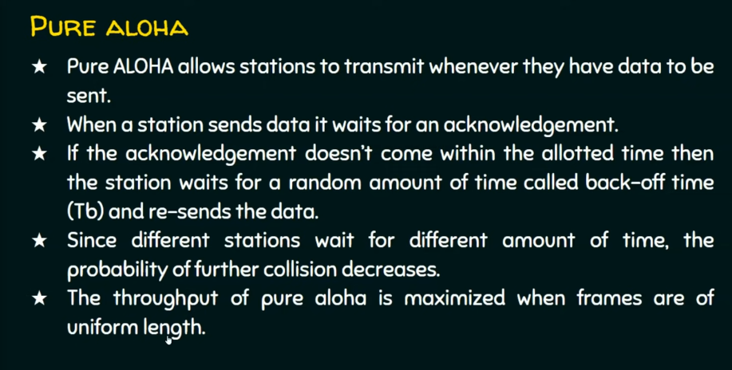
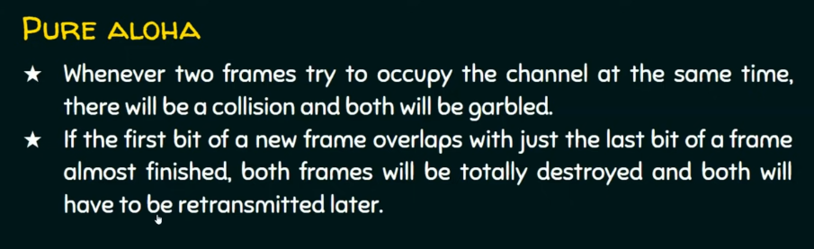
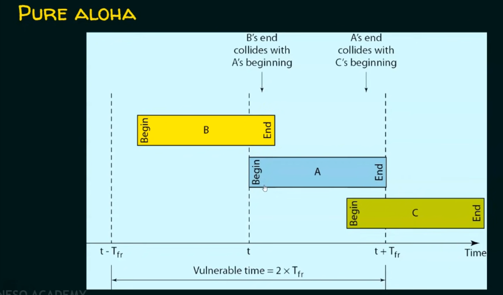

Tfr - Time to transmit one frame

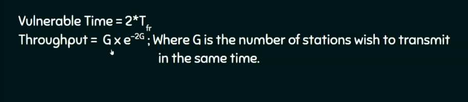
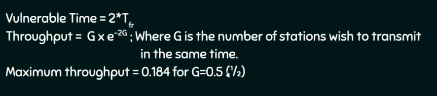

### Slotted ALOHA

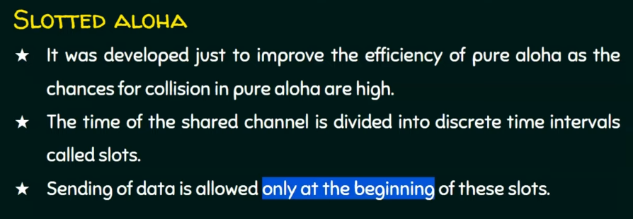
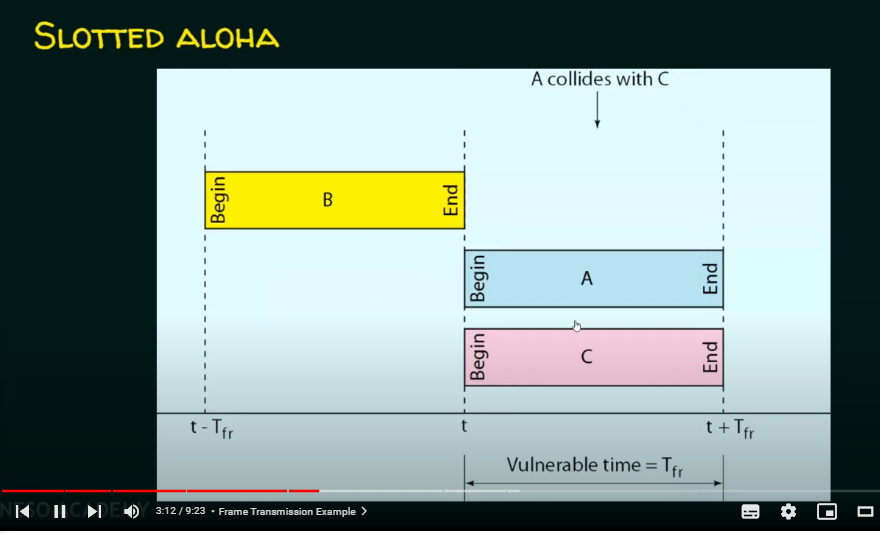

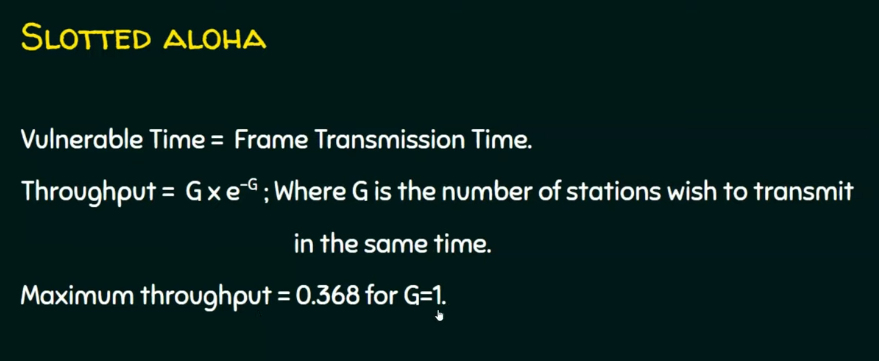

Conclusion

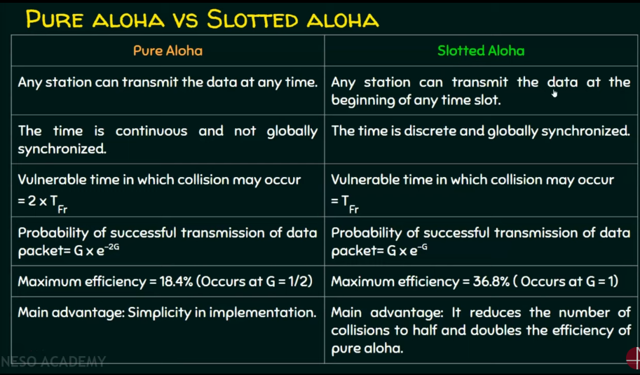

## Carrier Sense Multiple Access (CSMA)

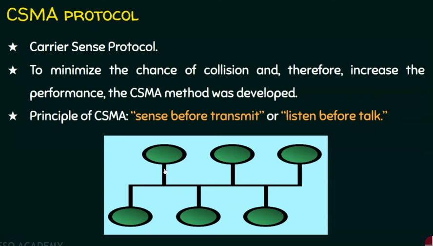
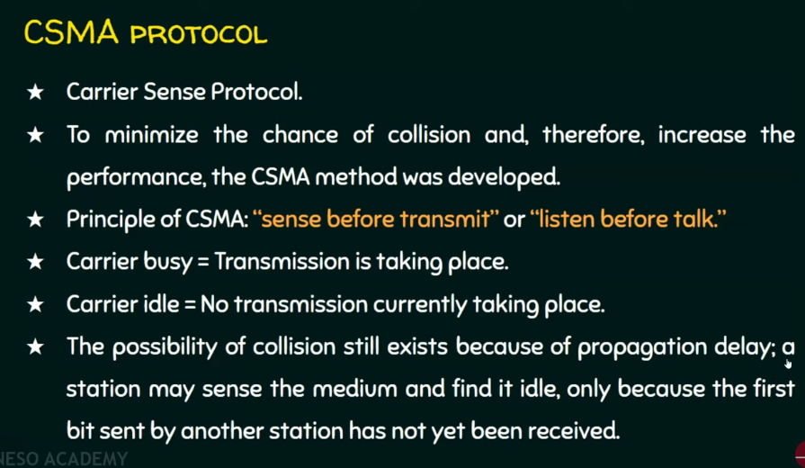
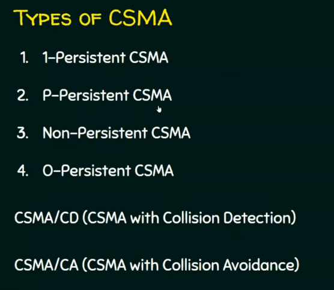
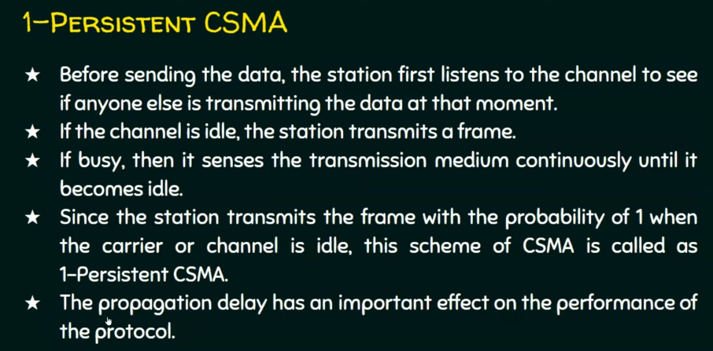

Middle line is the channel

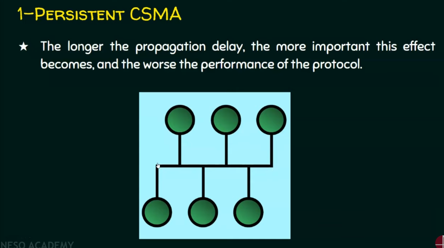

Non-Persistent CSMA

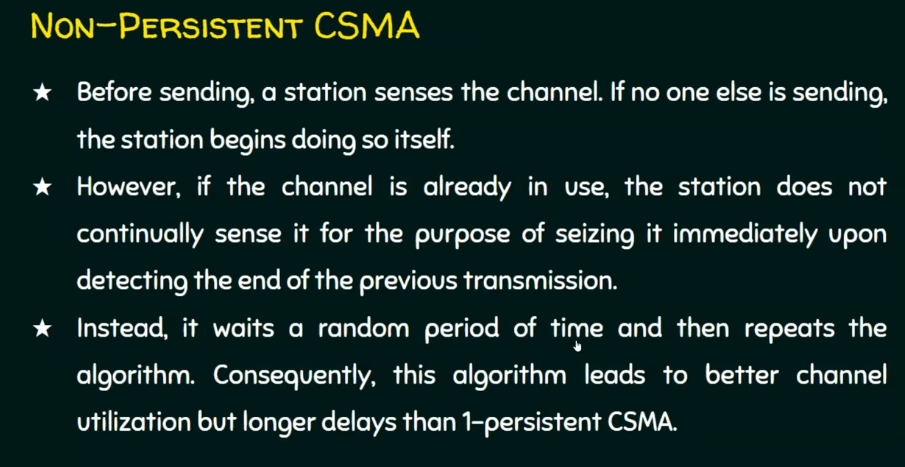

P-Persistent CSMA

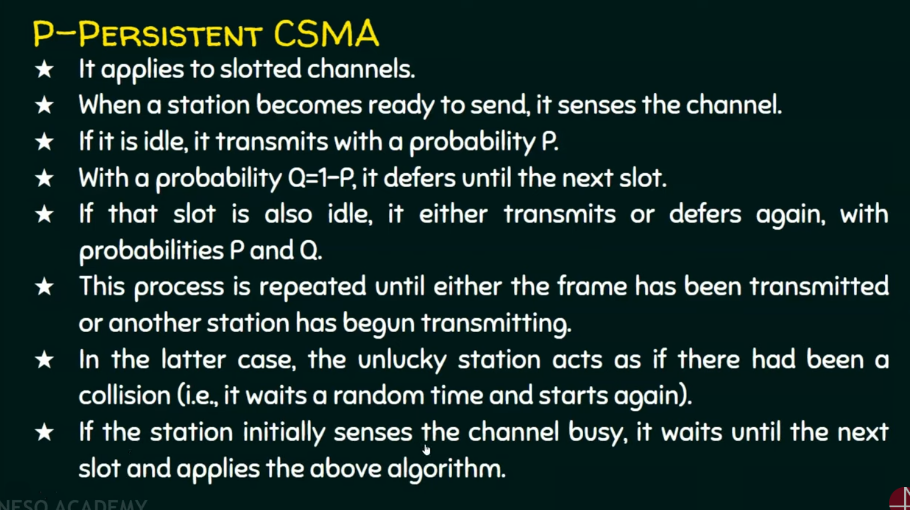

Comparison of different CSMA

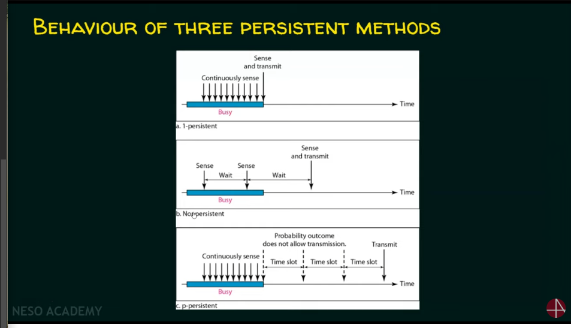

O-Persistent

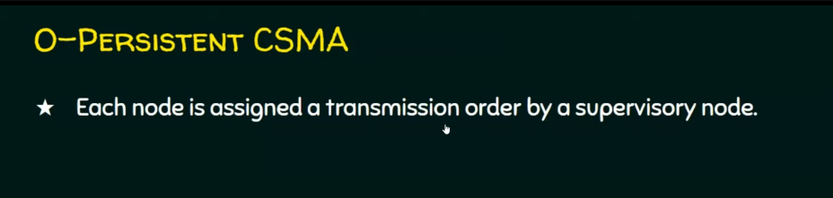

