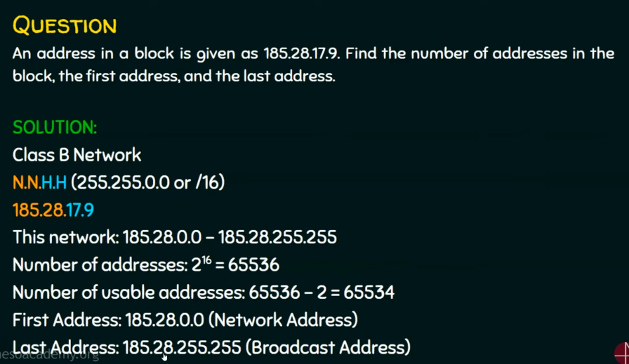
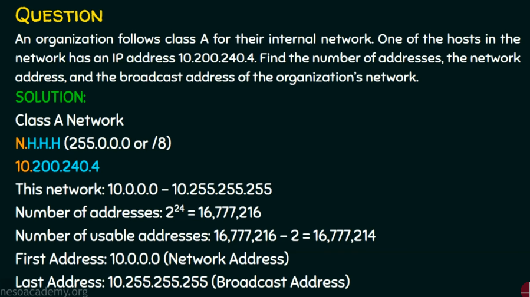

# Classful Addressing

Class defines by first bit

Range of octets for each class

Examples

Orange is network portion and blue is the host portion of the address

For C class network 

For B class network

For A class network

## Subnet Mask

## Unicast, Multicas, Broadcast

Unicast

Broadcast

Multicast

