# Classless Addressing

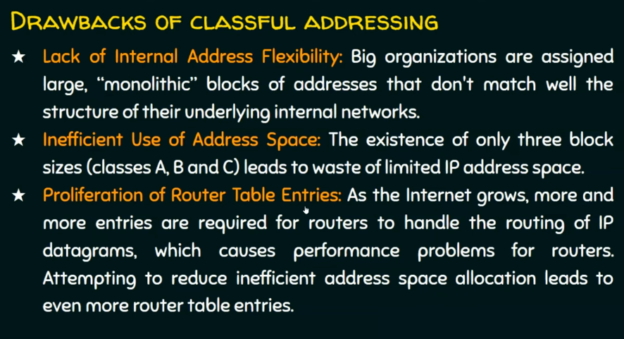

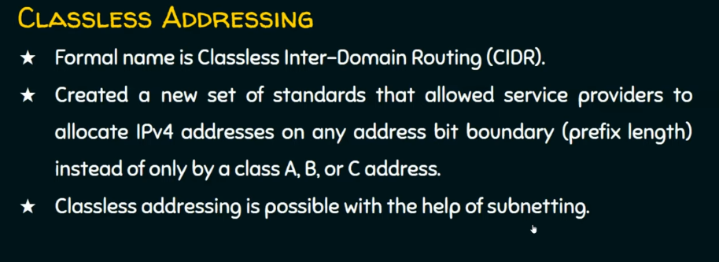

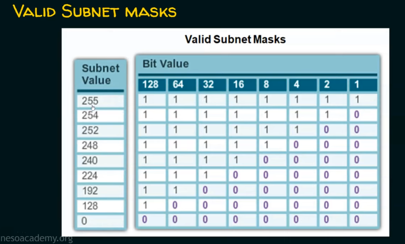

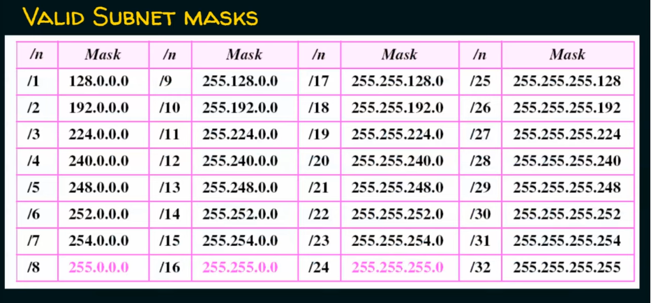

"/" - defines how many "1" followed by "0"

Pink addresses are A, B, C classes.  

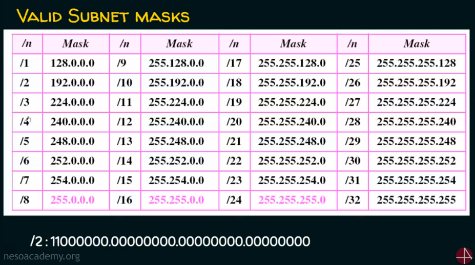

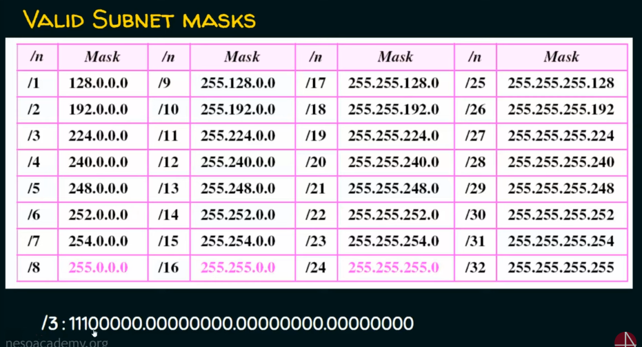

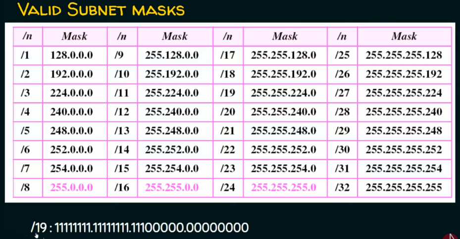

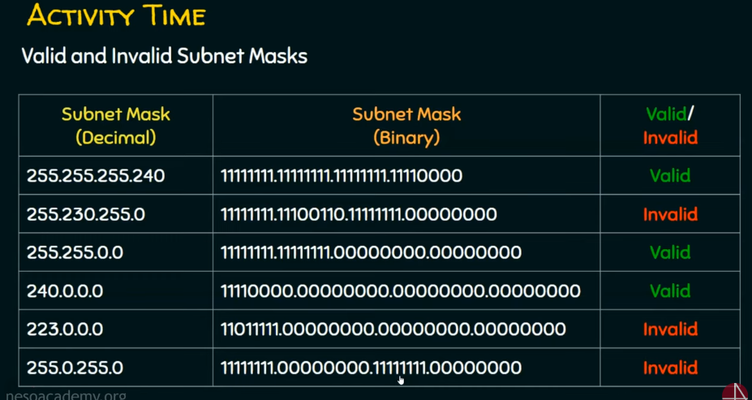

## Subnetting

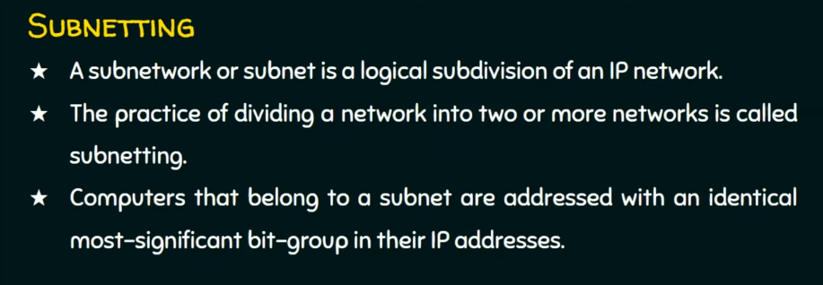

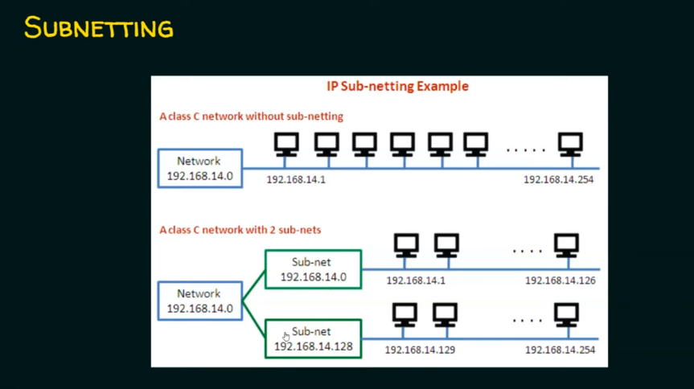

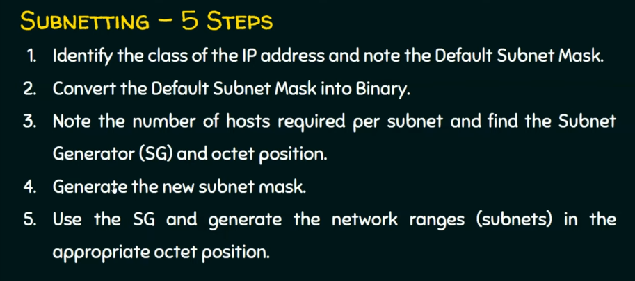

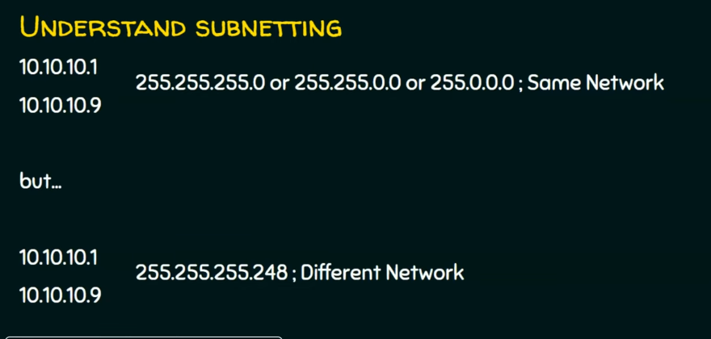

E.g.

"/27" means we have 27 "1" before "0"

Remember the first and last address is not allowed to use
because it is network and broadcast addresses. 

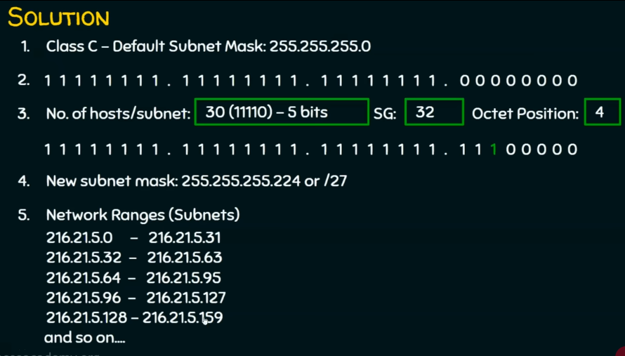
