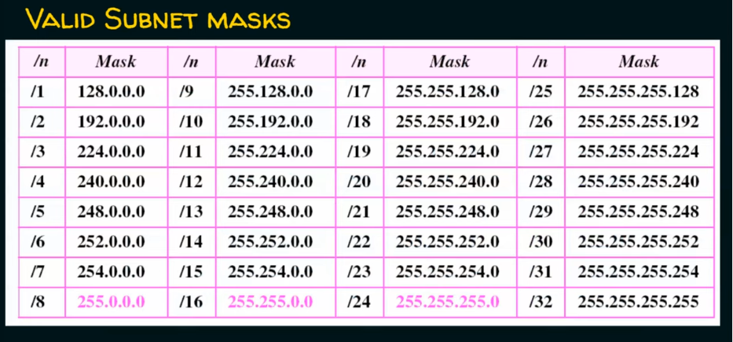

# Classless Addressing

"/" - defines how many "1" followed by "0"

Pink addresses are A, B, C classes.  

## Subnetting

E.g. 1

Class C address

"/27" means we have 27 "1" before "0"

SG calculated as value of first encountered "1" from beginning of the octet

2^Number of zeros is the number of hosts per Network (Subnet)

2^Number of ones is the number of subnets (Networks)

Remember the first and last address is not allowed to use
because it is network and broadcast addresses. 

E.g. 2

Class C address

E.g. 3

Class B address

E.g. 4

Class A address

E.g. 5

To solve this task we have to make mask complimentary (invert), and then use OR 

E.g. 6

## Fixed Length Subnet Masking

(https://www.youtube.com/watch?v=tJ9yAkEKR1Y&list=PLBlnK6fEyqRgMCUAG0XRw78UA8qnv6jEx&index=128)

## Variable Length Subnet Masking

(https://www.youtube.com/watch?v=N7BEDtZ7G4g&list=PLBlnK6fEyqRgMCUAG0XRw78UA8qnv6jEx&index=129)

