# Osi Reference Model

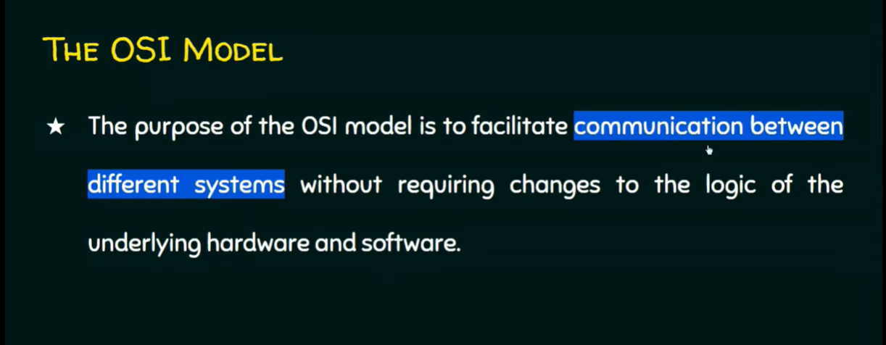

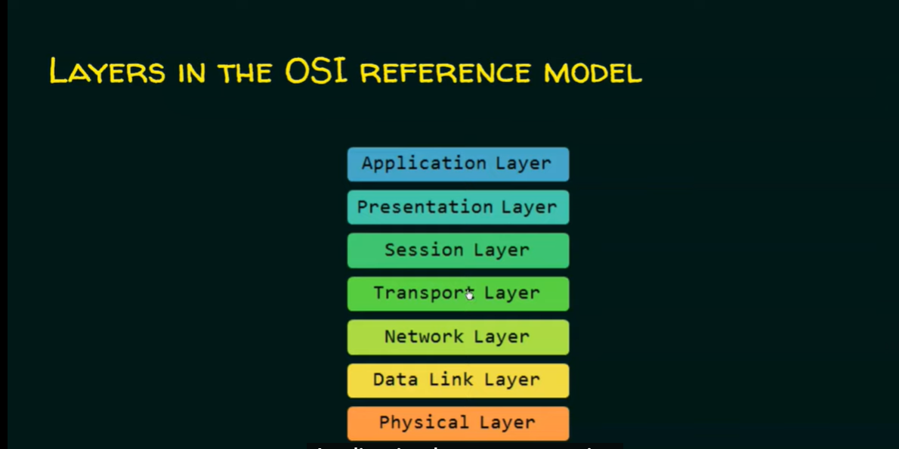

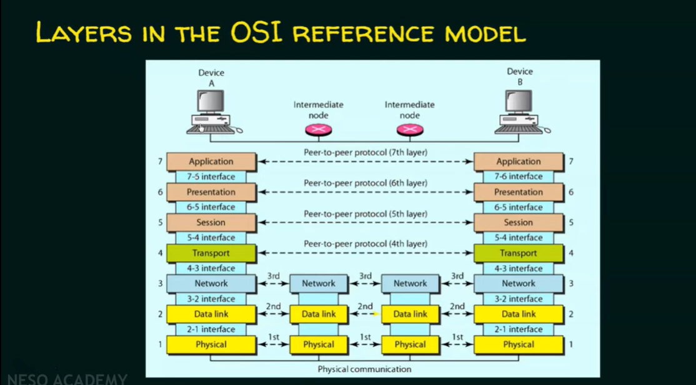

When device A sends data it goes from Application layer down to Presentation layer then 
to Session layer and so on. When Device B receives data they are going from bottom to top, 
Physical layer, then Data link, and so on.

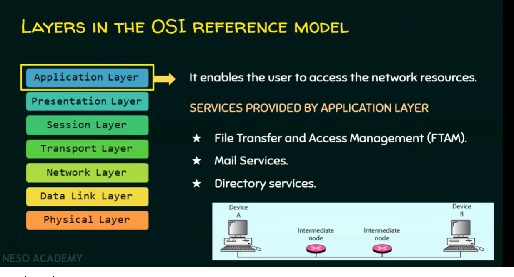

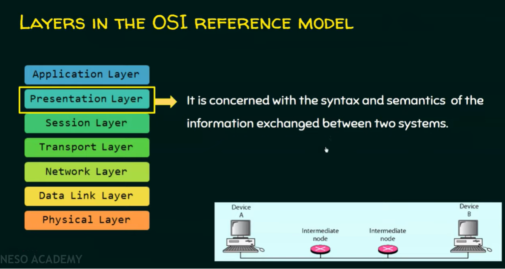

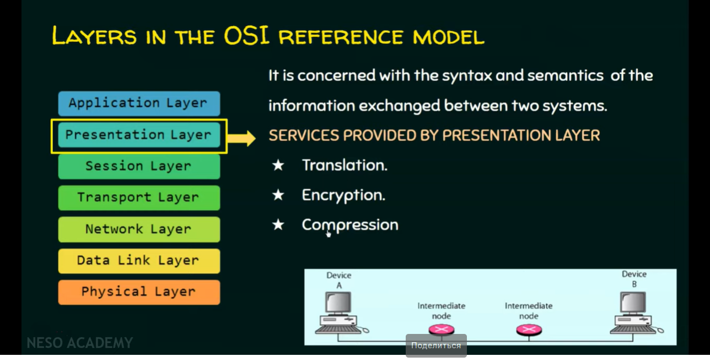

Translation means - converting data to format that accepts by both devices.

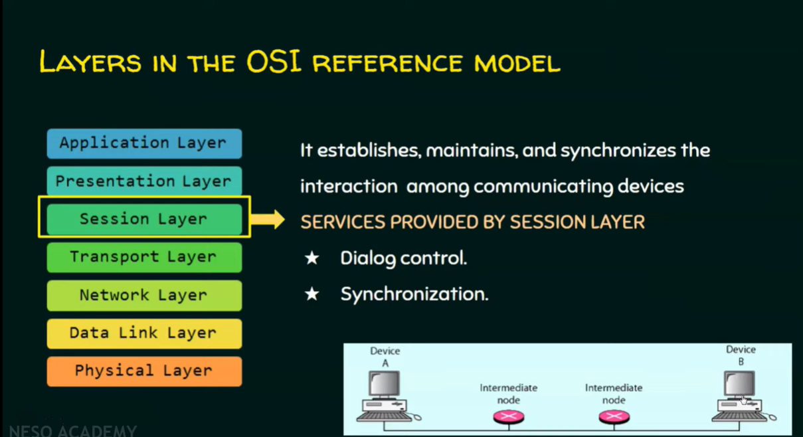

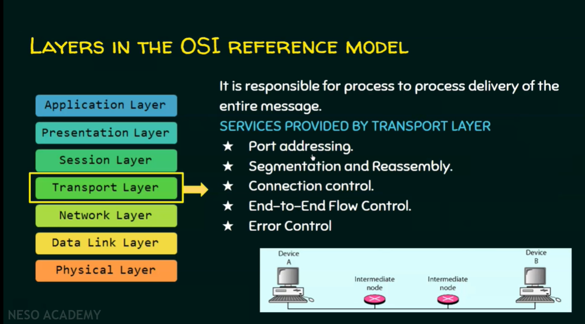

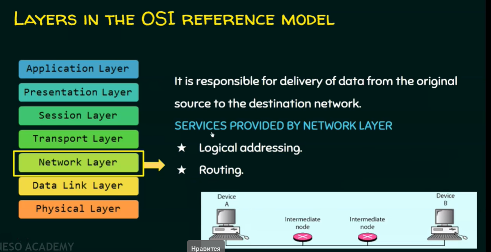

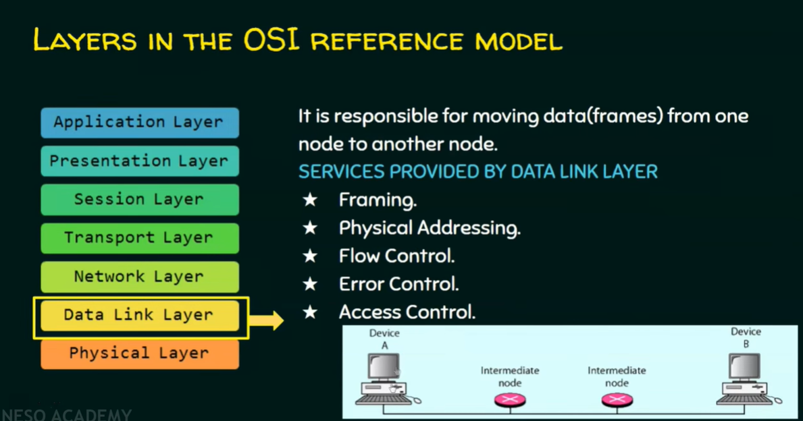

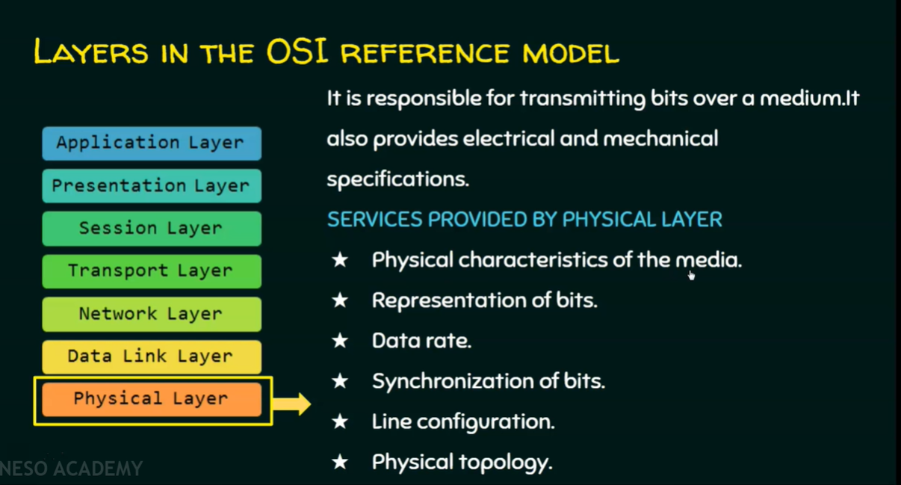

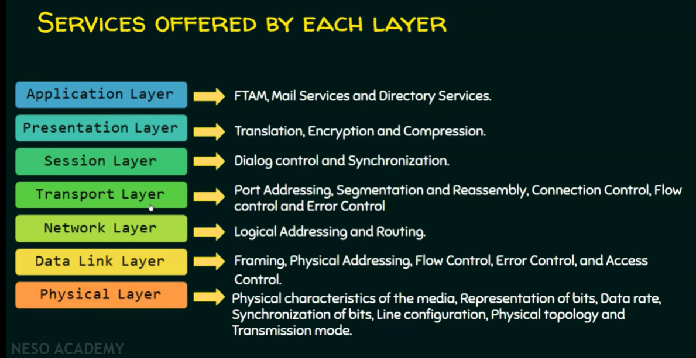

