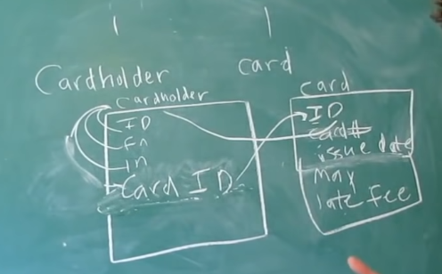
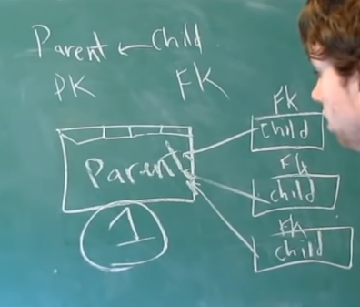
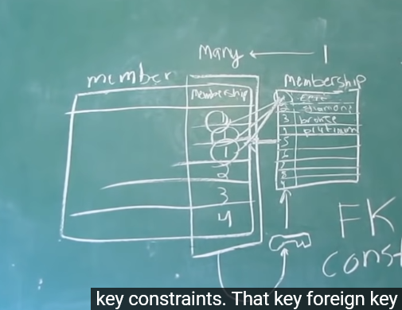
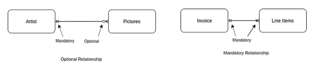
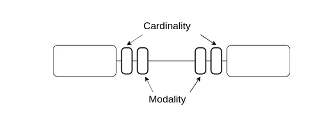
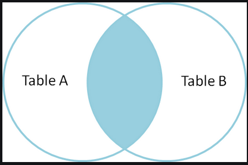
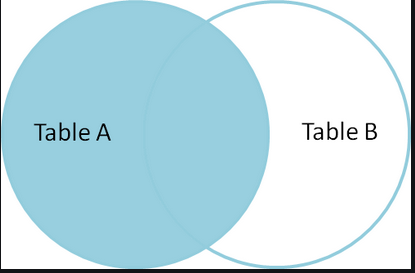
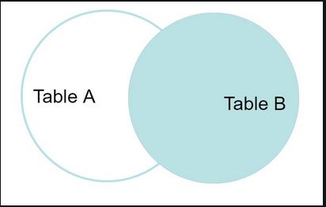
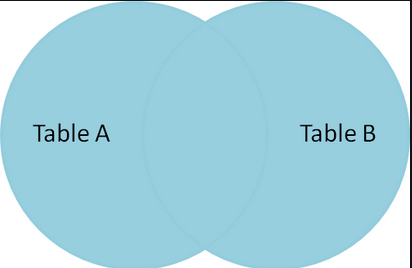

rd table.

## 6. Parent and Child tables

    Parent has Primary key (PK)
    Child has Foreign key (FK)
# Database Design

## Database schemas
    1. Conceptual (think about data overall)
    
    2. Logical  (specify tables, types, relations)

    3. Physical (choose server, provider, amount of memory)

## 1. Data integrity
    Integrity problems (prevent duplicates, keep data updated, e.t.c.)

### Types of Data Integrity

    1. Entity integrity 

    Each entity are unique. E.g. (we do not have two equals IDs in table)

    2. Referential integrity

    It is about reference from one table to another. E.g. Comments table refers to Users table
    because each comment must have user who sent it.

    3. Domain integrity

    It is about what we are storing and how we storing it. 
    E.g. phone number should have country code, then 7 - 9 digits.

## 2. Atomic values
    Basicaly means that value stores, changes, deletes as one thing.

## 3. Relationships
    1. One to One
    2. Many to One
    3. Many to Many

## 4. Design One to One relationship
    E.g we have account and user in tabke username exclusive for each user

    E.g. cardholder  and card.

## 5. Design One to Many relationship
    E.g. user can has many cards but the card can belongs to only one user.
    For this we just remove cardId from User table and add userId to ca
    E.g. comments on YouTube, User - Parent, Comments - Child, because
    Comments table refers to User with FK, Parent inherits nothing from child (we do not refer from user to each comment).
    But child "inherits" Foreign Key from Parent (each comment have one User who wrote it).

## 7. Keys

    1. Key must be UNIQUE
    2. NEVER changes
    3. NEVER NULL
        
#### Super Key 

    It`s any number of columns which forces the row to be unique. E.g. ID, email.

#### Candidate Key 
    
    It`s the least number of columns needed the row to be unique.

### Primary Key

    Key which will be used by another tables for reference to this table. Table
    can have only one PK.

### Foreign Key

    Key which references to PK in another table

    FOREIGN KEY CONSTRAINTS:
        1. ON DELETE (RESTRICT, CASCADE, SET NULL) - what to do with children when PK will be deleted.
        2. ON UPDATE (RESTRICT, CASCADE, SET NULL) - what to do with children when PK will be updated. 

### Alternate Key

### Surrogate Key

    It`s key which we added to database, and they are don`t exist in our data from beginning.
    In most cases this key should be private. 
    E.g. we add ID for each user in Users table to identify users.  

### Natural Key

     Natural key - is the key which is already in table data. 
     E.g. we have table User    with first_name, last_name, email. And we identify 
     user by email, so ligicaly email is a key.

### Simple, Composite, Compound Keys

    Simple - key consist from one columns.
    Composite - key consist from multiple columns.
    Compound - key which consists from multiple columns where each column is a key itself.

### Look up tables

    It`s about avoid same data duplication. 
    
    E.g. we have table Members, and each member have some status so instead of 
    duplicating status every time when user add, we create table Statuses and 
    save status names there, and when we add user to Members table we just assign
    key from Statuses to Member field.

## 8. Entity Relationship Model (ER diagram)

    Its a way to define relationship model in database, each table we draw as 
    square. 
    E.g. lets define table Users. First column it is ID, second is name, then 
    password.

    
## Cardinality
    
    Meanst that thing, or group of things or events compare with other groups
    by containing more, fewer, or same number of instances. In databases, 
    cardinality refers to the relationships between the data in two database 
    tables.

-One to One

-One to Many
  

E.g lets draw one cardholder can have many cards

## Modality

    Is about whether or not the relationship is required, we talk about that 
    when we talk about the column characteritic NOT NULL.

    E.g we have Cardholder and Card. And Card must always have Cardholder.
    So Cardholder must always have ID, or another column as PK and Card must 
    always have some Foreign Key which refers to Cardholder, so this field must
    not be NULL. 
    But if we change this requirement to Card should not always have Cardholder, 
    in such case Cardholder field in Card can be NULL. 

In ER diagram

One to One, required

One to One, not required

One to Many, not required and required

All together

## Cardinality and Modality together

## 9. Normalization

    Normalization is a process of correcting our database design.
    There is 3 main forms: 1NF, 2NF, 3NF.

### 1 Normal Form

    Makes all atomic.

    First Normal Form deals with data to be atomic. E.g. We have column Adress which consists
    from city, street, appartment. So this column are not atomic, and we should split it to 
    three different columns. 

### 2 Normal Form 

    Remove all partial dependencies

    Second Normal Form says  A non-prime attribute of a relation is an attribute that is not 
    a part of any candidate key of the relation. It means we should remove and avoid partial 
    dependencies in tables.

(https://www.geeksforgeeks.org/second-normal-form-2nf/)

### 3 Normal Form

    Remove all transitive dependencies

    A relation is in third normal form, if there is no transitive dependency for non-prime
    attributes as well as it is in second normal form.

    A relation is in 3NF if at least one of the following condition holds in every 
    non-trivial function dependency X –> Y:

    X is a super key.
    Y is a prime attribute (each element of Y is part of some candidate key).

    In other words,

    A relation that is in First and Second Normal Form and in which no non-primary-key 
    attribute is transitively dependent on the primary key, then it is in 
    Third Normal Form (3NF).
    
(https://www.geeksforgeeks.org/third-normal-form-3nf/)

## 10. Indexes

### Clustered
    
    Organized data. Can be created only if:
    1. The data or file, that you are moving into secondary memory should be in sequential 
    or sorted order.
    2. There should be a key value, meaning it can not have repeated values.

    Whenever you apply clustered indexing in a table, it will perform sorting in that table 
    only. You can create only one clustered index in a table like primary key. Clustered 
    index is as same as dictionary where the data is arranged by alphabetical order. 

    In clustered index, index contains pointer to block but not direct data. 

    E.g. If you apply primary key to any column, then automatically it will become clustered 
    index. 

### Nonclustered

    Non-Clustered Index is similar to the index of a book. The index of a book consists 
    of a chapter name and page number, if you want to read any topic or chapter then you 
    can directly go to that page by using index of that book. No need to go through each 
    and every page of a book. 

    The data is stored in one place, and index is stored in another place. Since, the data 
    and non-clustered index is stored separately, then you can have multiple non-clustered
    index in a table.

    In non-clustered index, index contains the pointer to data.
 
## 11. Joins

### Inner join

    The INNER JOIN keyword selects all rows from both the tables as long as the condition 
    is satisfied. This keyword will create the result-set by combining all rows from both 
    the tables where the condition satisfies i.e value of the common field will be the same. 

### Left join, or LEFT OUTER JOIN

    This join returns all the rows of the table on the left side of the join and matches 
    rows for the table on the right side of the join. For the rows for which there is no 
    matching row on the right side, the result-set will contain null. LEFT JOIN is also 
    known as LEFT OUTER JOIN.

### Right join, or RIGHT OUTER JOIN

    RIGHT JOIN is similar to LEFT JOIN. This join returns all the rows of the table on the
    right side of the join and matching rows for the table on the left side of the join. 
    For the rows for which there is no matching row on the left side, the result-set will
    contain null. RIGHT JOIN is also known as RIGHT OUTER JOIN.

### Full join 

    FULL JOIN creates the result-set by combining results of both LEFT JOIN and RIGHT JOIN.
    The result-set will contain all the rows from both tables. For the rows for which there
    is no matching, the result-set will contain NULL values.

