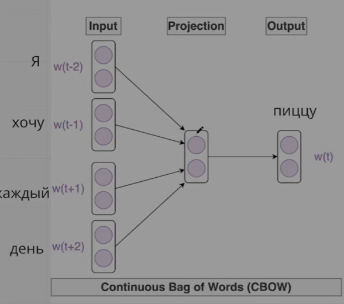
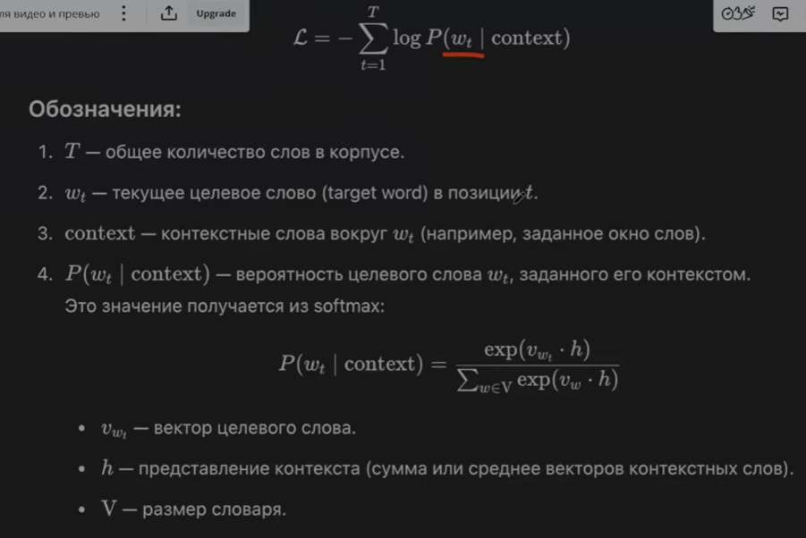
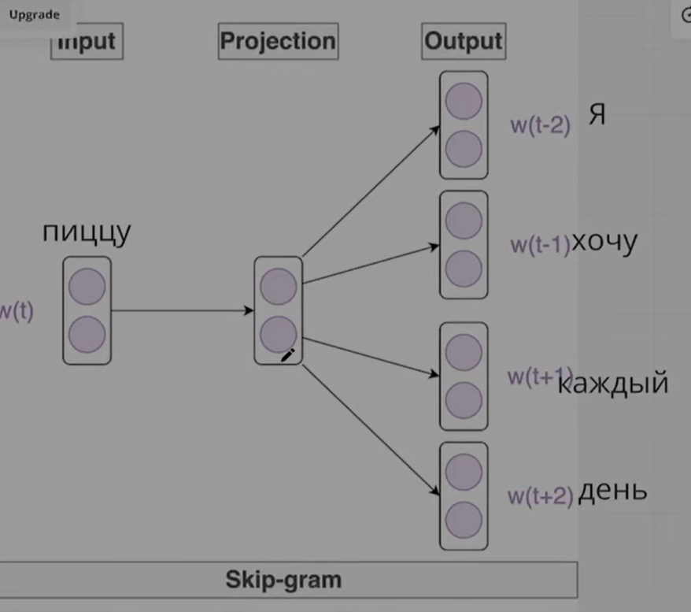
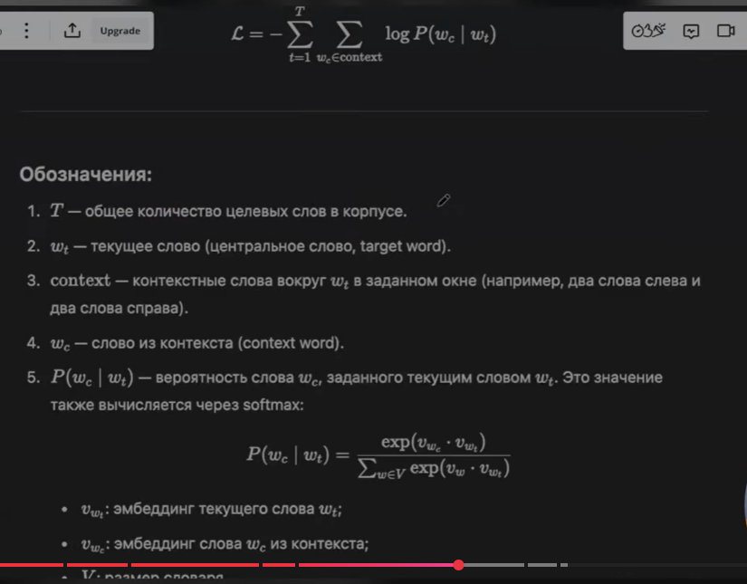

# Что такое TF-IDF?

TF-IDF это мера которая позволяет закрепить значимость некоторого слова, чем значение больше тем слово важнее, чем ниже тем менее важно. 

TF  - частота термина в документе

$$TF(t, d) = \frac{f_{t,d}}{\sum_{t' \in d} f_{t',d}}$$

Where:
- $f_{t,d}$ = number of times term $t$ appears in document $d$
- Denominator = total number of terms in document $d$

IDF - обратная частота термина в документе

#### Standard Formula
$$IDF(t, D) = \log\frac{N}{df_t}$$

Where:
- $N$ = total number of documents in corpus $D$
- $df_t$ = number of documents containing term $t$ (document frequency)

### Key Idea
- Words that appear **frequently in a document** but **rarely across all documents** are likely important and characteristic of that document
- Common words (like "the", "is", "and") appear in many documents → low importance
- Specific words appear in few documents → high importance

## Advantages

✅ **Simple and intuitive** — easy to understand and implement  
✅ **Effective** — works well for many tasks  
✅ **Interpretable** — weights have clear meaning  
✅ **Fast** — efficient computation  
✅ **No training required** — unsupervised method  
✅ **Highlights distinctive terms** — filters common words naturally  

---

## Disadvantages

❌ **Ignores word order** — "dog bites man" = "man bites dog"  
❌ **Ignores semantics** — no understanding of meaning  
❌ **Ignores context** — "bank" (river) vs "bank" (finance)  
❌ **Sparse vectors** — most values are zero (high dimensionality)  
❌ **Cannot handle OOV** — new words not in vocabulary  
❌ **Bag-of-words assumption** — loses grammatical structure  
❌ **Fixed vocabulary** — requires predetermined vocabulary  

# Что такое BM25? | Объяснение

### 1. BM25 (Best Matching 25)

Enhanced TF-IDF with:

- Saturation function for term frequency
- Document length normalization

### Full BM25 Score

For a query $Q$ containing terms $q_1, q_2, ..., q_n$, the BM25 score of document $D$ is:

$$\text{BM25}(D, Q) = \sum_{i=1}^{n} IDF(q_i) \cdot \frac{f(q_i, D) \cdot (k_1 + 1)}{f(q_i, D) + k_1 \cdot \left(1 - b + b \cdot \frac{|D|}{avgdl}\right)}$$

Where:
- $f(q_i, D)$ = frequency of term $q_i$ in document $D$
- $|D|$ = length of document $D$ (number of words)
- $avgdl$ = average document length in the corpus
- $k_1$ = term frequency saturation parameter (typical: 1.2 to 2.0)
- $b$ = length normalization parameter (typical: 0.75)
- $IDF(q_i)$ = inverse document frequency of term $q_i$

# Как правильно предобработать текст?

Общие правила для всех алгоритмов работы с текстом: 

1. Приведение к нижнему регистру
2. Удаление пунктуации
3. Удаление стоп слов
4. Лемматизация, или стемминг 
5. Удаление чисел
6. Удаление HTML тєгов

# Предобработка текста | Стемминг | Лемматизация

## Лемматизация (процесс приведения слова к его начальной, словарной форме (лемме), например, "бегу", "бежал", "бегут" к "бегать", или "столы" к "стол").

- Результат: Существующее, осмысленное слово (лемма).

- Плюсы: Высокая точность, учет части речи и контекста.

- Минусы: Работает медленнее, требует больше вычислительных ресурсов

Пример: "better" -> "good". 

## Cтемминг (Удаление окончаний и суффиксов на основе правил) 

- Результат: Основа слова (stem), которая может не совпадать с корнем и не являться существующим словом.

- Плюсы: Высокая скорость, простота внедрения.

- Минусы: Может объединять слова с разным значением, "отрезая" лишнее (омонимия).

Пример: "fishing", "fished", "fisher" \(\rightarrow \) "fish".

# Какие бывают метрики близости текста? | Объяснение

### 1. Cosine similarity

### Formula

$$\text{cosine\_similarity}(\mathbf{A}, \mathbf{B}) = \frac{\mathbf{A} \cdot \mathbf{B}}{||\mathbf{A}|| \times ||\mathbf{B}||} = \frac{\sum_{i=1}^{n} A_i B_i}{\sqrt{\sum_{i=1}^{n} A_i^2} \times \sqrt{\sum_{i=1}^{n} B_i^2}}$$

Where:
- $\mathbf{A}, \mathbf{B}$ = vectors in n-dimensional space
- $\mathbf{A} \cdot \mathbf{B}$ = dot product
- $||\mathbf{A}||$ = Euclidean norm (magnitude) of vector $\mathbf{A}$

### 2. Cosine Distance

$$\text{cosine\_distance}(\mathbf{A}, \mathbf{B}) = 1 - \text{cosine\_similarity}(\mathbf{A}, \mathbf{B})$$

- **Range:** $[0, 2]$
- Lower is more similar

### 2. Euclidean distance (L2 Distance)

### Formula

$$d_{Euclidean}(\mathbf{A}, \mathbf{B}) = ||\mathbf{A} - \mathbf{B}|| = \sqrt{\sum_{i=1}^{n}(A_i - B_i)^2}$$

### Properties
- **Range:** $[0, \infty)$
  - $0$ = identical vectors
  - Larger = more dissimilar
- **Measures:** Straight-line distance (as the crow flies)
- **Sensitive to:** Magnitude and scale
- **Use case:** KNN, clustering (K-means), physical distances

### 3. Manhattan distance (L1 Distance, Taxicab Distance)

### Formula

$$d_{Manhattan}(\mathbf{A}, \mathbf{B}) = \sum_{i=1}^{n}|A_i - B_i|$$

### Properties
- **Range:** $[0, \infty)$
  - $0$ = identical vectors
  - Larger = more dissimilar
- **Measures:** Grid-based distance (city block distance)
- **Name origin:** Distance a taxi travels in Manhattan's grid layout
- **Use case:** High-dimensional data, discrete/grid-based spaces, feature selection (Lasso)

# Что такое Word2Vec?

По факту это натренировання нейронная сеть которая слово превращает в вектор из чисел, это используется для того чтобы иметь возможность сравнивать числовые значения слов, находить расстояния между ними и интерпретировать как меру того насколько слова похожи, либо связанны друг с другом. 

Используется в двух сценариях:

## 1. Continuous Bag of Words - CBOW

Это когда мы имея некоторы контекст предсказываем следующее слово, либо пропущенное слово и т.д.

### Простой пример

**Предложение:** "Я люблю изучать машинное обучение"

**Окно контекста** (window size = 4):

[Я, люблю] → изучать ← [машинное, обучение] ↓ ↓ контекст целевое слово

**Что делает CBOW:**
- **Вход:** "Я", "люблю", "машинное", "обучение" (контекстные слова)
- **Выход:** "изучать" (целевое слово)

На вход мы получаем контекст, и на выход даем слово 

Вот так выглядит функция потерь и подсчет вероятности 

## 2. Skip Gram - когда мы имея предсказываем контекст по целевому слову.

**Предложение:** "Я люблю изучать машинное обучение"

**Окно контекста** (window size = 4):

  изучать → [Я, люблю, машинное, обучение]

**Что делает Skip-gram:**
- **Вход:** "изучать" (одно центральное слово)
- **Выход:** "Я", "люблю", "машинное", "обучение" (контекстные слова)

Функция потерь и вероятность:

# Что такое Negative Sampling?

### Стандартный Softmax в Word2Vec

$$P(w_O | w_I) = \frac{\exp(\mathbf{v}_{w_O}^T \mathbf{v}_{w_I})}{\sum_{w=1}^{|V|}\exp(\mathbf{v}_w^T \mathbf{v}_{w_I})}$$

**Проблема:** Знаменатель требует суммирования по **всему словарю** |V|

- Вычислительно очень дорого
- Замедляет обучение в тысячи раз

### Основная идея

Вместо предсказания вероятностей для **всех слов**, превращаем задачу в **binary classification**:

**Для каждого примера:**
1. ✅ **1 positive pair** — правильная пара (центр, контекст)
2. ❌ **k negative pairs** — случайные "неправильные" пары

### Пример

**Предложение:** "кот сидит на коврике"

**Positive pair:** (сидит, кот) — реально встречается в контексте

**Negative samples:** (сидит, машина), (сидит, океан), (сидит, программа), ...  
→ случайные слова, НЕ встречающиеся в контексте "сидит"

**Задача:** Научить модель отличать реальный контекст от случайного.

## Формула

### Loss Function с Negative Sampling

$$\mathcal{L} = -\log \sigma(\mathbf{v}_{w_O}^T \mathbf{v}_{w_I}) - \sum_{i=1}^{k} \log \sigma(-\mathbf{v}_{w_i}^T \mathbf{v}_{w_I})$$

Где:
- $\sigma(x) = \frac{1}{1+e^{-x}}$ — сигмоидная функция
- $w_I$ — центральное слово (input)
- $w_O$ — правильное контекстное слово (positive)
- $w_i$ — негативные примеры (negative samples)
- $k$ — количество негативных примеров (обычно 5-20)

### Компоненты

**Positive term (максимизируем):**
$$-\log \sigma(\mathbf{v}_{w_O}^T \mathbf{v}_{w_I})$$

Цель: $\mathbf{v}_{w_O}^T \mathbf{v}_{w_I} \to$ большое положительное → $\sigma \to 1$ → $-\log \to 0$

**Negative term (минимизируем):**
$$-\sum_{i=1}^{k} \log \sigma(-\mathbf{v}_{w_i}^T \mathbf{v}_{w_I})$$

Цель: $\mathbf{v}_{w_i}^T \mathbf{v}_{w_I} \to$ маленькое/отрицательное → $\sigma(-x) \to 1$ → $-\log \to 0$

## Как выбирать Negative Samples?

### Распределение вероятностей

$$P(w) = \frac{f(w)^{3/4}}{\sum_{w'} f(w')^{3/4}}$$

Где:
- $f(w)$ — частота слова $w$ в корпусе
- Степень $3/4$ — эмпирически найденное значение

**Почему не uniform?** 
- Редкие слова должны выбираться чаще, чем при uniform distribution
- Частые слова должны выбираться реже

**Почему не частота $f(w)$?**
- Слишком частые слова (the, is, a) будут доминировать
- Степень $3/4$ сглаживает распределение

# Отличие между Word2Vec и TF-IDF?

