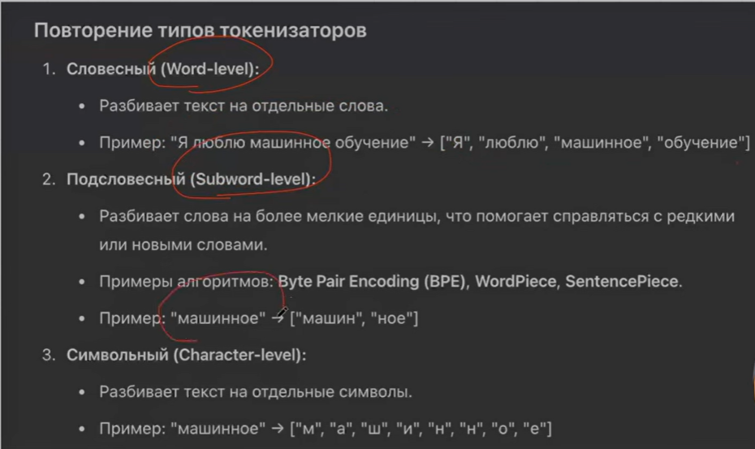

# Что такое RNN?

Представьте, что вы читаете книгу. Вы не забываете предыдущие слова сразу после их прочтения - вы держите контекст в голове. RNN работает похожим образом: он обрабатывает текст __слово за словом__ и __запоминает предыдущий контекст__.

Обычная нейросеть видит все слова сразу и независимо. RNN видит слова __последовательно__ и __помнит__, что было раньше.

__Ключевая идея:__ На каждом шаге RNN берет:

1. __Текущее слово__ ($x_t$)

2. __Память о прошлом__ ($h_{t-1}$)
 (скрытое состояние с прошлого обработанного слова)
3. И создает __новую память__ ($h_t$)
, которая содержит информацию обо ВСЁМ, что было до этого момента (новое скрытое состояние)

Скрытое состояние - по сути это представление входящего ембединга (слова) с учетом скрытого состояния которое передалось на предыдущем шаге (тоесть предыдущего слова). Либо еще проще, это представление этого слова с учетом слов до него. Скрытое состояние для первого входящего слова обычно инициализируют либо нулями, либо случайно.  

### Формула 1: Обновление скрытого состояния (памяти)

$$h_t = \tanh(W_{hh} \cdot h_{t-1} + W_{xh} \cdot x_t + b_h)$$

Где: 

$$h_t = \tanh(\underbrace{W_{hh} \cdot h_{t-1}}_{\text{все старые слова}} + \underbrace{W_{xh} \cdot x_t}_{\text{новое слово}} + b_h)$$

```
Новая память = tanh(
    "как учесть старую память" × старая_память +
    "как учесть новое слово" × новое_слово +
    смещение
)
```

## Ключевые моменты

1. __Последовательная обработка__: RNN обрабатывает слова по очереди, а не все сразу
2. __Память контекста__: Вектор $h_t$ хранит информацию обо всех предыдущих словах
3. __Одни и те же веса__: Матрицы $W_{hh}$, $W_{xh}$, $W_{hy}$ - одинаковые для всех шагов
4. __Цепочка зависимостей__: $h_3$ зависит от $h_2$, который зависит от $h_1$, который зависит от $h_0$

# Какие есть плюс и минусы у RNN?

## ✅ Плюсы

### 1. __Работа с последовательностями переменной длины__

- Может обрабатывать тексты любой длины (от 1 слова до целой книги)
- Один и тот же RNN работает с предложениями из 3 слов и из 100 слов

### 2. __Память о контексте__

- Запоминает предыдущие слова в векторе $h_t$
- Понимает, что "яблоко" в контексте "я ем яблоко" - это еда, а в "Apple выпустила iPhone" - это компания

### 3. __Небольшое количество параметров__

- Одни и те же веса $W_{hh}$, $W_{xh}$, $W_{hy}$ используются для всех слов
- Не растет с увеличением длины текста (в отличие от полносвязных сетей)

### 4. __Учитывает порядок слов__

- "Собака кусает человека" ≠ "Человек кусает собаку"
- Порядок имеет значение, и RNN это понимает

## ❌ Минусы

### __Проблема затухающих/взрывающихся градиентов__

__Самая критичная проблема!__

При обучении через backpropagation через время (BPTT), градиенты умножаются на каждом шаге:

$$\frac{\partial L}{\partial h_1} = \frac{\partial L}{\partial h_T} \cdot \prod_{t=2}^{T} \frac{\partial h_t}{\partial h_{t-1}}$$

__Проблема:__

- Если производная < 1: градиенты __затухают__ (vanishing gradients) → сеть не учит долгосрочные зависимости
- Если производная > 1: градиенты __взрываются__ (exploding gradients) → нестабильное обучение

__Пример:__

```javascript
Предложение: "Кот, который жил у бабушки в деревне прошлым летом, был рыжим"

RNN плохо запомнит связь "кот" → "был рыжим" из-за большого расстояния
```

### 2. __Медленное обучение (нельзя распараллелить)__

- Нужно обработать слово 1, чтобы получить $h_1$
- Потом слово 2, чтобы получить $h_2$
- И так далее последовательно ❌ не параллелится
- В отличие от Transformers, где все слова обрабатываются одновременно

### 3. __Короткая память__

- В теории $h_t$ хранит всю информацию
- На практике информация из начала длинного текста "забывается"
- Эффективная память: обычно 5-10 слов назад

# Какая сложность у RNN ?

## Вывод временной сложности (Forward Pass)

### Шаг 1: Анализ одного временного шага

Формула на одном шаге $t$:

$$h_t = \tanh(W_{hh} \cdot h_{t-1} + W_{xh} \cdot x_t + b_h)$$

__Операции умножения матриц:__

1. __$W_{hh} \cdot h_{t-1}$__

   - $W_{hh}$: размерность $[h \times h]$
   - $h_{t-1}$: размерность $[h \times 1]$
   - Сложность: $O(h^2)$ операций

2. __$W_{xh} \cdot x_t$__

   - $W_{xh}$: размерность $[h \times d]$
   - $x_t$: размерность $[d \times 1]$
   - Сложность: $O(h \cdot d)$ операций

3. __Сложение и tanh__

   - Сложность: $O(h)$ операций

__Итого для одного шага:__

$$\text{Complexity}_{\text{step}} = O(h^2 + h \cdot d + h) = O(h^2 + h \cdot d)$$

(Упрощаем, так как $h^2$ и $h \cdot d$ доминируют над $h$)

---

### Шаг 2: Для всей последовательности

У нас $T$ временных шагов, каждый с сложностью $O(h^2 + h \cdot d)$:

$$\boxed{\text{Forward Pass} = O(T \cdot (h^2 + h \cdot d))}$$

---

### Шаг 3: Вычисление выхода (опционально)

Если нужно вычислить выход на каждом шаге:

$$y_t = W_{hy} \cdot h_t + b_y$$

- $W_{hy}$: размерность $[V \times h]$
- $h_t$: размерность $[h \times 1]$
- Сложность: $O(V \cdot h)$ на каждый шаг

__С учетом выхода:__

$$\text{Forward Pass (full)} = O(T \cdot (h^2 + h \cdot d + V \cdot h))$$

## Вывод сложности Backward Pass (BPTT)

__Backpropagation Through Time (BPTT):__

При обучении градиенты вычисляются для каждого шага в обратном порядке:

$$\frac{\partial L}{\partial W_{hh}} = \sum_{t=1}^{T} \frac{\partial L}{\partial h_t} \cdot \frac{\partial h_t}{\partial W_{hh}}$$

__Сложность:__

- Для каждого из $T$ шагов нужно вычислить градиенты
- Операции аналогичны forward pass (умножение матриц)

$$\boxed{\text{Backward Pass (BPTT)} = O(T \cdot (h^2 + h \cdot d))}$$

## Конкретный пример

Параметры:

- $T = 50$ (длина предложения)
- $d = 300$ (размер эмбеддинга)
- $h = 512$ (размер скрытого состояния)
- $V = 30,000$ (размер словаря)

### Forward Pass:

$$T \cdot (h^2 + h \cdot d) = 50 \cdot (512^2 + 512 \cdot 300)$$ $$= 50 \cdot (262,144 + 153,600) = 50 \cdot 415,744$$ $$= 20,787,200 \text{ операций} \approx 20.8M \text{ ops}$$

### Параметры:

$$h^2 + h \cdot d + V \cdot h = 512^2 + 512 \cdot 300 + 30,000 \cdot 512$$ $$= 262,144 + 153,600 + 15,360,000$$ $$= 15,775,744 \text{ параметров} \approx 15.8M \text{ params}$$

# Что такое transformers (трансформеры)? Чем они отличаются от RNN ?

Представьте, что вы на совещании с 10 людьми. Когда кто-то говорит слово, __все остальные одновременно смотрят на него и решают, насколько это слово важно для их понимания__. Это и есть self-attention!

__RNN__ = человек читает текст __слово за словом последовательно__\
__Transformer__ = группа людей смотрит на __все слова одновременно__ и оценивает, какие слова связаны между собой

## Механизм Self-Attention

### Ключевая идея: Query, Key, Value (QKV)

Представьте библиотеку:

- __Query (Q)__ = "Что я ищу?" (запрос)
- __Key (K)__ = "Что я предлагаю?" (ключ)
- __Value (V)__ = "Какую информацию я даю?" (значение)

### Пример с "я хочу пиццу"

__Допустим, обрабатываем слово "пиццу":__

1. __Query от "пиццу"__: "Я ищу информацию о том, кто и что делает с пиццей"

2. __Keys от других слов:__

   - Key("я"): "Я субъект действия"
   - Key("хочу"): "Я глагол желания"
   - Key("пиццу"): "Я объект действия"

3. __Сравнение Query с Keys__ (вычисляем "похожесть"):

   ```javascript
   Attention("пиццу" → "я")    = 0.3  (средняя важность)
   Attention("пиццу" → "хочу") = 0.6  (высокая важность!) ← связаны!
   Attention("пиццу" → "пиццу") = 0.1  (низкая, сам с собой)
   ```

4. __Взвешиваем Values:__

   ```javascript
   Новое представление "пиццу" = 
       0.3 × Value("я") + 
       0.6 × Value("хочу") +  ← больше информации от "хочу"
       0.1 × Value("пиццу")
   ```

__Результат:__ "пиццу" теперь "знает", что его "хочут"!

### Формула 1: Вычисление QKV

Для каждого слова $x_i$ вычисляем три вектора:

$$Q_i = W_Q \cdot x_i$$ $$K_i = W_K \cdot x_i$$ $$V_i = W_V \cdot x_i$$

### Формула 2: Вычисление Attention Scores

$$\text{Attention}(Q, K, V) = \text{softmax}\left(\frac{Q \cdot K^T}{\sqrt{d_k}}\right) \cdot V$$

__Разбор по шагам:__

#### Шаг 1: Вычисляем "похожесть" (scores)

$$\text{scores} = Q \cdot K^T$$

Это __скалярное произведение__ Query с каждым Key:

```javascript
Для слова "пиццу":
Q("пиццу") · K("я")    = число (насколько похожи)
Q("пиццу") · K("хочу") = число (насколько похожи)
Q("пиццу") · K("пиццу") = число (насколько похожи)
```

#### Шаг 2: Нормализуем (делим на $\sqrt{d_k}$)

$$\text{scaled-scores} = \frac{Q \cdot K^T}{\sqrt{d_k}}$$

__Зачем делить на $\sqrt{d_k}$?__

- Предотвращает слишком большие значения при большой размерности
- Стабилизирует градиенты при обучении
- Обычно $d_k = 64$, тогда $\sqrt{d_k} = 8$

#### Шаг 3: Применяем softmax

$$\text{attention-weights} = \text{softmax}\left(\frac{Q \cdot K^T}{\sqrt{d_k}}\right)$$

__Softmax__ превращает scores в вероятности (сумма = 1):

```javascript
Для "пиццу":
scores = [5.2, 8.7, 2.1]  → softmax →  weights = [0.15, 0.82, 0.03]
                                                      ↑
                                        "хочу" самый важный!
```

#### Шаг 4: Взвешиваем Values

$$\text{output} = \text{attention-weights} \cdot V$$

```javascript
Новое представление = 0.15 × V("я") + 0.82 × V("хочу") + 0.03 × V("пиццу")
```

## 🎨 Multi-Head Attention (Много голов)

__Идея:__ Разные "головы" смотрят на разные аспекты связей.

### Пример для "я хочу пиццу":

__Head 1__ (фокус на субъект-глагол):

```javascript
"я"    ──высокая связь──► "хочу"
"хочу" ──высокая связь──► "я"
```

__Head 2__ (фокус на глагол-объект):

```javascript
"хочу"  ──высокая связь──► "пиццу"
"пиццу" ──высокая связь──► "хочу"
```

__Head 3__ (фокус на дальние связи):

```javascript
"я" ──средняя связь──► "пиццу"
```

__Формула:__

$$\text{MultiHead}(Q,K,V) = \text{Concat}(\text{head}_1, ..., \text{head}_h) \cdot W_O$$

где каждая голова:

$$\text{head}_i = \text{Attention}(Q \cdot W_i^Q, K \cdot W_i^K, V \cdot W_i^V)$$

---

## 🔢 Positional Encoding (Кодирование позиций)

__Проблема:__ Transformer видит все слова одновременно → не знает порядок!

"я хочу пиццу" vs "пиццу хочу я" → __без позиций выглядят одинаково__ ❌

__Решение:__ Добавляем к эмбеддингу информацию о позиции.

### Формула:

$$PE_{(pos, 2i)} = \sin\left(\frac{pos}{10000^{2i/d_{model}}}\right)$$

$$PE_{(pos, 2i+1)} = \cos\left(\frac{pos}{10000^{2i/d_{model}}}\right)$$

__Где:__

- $pos$ - позиция слова (0, 1, 2, ...)
- $i$ - индекс измерения в векторе
- $d_{model}$ - размерность эмбеддинга

__Пример для "я хочу пиццу":__

```javascript
"я"    (pos=0): embedding + PE(0) = [0.2, -0.5, ...] + [0.0, 1.0, 0.0, ...]
"хочу" (pos=1): embedding + PE(1) = [0.5, 0.3, ...]  + [0.84, 0.54, ...]
"пиццу"(pos=2): embedding + PE(2) = [-0.1, 0.7, ...] + [0.91, -0.42, ...]
```

Теперь модель __знает порядок__! ✅

---

## ✅ Плюсы и ❌ Минусы Transformer

### ✅ Плюсы (Преимущества)

#### 1. __Полная параллелизация__ ⚡

- Все слова обрабатываются __одновременно__
- Обучение в 10-100 раз быстрее RNN
- Эффективно использует GPU

#### 2. __Нет проблемы затухающих градиентов__

- Каждое слово напрямую связано с каждым
- Градиенты распространяются эффективно
- Нет длинной цепочки зависимостей как в RNN

#### 3. __Долгосрочные зависимости__

```javascript
"Я родился во Франции... (1000 слов)... поэтому говорю по-французски"
         ↑                                              ↑
         └──────────── прямая связь ────────────────────┘
```

Transformer __легко__ связывает далёкие слова!

#### 4. __Интерпретируемость__

- Можно визуализировать attention weights
- Видно, какие слова связаны
- Понятно, на что модель смотрит

### ❌ Минусы (Недостатки)

#### 1. __Квадратичная сложность по длине__

$$O(T^2 \cdot d)$$

__Проблема:__

- Предложение в 100 слов → $100^2 = 10,000$ связей
- Предложение в 1000 слов → $1,000^2 = 1,000,000$ связей ❌

__Решения:__

- Sparse Attention (разреженное внимание)
- Longformer, BigBird (оптимизированные архитектуры)

#### 2. __Много параметров__

- Типичная модель: 110M - 175B параметров
- Требует много памяти (GPU/TPU)
- Дорогое обучение

#### 3. __Требует много данных для обучения__

- RNN: можно обучить на 10k примерах
- Transformer: нужно 100k+ примеров
- Склонен к переобучению на малых данных

#### 4. __Нет встроенного понимания порядка__

- Нужен отдельный Positional Encoding
- Не так естественно, как RNN

# Объяснение - что такое контекстуальные эмбеддинги?

По сути это ембеддинг с учетом контекста слова, потому что например слова "mouse" может означать как обычную мышь, так и компьютерную и в этих двух случаях мы должны по разному на него реагировать и получать разные эмбединги. 

# Нужно ли в transformers использовать предобработку текста?

Нет не нужно, модели достаточно умные чтобы уметь оринтировать в тексте без этого. 

# Что такое токенайзер? Какие виды существуют?

Представьте библиотеку:

- __Токен__ = __номер книги__ (например, книга #245)
- __Эмбеддинг__ = __содержание книги__ (её смысл, темы, настроение)

Номер - это просто метка, цифра. Содержание - это реальная информация, которую можно понять и использовать.

И задача токенайзера это просто превратить слово в число. А задаче ембеддингов уже по этому числу дать содержание.

## 📚 Определения

### Токен

__Токен__ = дискретная единица текста + её уникальный ID (целое число)

```javascript
Слово "пиццу" → Токен "пиццу" → ID: 8942
                    ↑              ↑
                  строка         число
```

__Характеристики:__

- Дискретный (отдельный, не непрерывный)
- Уникальный ID
- Не содержит семантики (смысла)
- Просто метка

---

### Эмбеддинг (Embedding)

__Эмбеддинг__ = векторное представление токена в многомерном пространстве

```javascript
Токен "пиццу" (ID: 8942) → Эмбеддинг: [0.23, -0.51, 0.87, 0.12, ..., -0.34]
                                        ↑
                                  вектор из 300-768 чисел
```

```javascript
Текст: "я хочу пиццу"
        ↓ ТОКЕНАЙЗЕР ↓
Токены: ["я", "хочу", "пиццу"]
        ↓
ID токенов: [245, 1567, 8942]
        ↓
Нейросеть обрабатывает числа
```

### Формальное определение

__Токенайзер__ = алгоритм, который:

1. Разбивает текст на __токены__ (части)
2. Сопоставляет каждому токену __уникальный ID__ (число)
3. Создаёт __словарь__ (vocabulary) токен ↔ ID



# Можно ли расширять токенайзер? И в каких случаях это стоит делать?

## 🔤 Два основных вида токенайзеров

### 1. Word-based (На основе слов)

__Принцип:__ Каждое слово = отдельный токен

#### Пример:

```javascript
Текст: "я хочу большую вкусную пиццу"

Токены: ["я", "хочу", "большую", "вкусную", "пиццу"]

Словарь:
{
  "я": 0,
  "хочу": 1,
  "большую": 2,
  "вкусную": 3,
  "пиццу": 4,
  ...
}

ID: [0, 1, 2, 3, 4]
```

#### ✅ Плюсы:

- __Простота__ - легко понять и реализовать
- __Интерпретируемость__ - каждый токен = осмысленное слово
- __Размер токенов__ - компактный (1 токен = 1 слово)

#### ❌ Минусы:

- __Огромный словарь__ - миллионы слов в языке

  ```javascript
  "бежать", "бегу", "бежал", "бежала", "побегу" → 5 разных токенов!
  ```

- __OOV (Out-of-Vocabulary)__ - новые/редкие слова не распознаются

  ```javascript
  Словарь: ["я", "хочу", "пиццу"]
  Текст: "я хочу шаурму" → "шаурму" = [UNK] (неизвестно)
  ```

- __Память__ - нужно хранить огромную embedding матрицу

  ```javascript
  Словарь 100,000 слов × 512 размерность = 51,200,000 параметров
  ```

#### Пример кода:

```python
# Word-based tokenizer
text = "я хочу пиццу"
tokens = text.split()  # ["я", "хочу", "пиццу"]
vocab = {"я": 0, "хочу": 1, "пиццу": 2}
ids = [vocab[token] for token in tokens]  # [0, 1, 2]
```

---

### 2. Subword-based (На основе подслов)

__Принцип:__ Разбиваем слова на __части__ (подслова), которые встречаются часто

#### Три популярных алгоритма:

##### A) BPE (Byte Pair Encoding)

Используется в: GPT-2, GPT-3, GPT-4, RoBERTa

__Алгоритм:__

1. Начинаем с символов
2. Итеративно объединяем __самые частые пары__ токенов
3. Повторяем до нужного размера словаря

__Пример обучения BPE:__

```javascript
Шаг 0: Начальные токены (символы)
Текст: "пиццу пицца пицце"
Токены: ["п", "и", "ц", "ц", "у", " ", "п", "и", "ц", "ц", "а", ...]

Шаг 1: Самая частая пара = ("ц", "ц") встречается 3 раза
Объединяем: "цц" → новый токен
Словарь: ["п", "и", "ц", "у", "а", "е", "цц"]

Шаг 2: Самая частая пара = ("п", "и")
Объединяем: "пи" → новый токен
Словарь: ["п", "и", "ц", "у", "а", "е", "цц", "пи"]

Шаг 3: Самая частая пара = ("пи", "цц")
Объединяем: "пицц" → новый токен
...и так далее
```

__Результат токенизации:__

```javascript
"я хочу большую пиццу"
→ ["я", "хоч", "у", "больш", "ую", "пицц", "у"]
```

##### B) WordPiece

Используется в: BERT, DistilBERT

__Отличие от BPE:__ Выбирает пары на основе __вероятности__, а не частоты

__Пример:__

```javascript
"непонятный" → ["не", "##понят", "##ный"]
               ↑      ↑           ↑
            начало  продолжение продолжение
            
Префикс "##" означает "продолжение слова"
```

##### C) Unigram

Используется в: T5, mBART

__Принцип:__ Начинаем с большого словаря, постепенно __удаляем__ редкие токены


# Объяснение - Можно ли расширять токенайзер? И в каких случаях это стоит использовать?

### Можно ли расширять токенайзер?

__Да! ✅__ Это называется __vocabulary extension__ или __токенайзер fine-tuning__

### Что это значит?

Добавить __новые токены__ в существующий словарь предобученной модели (например, GPT, BERT)

### Пример:

```python
# Исходный токенайзер GPT-2
tokenizer = GPT2Tokenizer.from_pretrained("gpt2")
print(len(tokenizer))  # 50,257 токенов

# Добавляем специфичные для домена токены
new_tokens = ["COVID-19", "mRNA", "антитела", "[MASK]"]
tokenizer.add_tokens(new_tokens)

print(len(tokenizer))  # 50,261 токен (добавили 4)

# Обучите модель на вашем корпусе
# Новые токены получат осмысленные эмбеддинги
trainer.train(model, dataset)
```

---

## 📌 В каких случаях стоит расширять токенайзер?

### 1. __Специализированная терминология__ ⭐⭐⭐

__Проблема:__

```javascript
Медицинский текст: "азитромицин"

Стандартный токенайзер:
["азит", "ром", "иц", "ин"]  ← 4 токена, теряется смысл
```

__Решение:__

```python
tokenizer.add_tokens(["азитромицин"])

Теперь:
["азитромицин"]  ← 1 токен, сохраняет семантику
```

__Когда использовать:__

- ✅ Медицинские тексты (названия лекарств, болезней)
- ✅ Юридические документы (специальные термины)
- ✅ Программирование (названия функций, переменных)
- ✅ Химия/биология (формулы, названия веществ)

---

### 2. __Специальные токены для задач__ ⭐⭐⭐

__Примеры:__

```python
# Для классификации
tokenizer.add_special_tokens({"cls_token": "[CLS]"})

# Для маскированного языкового моделирования
tokenizer.add_special_tokens({"mask_token": "[MASK]"})

# Для разделителей
tokenizer.add_special_tokens({"sep_token": "[SEP]"})

# Для диалогов
tokenizer.add_tokens(["[USER]", "[BOT]", "[SYSTEM]"])
```

__Применение:__

```javascript
Диалог:
"[USER] Привет! [BOT] Здравствуйте! Чем могу помочь?"
```

# Зачем нужна матрица эмбеддингов в transformers? И как её обучать с нуля?

# Объяснение - Зачем нужна матрица эмбеддингов в transformers? 

# Чем обычные токены отличаются от специализированных?

# На что влияет размер словаря в transformers?

# Что такое self-attention в transformers? 

# Объяснение - Что такое self-attention в transformers? 

# Ещё больше вопросов с собесов тут - телеграм канал

# Какая архитектура у self-attention? Как он устроен внутри?

# Подробнейшее объяснение устройства self-attention

# Написание self-attention с нуля на torch
