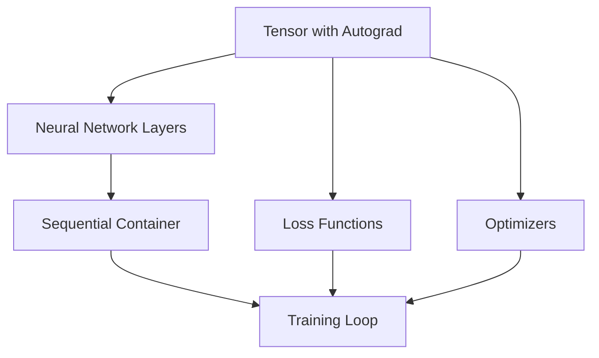
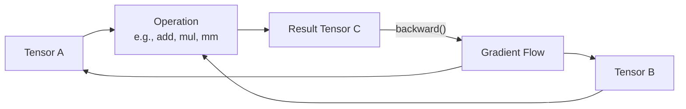
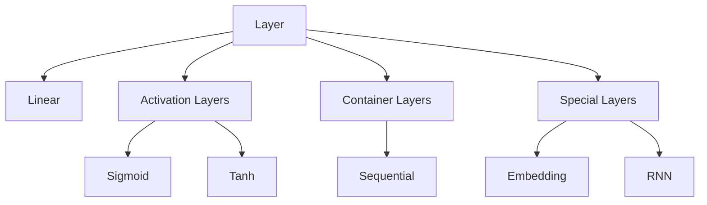
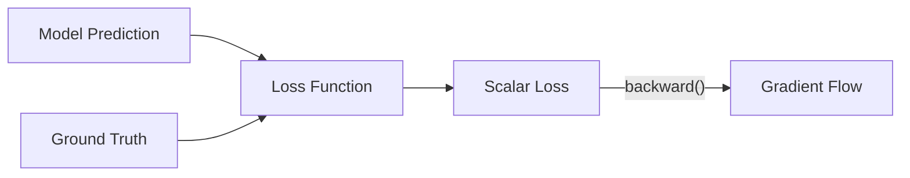
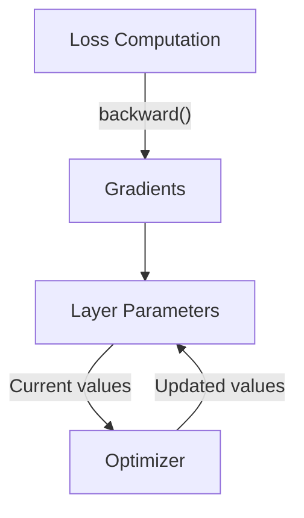
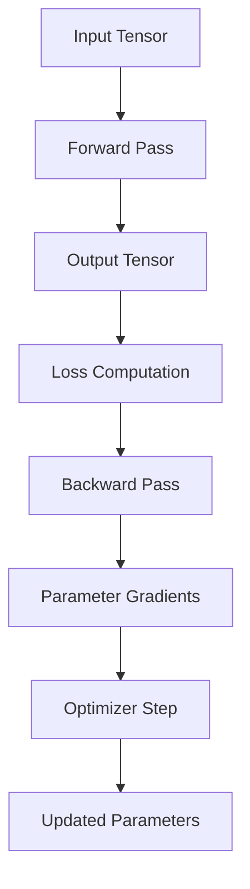
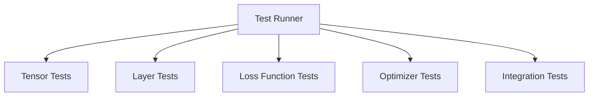

# System Patterns: Deep Learning Framework

## High-Level Architecture

The framework is structured around a core computational unit (Tensor) with additional components built on top. The architecture follows a layered approach with clear separation of concerns:



## Core Architectural Patterns

### 1. Computational Graph

The framework implements a **dynamic computational graph** that:
- Records operations as they are executed
- Tracks data dependencies between operations
- Enables automatic backward gradient propagation

Unlike static graph frameworks (e.g., TensorFlow 1.x), operations are recorded during the forward pass, allowing for dynamic control flow.

### 2. Factory Pattern

Layer constructors serve as factories that produce configurable components:

```python
# Factory pattern - Linear layer constructor creates a configured layer instance
layer = Linear(input_size=10, output_size=5)
```

### 3. Composite Pattern

The `Sequential` container implements the Composite pattern, allowing multiple layers to be treated as a single layer:

```python
model = Sequential([
    Linear(2, 3),
    Sigmoid(),
    Linear(3, 1)
])

# The composite is used the same way as individual layers
output = model.forward(input_tensor)
```

### 4. Template Method Pattern

The base `Layer` class defines a template for how layers should behave, with subclasses implementing specific operations:

```python
class Layer:
    def forward(self, input):
        # To be implemented by subclasses
        pass
        
    def get_parameters(self):
        # Default implementation that subclasses may override
        return []
```

## Key Component Relationships

### Tensor and Autograd

The `Tensor` class is the fundamental building block, implementing:

1. **Operation Recording**: Each operation creates a new Tensor with:
   - Reference to creator Tensors (`creators`)
   - The operation that created it (`creation_op`)
   - Child tracking for backpropagation (`children`)

2. **Backward Pass Implementation**: 
   - Gradient accumulation from multiple paths
   - Chain rule application based on operation type
   - Gradient flow control through the computational graph



### Layer Hierarchy

The layer system follows an inheritance hierarchy:



Each layer implements:
1. `forward()` method for computation
2. `get_parameters()` method to expose learnable parameters

### Loss Functions

Loss functions convert model outputs and targets into a scalar loss value:



### Optimizer Pattern

Optimizers implement the update rule for model parameters:



## Data Flow

The typical data flow through the framework follows this pattern:



## Extension Points

The framework is designed to be extensible at multiple levels:

1. **New Operations**: Add methods to the `Tensor` class, implementing both forward and backward passes
2. **New Layers**: Subclass `Layer` and implement `forward()` and `get_parameters()`
3. **New Loss Functions**: Create classes that compute loss values and gradients
4. **New Optimizers**: Implement parameter update strategies

Each extension must integrate with the autograd system by properly defining gradient computations.

## Testing Architecture

The testing system is organized around component-specific test files:



Each test file verifies:
1. Forward computation correctness
2. Backward gradient computation
3. Integration with other components

## Design Principles

The framework adheres to these principles:

1. **Separation of Concerns**: Each component has a specific responsibility
2. **Composition over Inheritance**: Complex behaviors built by composing simple components
3. **Single Responsibility**: Each class has a clear, focused purpose
4. **Interface Consistency**: Similar components have similar interfaces
5. **Fail Fast**: Error conditions are checked early and reported clearly
