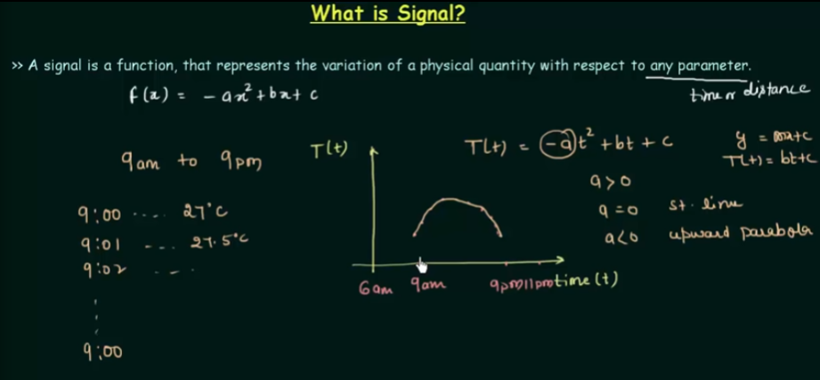
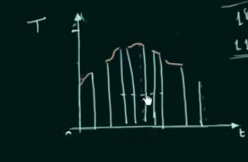

# Signals

## What is Signal

In electrical and electronics usually signal is a 
variation of electrical voltage. 

## Analog signal 

Discrete Time Signal - the signal which is defined for
the discrete intervals of time. It is a subset of analog 
signal

## Digital Signal

    - In digital signals we descritise both time and magnitude
    - We divide the magnitude axis in to fixed number of levels
      and the signal can take value equal to these levels only

