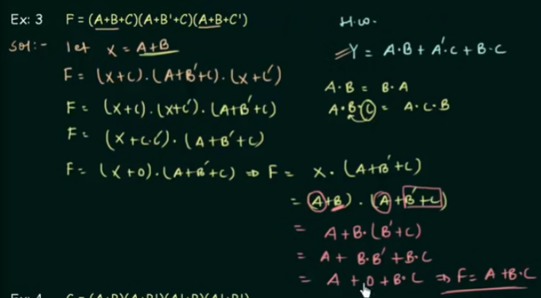

# Boolean Algebra

### AND

### OR

### Priority of rules

1. NOT
2. AND
3. OR

### Distributive law

A * (B + C) = A * B + A * C

A + (B * C) = (A + B) * (A + C)

### Commutative law

(A * B) * C = A * (B * C)

### De Morgans law

