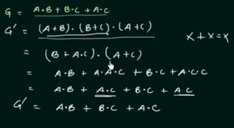

# Positive and Negative Logic

Negative and Positive logic are about how we understand zero value 
of voltage 

e.g. 0 means 1 and -5 means 0 - positive logic
    0 means 0 and -5 means 1 - negative logic

## Dual Form

Positive logic AND gate

Negative logic AND gate

Positive logic OR gate

Negative logic OR gate

Dual Form

## Self Dual

Proof of first law 

Lets make first dual, so we should switch all AND to OR
and all OR to AND, and take variables as it is.

For second law

