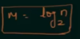
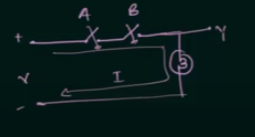
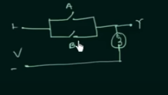
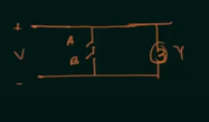
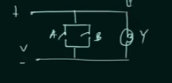
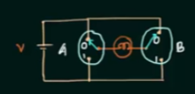

# Switch Circuits

If we have M switches we can implement 2^m combinations

To calculate how many switches we need to implement N combos
we can use such formula

Where are M is our result and N is number of combinations.

## Common operations with sockets

AND 

OR 

NAND

NOR

XOR

