# Kubernetes Install and Your First Pods

## Kubernetes Architecture

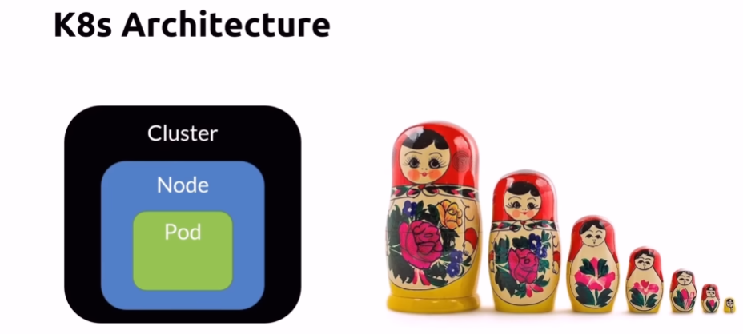

## K8s API

## K8s CLI

## K8s Context

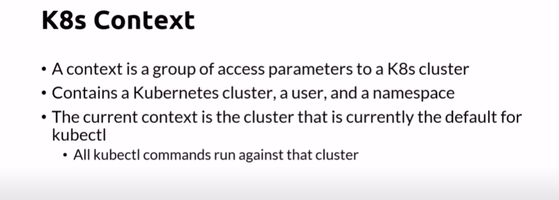

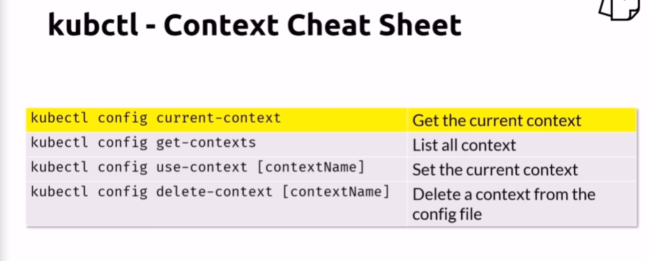

## K8s Nodes

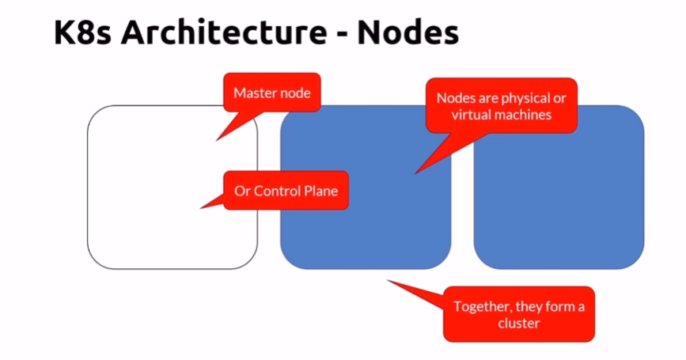

## K8s Pods

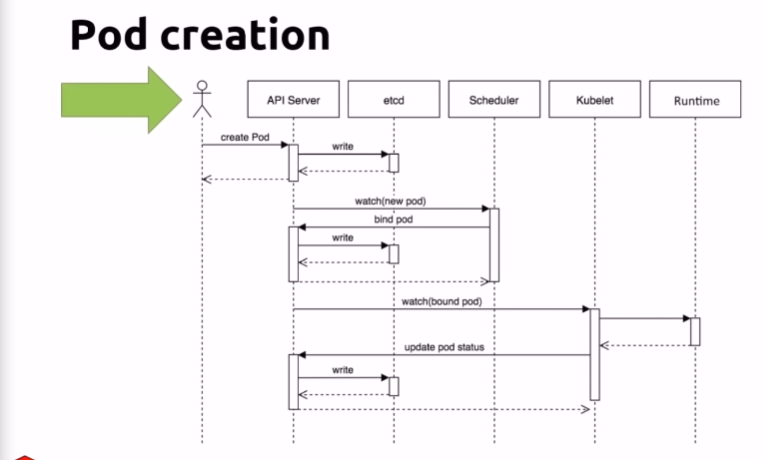

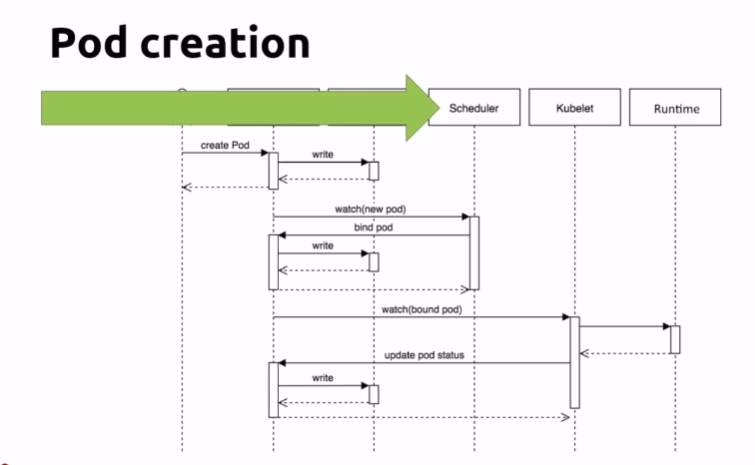

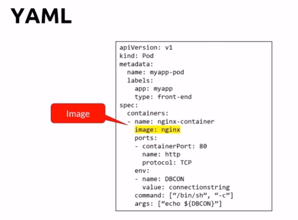

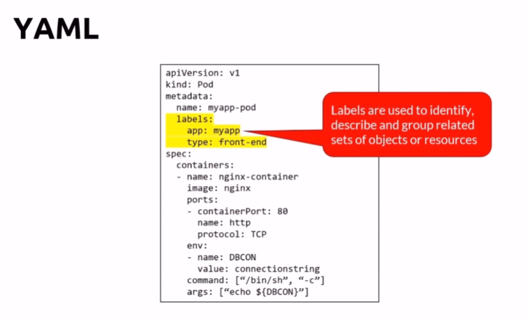

Common commands for pods

Init containers

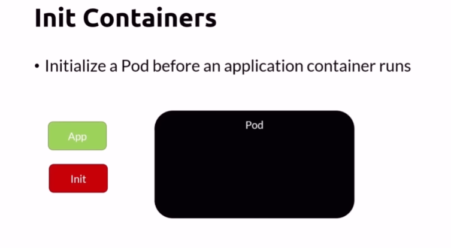

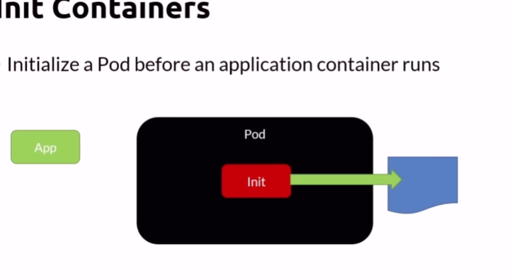

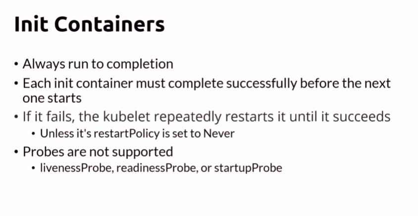

## Labels and Selectors

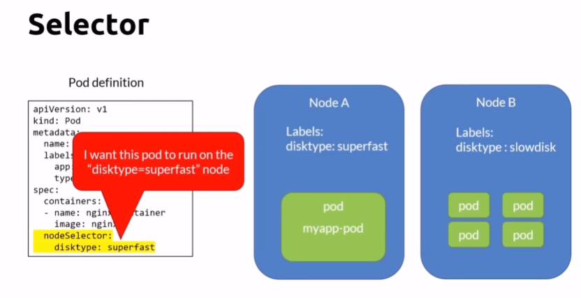

## Multi Container Pods

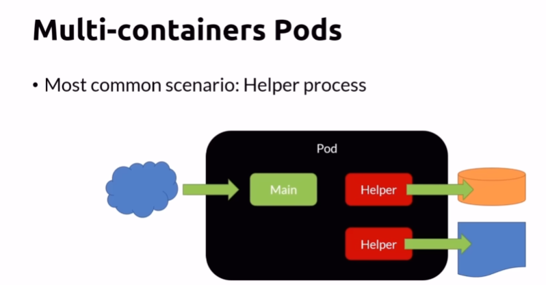

Common Commands 

## Pods networking

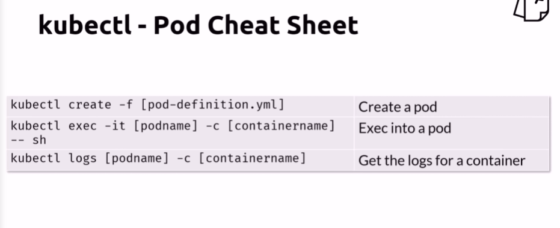

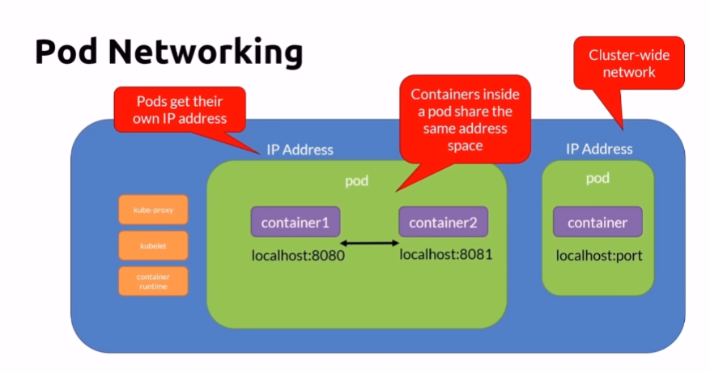

## Kubectl run, create and apply

    kubectl run
    
    kubectl create
    
    kubectl apply

## Our First Pod With Kubectl run

    kubectl version
    
    kubectl run my-nginx --image nginx
    
    kubectl get pods
    
    kubectl get all
    
    kubectl delete deployment my-nginx
    
    kubectl get all

## Scaling ReplicaSets

    kubectl run my-apache --image httpd
    
    kubectl get all
    
    kubectl scale deploy/my-apache --replicas2
    
    kubectl scale deployment my-apache --replicas2
    
    kubectl get all

## Inspecting Kubernetes Objects

    kubectl get pods
    
    kubectl logs deployment/my-apache
    
    kubectl logs deployment/my-apache --follow --tail 1
    
    kubectl logs -l run=my-apache
    
    kubectl get pods
    
    kubectl describe pod/my-apache-<pod id>
    
    kubectl get pods -w
    
    kubectl delete pod/my-apache-<pod id>
    
    kubectl get pods
    
    kubectl delete deployment my-apache
    

 

