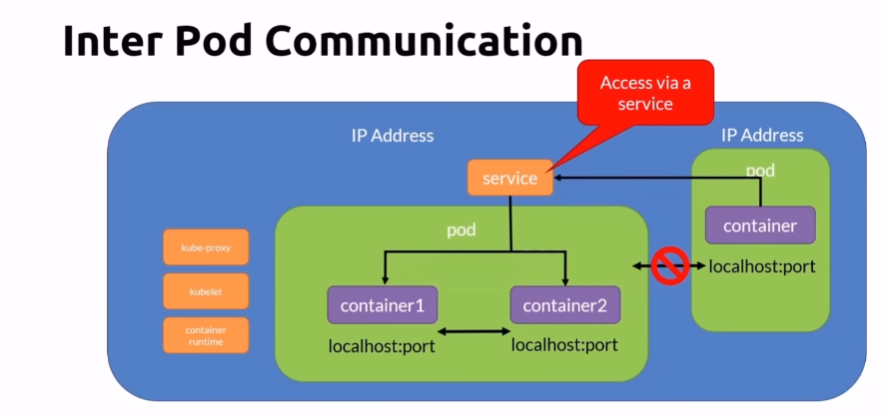
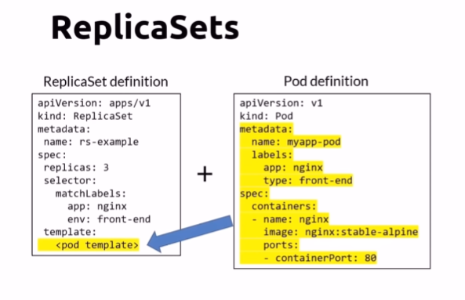
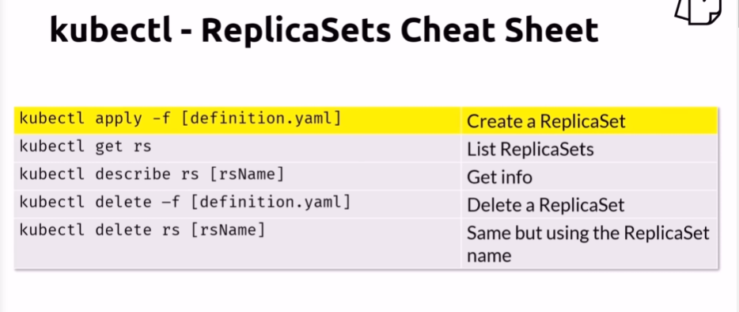
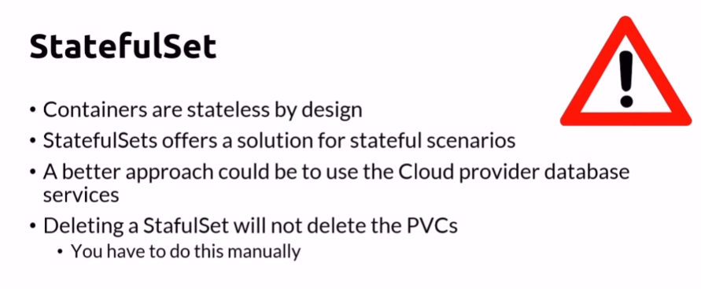
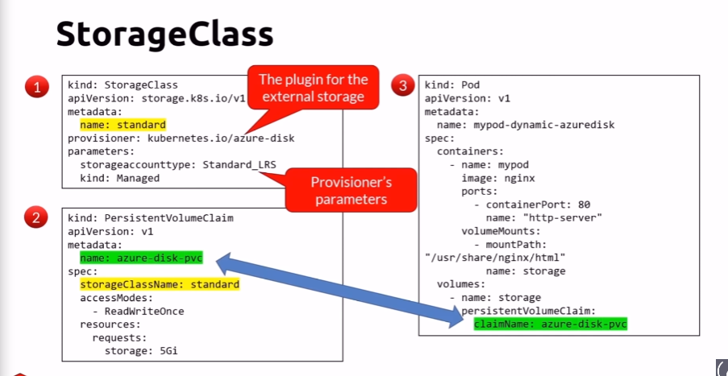
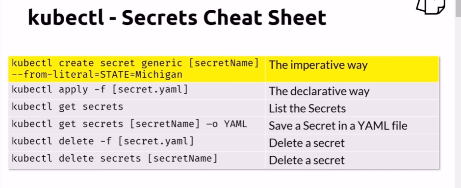

# Kubernetes Install and Your First Pods

## Kubernetes Architecture

## K8s API

## K8s CLI

## K8s Context

## Namespaces

Common namespace commands

## K8s Nodes

## K8s Pods

Common commands for pods

Init containers

## Labels and Selectors

## Multi Container Pods

Common Commands

## Pods networking

## Workloads

## Replica Sets

Commands

Deployment commands

## Daemon Set

## Stateful sets

## Job

## CronJob

## Rolling Updates

## Services

## ClusterIP

## NodePort

## Storage and Persistence

## Configuration and Application Settings

## Secrets

## Pod Crash and Probes

## Dashboard

## Scaling

