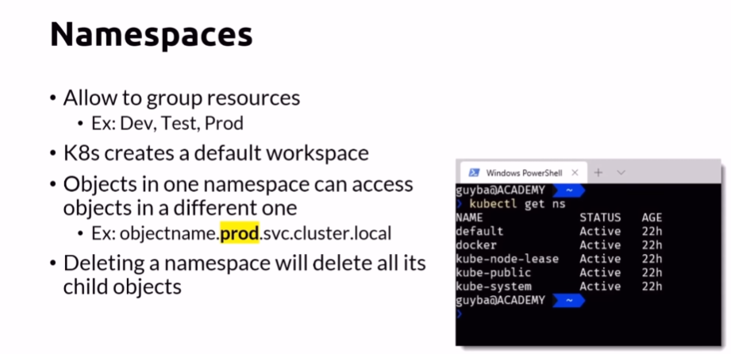
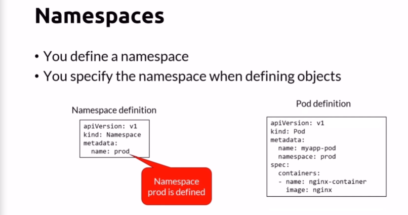
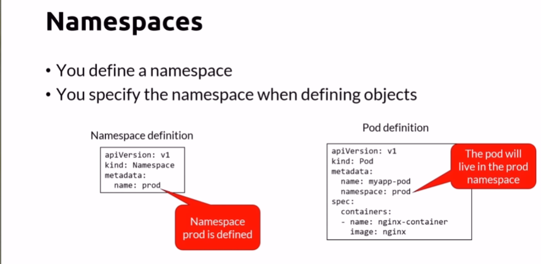
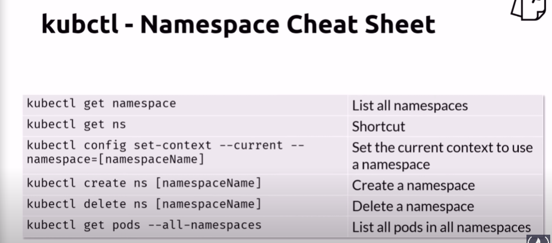

# Kubernetes Management Techniques

## Namespaces 

Common namespace commands

## Run, Expose and Create Generators

    kubectl create deployment sample --image nginx --dry-run -o yaml

    kubectl create deployment test --image nginx --dry-run

    kubectl create deployment test --image nginx --dry-run -o yaml

    kubectl create job test --image nginx -dry-run -o yaml

    kubectl expose deployment/test --port 80 --dry-run -o -yaml

    kubectl create deployment test --image nginx

    kubectl expose deployment/test --port 80 --dry-run -o -yaml

    kubectl delete deployment test

## The Future of Kubectl Run

    kubectl run test --image nginx --dry-run
    
    kubectl run test --image nginx --port 80 --expose --dry-run
    
    kubectl run test --image nginx --restart OnFailure --dry-run
    
    kubectl run test --image nginx --restart Never --dry-run
    
    kubectl run test --image nginx --scheduled "*/1 * * * *" --dry-run

## Imperative vs. Declarative

    kubectl apply -f my-resources.yaml
    
    kubectl run

