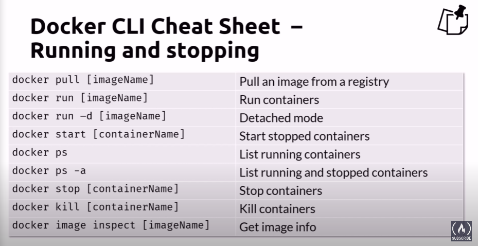
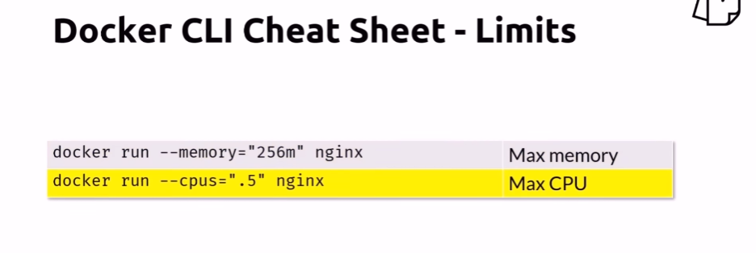
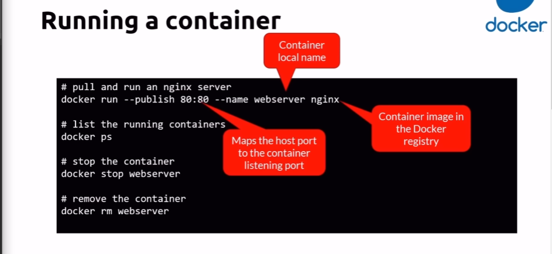
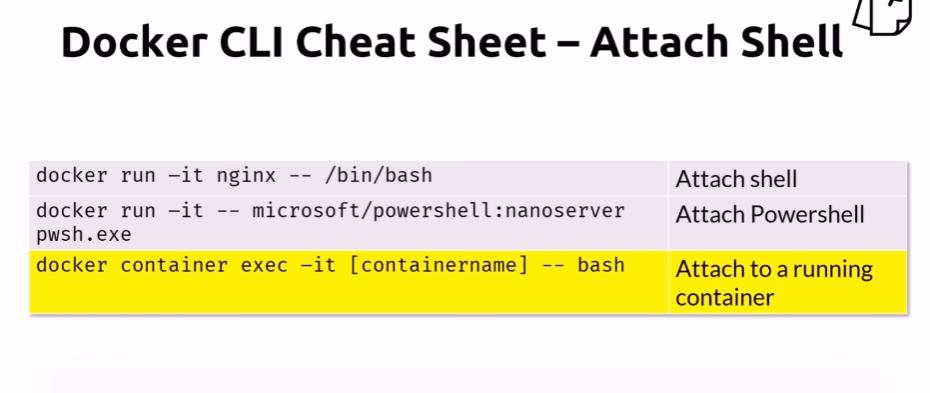
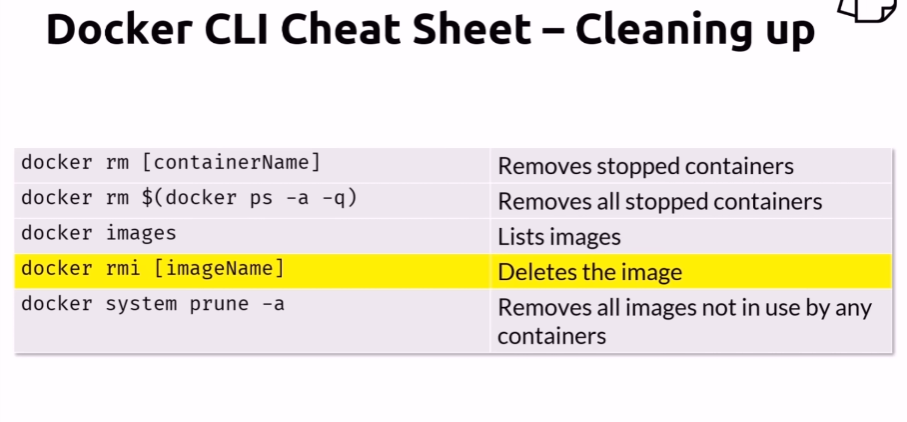

# Creating and Using Containers Like a Boss

## Basic Docker CLI commands

Add memory and CPU limits for container 

Command structure example

Another useful commands

## Check Our Docker Install and Config

    docker version
    
    docker info
    
    docker
    
    docker container run
    
    docker run

## Starting and working with a Nginx Web Server

    docker container run --publish 80:80 nginx
    
    // --detach command allows us to execute another commands in cmd
    // while container running in background

    docker container run --publish 80:80 --detach nginx 
    
    docker container ls
    
    docker container stop 690
    
    docker container ls
    
    docker container ls -a
    
    docker container run --publish 80:80 --detach --name webhost nginx
    
    docker container ls -a
    
    docker container logs webhost
    
    docker container top
    
    docker container top webhost
    
    docker container --help
    
    docker container ls -a
    
    docker container rm 63f 690 ode
    
    docker container ls
    
    docker container rm -f 63f
    
    docker container ls -a

## Container VS. VM: It's Just a Process

    docker run --name mongo -d mongo
    
    docker ps
    
    docker top mongo
    
    docker stop mongo
    
    docker ps
    
    docker top mongo
    
    docker start mongo
    
    docker ps
    
    docker top mongo

## Assignment Answers: Manage Multiple Containers

    docker container run -d -p 3306:3306 --name db -e MYSQL_RANDOM_ROOT_PASSWORD=yes mysql
    
    docker container logs db
    
    docker container run -d --name webserver -p 8080:80 httpd
    
    docker ps
    
    docker container run -d --name proxy -p 80:80 nginx
    
    docker ps
    
    docker container ls
    
    docker container stop
    
    docker ps -a
    
    docker container ls -a
    
    docker container rm
    
    docker ps -a
    
    docker image ls

## What's Going On In Containers: CLI Process Monitoring

    docker container run -d --name nginx nginx
    
    docker container run -d --name mysql -e MYSQL_RANDOM_ROOT_PASSWORD=true mysql
    
    docker container ls
    
    docker container top mysql
    
    docker container top nginx
    
    docker container inspect mysql
    
    docker container stats --help
    
    docker container stats
    
    docker container ls

## Getting a Shell Inside Containers: No Need for SSH

    docker container run -help
    
    docker container run -it --name proxy nginx bash
    
    docker container ls
    
    docker container ls -a
    
    docker container run -it --name ubuntu ubuntu
    
    docker container ls
    
    docker container ls -a
    
    docker container start --help
    
    docker container start -ai ubuntu
    
    docker container exec --help
    
    docker container exec -it mysql bash
    
    docker container ls
    
    docker pull alpine
    
    docker image ls
    
    docker container run -it alpine bash
    
    docker container run -it alpine sh

## Docker Networks: Concepts for Private and Public Comms in Containers

    docker container run -p 80:80 --name webhost -d nginx
    
    docker container port webhost
    
    docker container inspect --format '{{ .NetworkSettings.IPAddress }}' webhost

## Docker Networks: CLI Management of Virtual Networks

    docker network ls
    
    docker network inspect bridge
    
    docker network ls
    
    docker network create my_app_net
    
    docker network ls
    
    docker network create --help
    
    docker container run -d --name new_nginx --network my_app_net nginx
    
    docker network inspect my_app_net
    
    docker network --help
    
    docker network connect
    
    docker container inspect
    
    docker container disconnect
    
    docker container inspect

## Docker Networks: DNS and How Containers Find Each Other

    docker container ls
    
    docker network inspect
    
    docker container run -d --name my_nginx --network my_app_net nginx
    
    docker container inspect
    
    docker container exec -it my_nginx ping new_nginx
    
    docker container exec -it new_nginx ping my_nginx
    
    docker network ls
    
    docker container create --help

## Assignment Answers: Using Containers for CLI Testing

    docker container run --rm -it centos:7 bash
    
    docker ps -a
    
    docker container run --rm -it ubuntu:14.04 bash
    
    docker ps -a

## Assignment Answers: DNS Round Robin Testing

    docker network create dude
    
    docker container run -d --net dude --net-alias search elasticsearch:2
    
    docker container ls
    
    docker container run --rm -- net dude alpine nslookup search
    
    docker container run --rm --net dude centos curl -s search:9200
    
    docker container ls
    
    docker container rm -f

