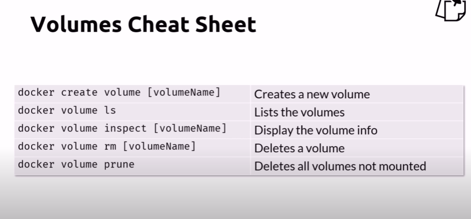
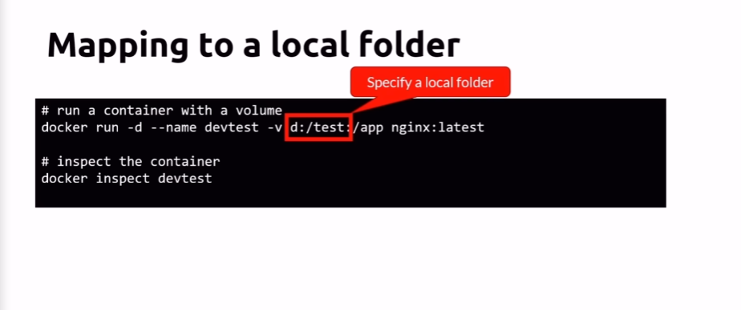

# Container Lifetime & Persistent Data: Volumes, Volumes, Volumes

## Common Volumes Commands

Mapping a Volume to container

## Persistent Data: Data Volumes

    docker pull mysql
    
    docker image inspect mysql
    
    docker container run -d --name mysql -e MYSQL_ALLOW_EMPTY_PASSWORD=True mysql
    
    docker container ls
    
    docker container inspect mysql
    
    docker volume ls
    
    docker volume inspect TAB COMPLETION
    
    docker container run -d --name2 mysql -e MYSQL_ALLOW_EMPTY_PASSWORD=True mysql
    
    docker volume ls
    
    docker container stop mysql
    
    docker container stop mysql2
    
    docker container ls
    
    docker container ls -a
    
    docker volume ls
    
    docker container rm mysql mysql2
    
    docker volume ls
    
    docker container run -d --name mysql -e MYSQL_ALLOW_EMPTY_PASSWORD=True -v mysql-db:/var/lib/mysql mysql
    
    docker volume ls
    
    docker volume inspect mysql-db
    
    docker container rm -f mysql
    
    docker container run -d --name mysql3 -e MYSQL_ALLOW_EMPTY_PASSWORD=True -v mysql-db:/var/lib/mysql mysql
    
    docker volume ls
    
    docker container inspect mysql3
    
    docker volume create --help

## Persistent Data: Bind Mounting

    cd dockerfile-sample-2
    
    pcat Dockerfile
    
    docker container run -d --name nginx -p 80:80 -v $(pwd):/usr/share/nginx/html nginx
    
    docker container run -d --name nginx2 -p 8080:80 nginx
    
    docker container exec -it nginx bash

## Assignment Answers: Edit Code Running In Containers With Bind Mounts

    docker run -p 80:4000 -v $(pwd):/site bretfisher/jekyll-serve
