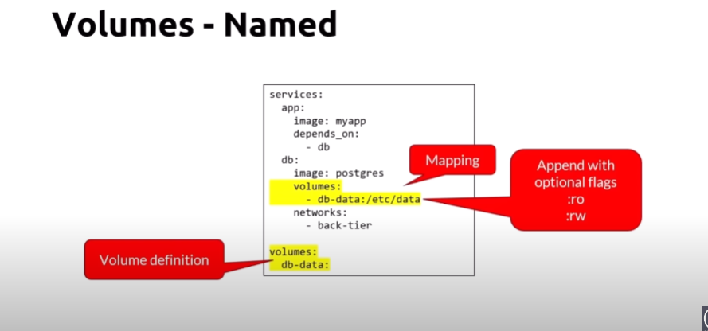

# Making It Easier with Docker Compose: The Multi-Container Tool

## YAML file structure

## Compose file structure

## Specify resources limit and env vars

## Networking

## Volumes

## Restart policies

## Common compose commands

IN DOCKER COMPOSE V2 we write commands in different way
instead "docker-compose" write "docker compose"

Example 

## Docker Compose and The Docker-compose.yml File

    docker-compose.yml
    
    https://docs.docker.com

## Trying Out Basic Compose Commands

    pcat docker-compose.yml
    
    docker-compose up
    
    docker-compose up -d
    
    docker-compose logs
    
    docker-compose --help
    
    docker-compose ps
    
    docker-compose top
    
    docker-compose down

## Assignment Answers: Build a Compose File for a Multi-Container Service

    docker-compose.yml
    
    docker pull drupal
    
    docker image inspect drupal
    
    docker-compose up
    
    https://hub.docker.com
    
    docker-compose down --help
    
    docker-compose down -v

## Adding Image Building to Compose Files

    docker-compose.yml
    
    docker-compose up
    
    docker-compose up --build
    
    docker-compose down
    
    docker image ls
    
    docker-compose down --help
    
    docker image rm nginx-custom
    
    docker image ls
    
    docker-compose up -d
    
    docker image ls
    
    docker-compose down --help
    
    docker-compose down --rmi local

## Assignment Answers: Compose for Run-Time Image Building and Multi-Container Dev

    docker-compose up

    docker-compose down

    docker-compose up

