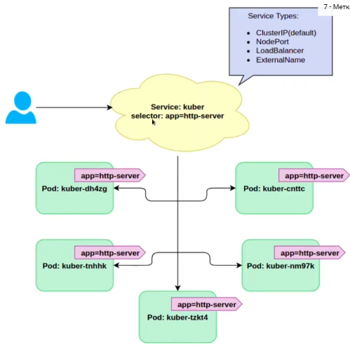
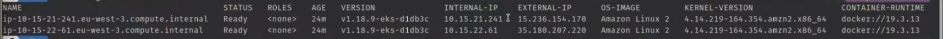
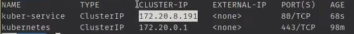
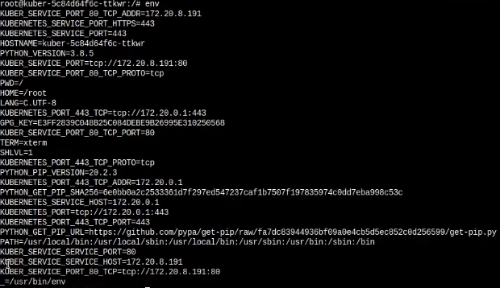
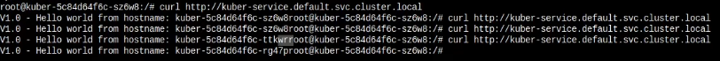
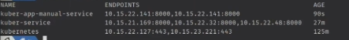

# Service в Kubernetes - Часть 1. Type: ClusterIP. Endpoints

Service - объект Kubernetes который создается, для того чтобы создать единую постоянную точку входа для группы подов
представляющих одно и то же приложение. Сервис находит поды на основе селектора меток.



Есть 4 типа сервисов:

- ClusterIP(default)
- NodePort
- LoadBalancer
- ExternalName

### ClusterIP

Сервисы этого типа не имеют внешнего ИП, а только кластерный, это потому что они предназначены не для использования
извне, а для взаимодействия внутри кластера.

И так у нас есть две ноды



Теперь создадим деплоймент

```yaml
apiVersion: apps/v1
kind: Deployment
metadata:
  name: kuber
  labels:
    app: kuber
spec:
  replicas: 3
  minReadySeconds: 5
  strategy:
    rollingUpdate:
      maxSurge: 1
      maxUnavailable: 1
    type: RollingUpdate
  selector:
    matchLabels:
      app: http-server
  template:
    metadata:
      labels:
        app: http-server
    spec:
      containers:
        - name: kuber-app
          image: bokovets/kuber:v1.0
          ports:
            - containerPort: 8000

```

    kubectl apply -f kuber-deployment.yaml

Создадим сервис

```yaml
apiVersion: v1
kind: Service
metadata:
  name: kuber-service # Имя сервиса
spec:
  selector:
    app: http-server # Селектор меток
  ports:
    - protocol: TCP
      port: 80 # Порт сервиса 
      targetPort: 8000 # Порт приложения 
  type: ClusterIP # Тип сервиса ClusterIP
```

Запустим сервис

    kubectl apply -f clusterip-service.yaml

Посмотрим список запущенных сервисов и ИП

    kubectl get svc



Запросить сервис можно зайдя в один из контейнеров кластера и выполнив команду

    curl http://172.20.9.191

Создадим более сложный yaml файл используя для указания целевого порта не номер, а имя

```yaml
apiVersion: v1
kind: Pod
metadata:
  name: kuber-app-manual
  labels:
    app: web-server
spec:
  containers:
    - name: kuber-app-image
      image: bokovets/kuber:v2.0
      ports:
        - name: http # Создаем именованные порты у объекта Pod
          containerPort: 8000
        - name: https
          containerPort: 8000
---
apiVersion: v1
kind: Service
metadata:
  name: kuber-app-manual-service
spec:
  selector:
    app: web-server
  ports:
    - name: http
      port: 80
      targetPort: http # Обращаемся к порту не по номеру, а по имени. 
      # Таким образом поменяв порт в поде нам не придется идти в сервис и менять его там. 
    - name: https
      port: 443
      targetPort: https
```

Запустим новый файл

    kubectl apply -f pod-service-port-names.yaml

Исследуем подробнее любой из наших подов открыв его env файл



В самом низу мы видим три переменные которые были добавлены используя имя пода и информацию о портах

А сейчас попробуем обратиться к сервису не напрямую по ИП, а используя ДНС

Для этого зайдя в любой из подов надо выполнить команду curl

    curl http://kuber-service.default.svc.cluster.local
                ^              ^
         используем не IP, а  через точку указываем
         имя сервиса          неймспейс в ктором он запущен



Каждый сервис хранит у себя список IP адресов подов которые в нем зарегистрированы, этот список можно посмотреть
выполнив команду.

    kubectl get endpoints



Но ендпоинты можно зарегистрировать и в ручную для этого создадим следующий файл с сервисом и при регистрированным к
нему списком ендпоинтов. Руками мы обычно так не делаем, эту работу за нас выполняет Kubernetes. 

```yaml
apiVersion: v1
kind: Service
metadata:
  name: endpoints-service
spec:
  ports:
  - port: 80
---
apiVersion: v1
kind: Endpoints # Испльзуем объект ендпоинт
metadata:
  name: endpoints-service # Имя совпадает с именем сервиса
subsets:
  - addresses: # Список адресов внутри кластера
    - ip: 10.75.21.169
    - ip: 10.75.22.141
    ports:
    - port: 8000
```

