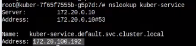
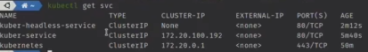
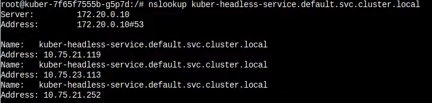
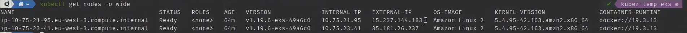
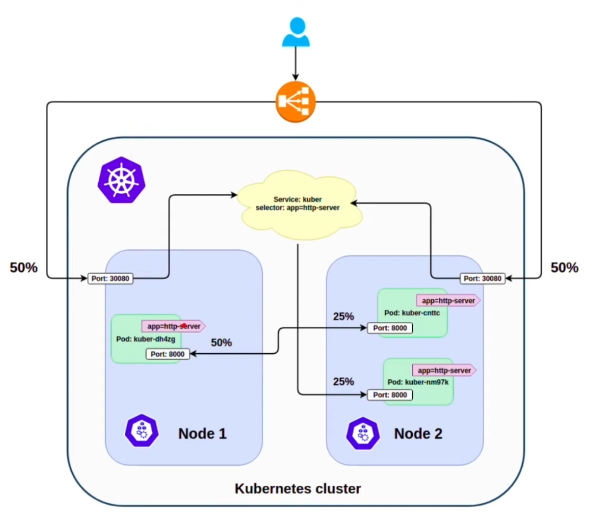

# Service в Kubernetes - Часть 2. ExternalName, NodePort и LoadBalancer. Headless Service

Создадим заново наш сервис

    kubectl apply -f clusterip-service.yaml

## Headless Service

Смысл такого сервиса в том, чтобы стучаться сразу во все поды, выданную после балансировки нагрузки сервисом.

Создадим следующий сервис

```yaml
apiVersion: v1
kind: Service
metadata:
  name: kuber-headless-service
spec:
  clusterIP: None # Явно указываем None. То есть у такого сервиса не будет clusterIP
  selector:
    app: http-server # Сервис обслуживает те же поды что и наш старый сервис
  ports:
    - protocol: TCP
      port: 80
      targetPort: 8000
  type: ClusterIP
```

Установим на один из подов пакет nslookup и посмотрим какой IP резолвится по умолчанию

    nslookup kuber-service



Это адрес нашего первого сервиса.

Запустим Headless Service

    kubectl apply -f headless-clusterip-service.yaml

И посмотрим список сервисов

    kubectl get svc 



Достучаться к такому сервису через ДНС нельзя, но можно в поде выполнить команду

    nslookup kuber-headless-service.default.svc.cluster.local



И как видим нам вернется сразу три пода которые зарегистрированы в этом сервисе, это удобно если у нас есть например
стороння программа которой нужен доступ сразу ко всем подам.

## External Name

Такой сервис служит псевдонимом какого-то внешнего ресурся, например БД. Это позволяет подключаться к такому ресурсу
используя ДНС имя сервиса.

```yaml
apiVersion: v1
kind: Service
metadata:
  name: external-service
spec:
  type: ExternalName
  externalName: example.com # Ресурс к которому подключаемся
```

Создадим службу

    kubectl apply -f externalname-service.yaml

## NodePort

Сервис такого типа ведет себя похожим на ClusterIP образом, но позволяет получать к себе доступ из вне кластера.

```yaml
apiVersion: v1
kind: Service
metadata:
  name: kuber-service-nodeport
spec:
  externalTrafficPolicy: Local
  # sessionAffinity: ClientIP #
  selector:
    app: http-server
  ports:
    - protocol: TCP
      port: 80
      targetPort: 8000
      nodePort: 30080 # port-range: 30000-32767
  type: NodePort

  ### sessionAffinity - заставит перенаправлять все запросы на один и тот же модуль.
  #                     А не на случайно выбранный балансировкой нагрузки. Сервис 
  #                     запомнит наш IP и будет перенаправлять запросы с него на один 
  #                     и тот же под.
```

Запустим его

    kubectl apply -f nodeport-service.yaml

И посмотрим информацию. Видим что у нас доступен EXTERNAL-IP. Данный кластер хостится на амазоне поэтому такое название
ОС.



Теперь можно в браузер вставить строку и увидеть ответ приложения

    http://15.237.144.183:30080

## LoadBalancer

Сервис этого типа можно использовать только если наш Кубернетс хостится на облачном провайдере, локально его не создать
в нашем случае используется Амазон.

Создадим такой сервис

```yaml
apiVersion: v1
kind: Service
metadata:
  name: kuber-service-lb
spec:
  selector:
    app: http-server
  ports:
    - protocol: TCP
      port: 80
      targetPort: 8000
  type: LoadBalancer
```

Запустим его

    kubectl apply -f lb-service.yaml

В нашем случае Амазоном был выдан External Endpoint для сервиса, этот ендпоинт доступен из вне. Сам сервис по сути
является улучшенным NodePort, и предоставляет ту же балансировку нагрузки.



