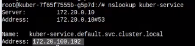
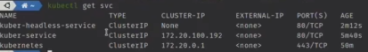
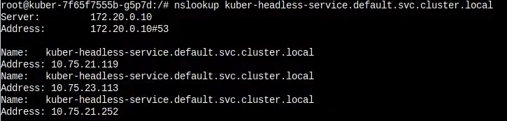

# Service в Kubernetes - Часть 2. ExternalName, NodePort и LoadBalancer. Headless Service

Создадим заново наш сервис

    kubectl apply -f clusterip-service.yaml

## Headless Service

Смысл такого сервиса в том, чтобы стучаться сразу во все поды, выданную после балансировки нагрузки сервисом.

Создадим следующий сервис

```yaml
apiVersion: v1
kind: Service
metadata:
  name: kuber-headless-service
spec:
  clusterIP: None # Явно указываем None. То есть у такого сервиса не будет clusterIP
  selector:
    app: http-server # Сервис обслуживает те же поды что и наш старый сервис
  ports:
    - protocol: TCP
      port: 80
      targetPort: 8000
  type: ClusterIP
```

Установим на один из подов пакет nslookup и посмотрим какой IP резолвится по умолчанию

    nslookup kuber-service



Это адрес нашего первого сервиса.

Запустим Headless Service

    kubectl apply -f headless-clusterip-service.yaml

И посмотрим список сервисов

    kubectl get svc 



Достучаться к такому сервису через ДНС нельзя, но можно в поде выполнить команду

    nslookup kuber-headless-service.default.svc.cluster.local



И как видим нам вернется сразу три пода которые зарегистрированы в этом сервисе, это удобно если у нас есть например
стороння программа которой нужен доступ сразу ко всем подам.

## External Name
