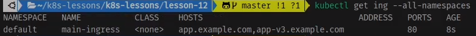
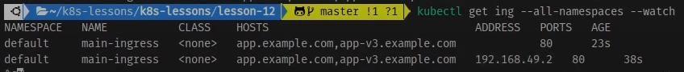
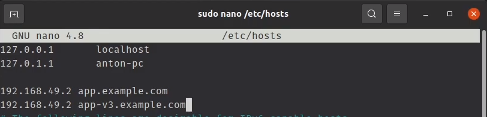

# Ingress в Kubernetes. Создание Ingress на Minikube

Ingress - это такой специальный Load balancer для Load Balancer-ов, он работает на 7 уровне OSI модели - HTTP, в отличие
от стандартного балансировщика нагрузки который использует 4 уровень - Транспортный. Что позволяет ему использовать
такие
возможности как сохранение сессии, куки, для своей работы Ингресс требует кластер с ингресс контроллером. В нашем случае
мы будем использовать minikube

Для начала включим ingress аддон в миникуб

    minikube addons list - просмотр всех возможных аддонов

    minikube addons enable ingress - включаем ингресс

Теперь попрактикуемся с ингресс. В файлах "deploy-svc-app-(latest, v1, v2, v3)" мы создали несколько деплойментов -
запустим их.

    kubectl apply -f deploy-svc-app-latest.yaml -f deploy-svc-app-v1.yaml -f deploy-svc-app-v1.yaml -f deploy-svc-app-v1.yaml

Теперь создадим ингресс объект

```yaml
apiVersion: networking.k8s.io/v1
kind: Ingress # Тип
metadata:
  name: main-ingress # Имя сервиса
spec:
  rules: # Спецификация содержащая список хостов то есть 
   - host: app.example.com # Все запросы приходящие на этот хост 
     http: # по протоколу хттп 
        paths: # где путь начинается со 
          - pathType: Prefix 
            path: / # слеша
            backend:
              service:
                name: kuber-service # будут перенаправляться на сервис с таким именем.
                port: 
                  number: 80
          - pathType: Prefix
            path: /v1 # Если путь начинается с v1 то перенаправятся сюда.
            backend:
              service:
                name: kuber-service-v1
                port: 
                  number: 80
          - pathType: Exact # Если будет точно соответствовать v2 то сюда.
            path: /v2
            backend:
              service:
                name: kuber-service-v2
                port: 
                  number: 80
   - host: app-v3.example.com # Аналогично но для другого хоста.
     http:
        paths:
          - pathType: Exact
            path: /
            backend:
              service:
                name: kuber-service-v3
                port: 
                  number: 80
```

Запустим сервис 

    kubectl apply -f ingress.yaml

Посмотрим все ингресс контроллеры во всех пространствах имен 

    kubectl get ing --all-namespaces --watch



Как видим тут указан список хостов которые обслуживает данный контроллер. Если подождать еще немного, то появится так же 
и ИП адрес куда можно слать запросы.



P.S. Но если мы просто введем в браузер что-то вроде http://app-v3.example.com то ничего не получим так как такое имя не 
зарегистрировано в глобальном ДНС, оно есть только у нас поэтому надо отредактировать файл /etc/hosts/ дописав в него 
ИП адрес и имя хоста. 




