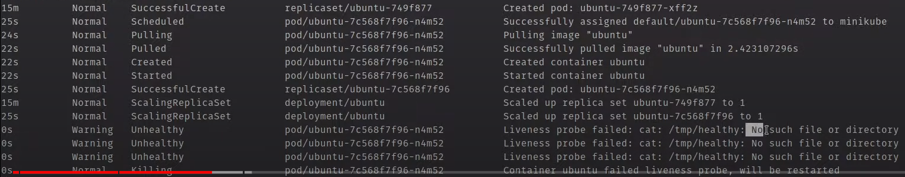

# Liveness и Readiness Probes в Kubernetes

## Liveness Probes

Это специальная проверка которую можно указать для каждого контейнера, она будет периодически проверять жив ли он и
перезапускать при необходимости. Всего существует три типа проверок:

- http get
- tcp
- exec

Для начала запустим деплоймент и сервис для него

```yaml
apiVersion: apps/v1
kind: Deployment
metadata:
  name: kuber-default
  labels:
    app: kuber
spec:
  replicas: 1
  selector:
    matchLabels:
      app: http-server-default
  template:
    metadata:
      labels:
        app: http-server-default
    spec:
      containers:
        - name: kuber-app
          image: bakavets/kuber:v1.0
          ports:
            - containerPort: 8000
---
apiVersion: v1
kind: Service
metadata:
  name: kuber-default-service
spec:
  selector:
    app: http-server-default
  ports:
    - protocol: TCP
      port: 80
      targetPort: 8000
      nodePort: 30001
  type: NodePort
```

    kubectl apply -f kuber-deploy.yaml

### Liveness Probe типа exec

Создадим нужный файл. В данном сценарии мы запустим контейнер с убунту, создадим в нем файл, и удалим его через
некоторое время, а проверка на то жив ли контейнер будет заключаться в проверке есть ли файл в контейнере.

```yaml
apiVersion: apps/v1
kind: Deployment
metadata:
  name: ubuntu
  labels:
    app: ubuntu
spec:
  replicas: 1
  selector:
    matchLabels:
      app: ubuntu
  template:
    metadata:
      labels:
        app: ubuntu
    spec:
      containers: # В качестве контейнера поднимем базовый экземпляр Ubuntu
        - name: ubuntu
          image: ubuntu
          args: # Аргументы подробнее будут рассмотрены позже. Но вкратце мы создадим файл с именем healthy, затем  
            - /bin/sh # удалим его после таймаута в 30 сек и поставим еще один таймаут на 600 сек.
            - -c
            - touch /tmp/healthy; sleep 30; rm -rf /tmp/healthy; sleep 600
          livenessProbe: # Описываем нашу пробу и что она должна сделать
            exec: # тип пробы exec. Выполняет команду exec внутри контейнера и смотрит на возвращаемое ей значение (0 - успешно, остальное - нет). 
              command: # выполняем команду cat, для того чтобы проверить существует ли файл.
                - cat
                - /tmp/healthy
            initialDelaySeconds: 5 # Defaults to 0 seconds. Minimum value is 0.
            periodSeconds: 5 # Default to 10 seconds. Minimum value is 1.
            timeoutSeconds: 1 # Defaults to 1 second. Minimum value is 1.
            successThreshold: 1 # Defaults to 1. Must be 1 for liveness and startup Probes. Minimum value is 1.
            failureThreshold: 3 # Defaults to 3. Minimum value is 1.
```

Запустим файл и выполним команду для просмотра происходящих в контейнере событий

    kubectl apply -f kuber-deploy-livenessProbe-exec.yaml

    kubectl get events --watch



Как видим проба обнаруживает отсутствие файла и перезапускает контейнер.

### Liveness Probe типа TCP

