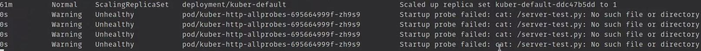

# StartupProbe и httpHeaders для httpGet в Kubernetes

## Startup Probe

Нужна для взаимодействия со сторонними приложениями которым требуется дополнительное время для запуска. Сами механизмы
пробы схожи с двумя предыдущими. Как только такая проба возвращает успех, включаются все остальные пробы.

Создадим файл используя все три пробы

```yaml
apiVersion: apps/v1
kind: Deployment
metadata:
  name: kuber-http-allprobes
  labels:
    app: kuber
spec:
  replicas: 1
  selector:
    matchLabels:
      app: kuber-http-allprobes
  template:
    metadata:
      labels:
        app: kuber-http-allprobes
    spec:
      containers:
        - name: kuber-app
          image: bakavets/kuber:v1.0
          ports:
            - containerPort: 8000
          startupProbe: # Startup Probe. 
            exec: # Используем exec тип для проверки существует ли файл server-test.py
              command:
                - cat
                - /server.py
            initialDelaySeconds: 10
            periodSeconds: 10
            failureThreshold: 30 # (30 * 10) + 10 = 310 sec. Суммарное время на запуск приложения.
            # (failureThreshold * periodSeconds) + initialDelaySeconds
          readinessProbe:
            httpGet:
              path: /
              port: 8000
            initialDelaySeconds: 10
            periodSeconds: 5
          livenessProbe:
            exec:
              command:
                - cat
                - /server-test.py
            failureThreshold: 1
            periodSeconds: 10
---
apiVersion: v1
kind: Service
metadata:
  name: kuber-http-allprobes-service
spec:
  selector:
    app: kuber-http-allprobes
  ports:
    - protocol: TCP
      port: 80
      targetPort: 8000
      nodePort: 30004
  type: NodePort
```

Запустим деплоймент

    kubectl apply -f kuber-deploy-all-Probes-http.yaml

Посмотрим список происходящих ивентов

    kubectl get events --watch



Как видим Стартап проба в начале сообщает что приложение еще не запустилось, но когда нужный файл появляется от нее
просто перестают приходить ответы что означает - приложение запустилось успешно.

## HTTP Headers для Get запроса из проб

Для начала запустим новый деплоймент

    kubectl apply -f kuber-deploy-livenessProbe-http-with-host-headers.yaml

В этом файле стоит обратить внимание на небольшое изменение в liveness пробе

```yaml
 livenessProbe:
   httpGet:
     path: /
     httpHeaders: # http headers которые будут посылаться на определенный адрес.
       - name: Host
         value: kuber-healthy.example.com
     port: 80
   # initialDelaySeconds: 5
```

HTTP заголовки позволяют приложению которое получит такой запрос более тонко его обработать. Например если заголовка
нет, то можно считать что это не healthcheck запрос, и т.д.

