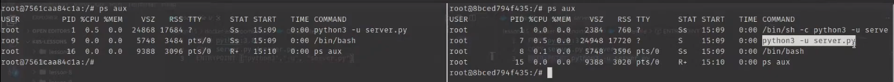
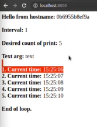

# Переопределение CMD и ENTRYPOINT Docker иструкций, используя Kubernetes

Существует две формы задания Dockerfile первая - exec, вторая - shell. Они обе приведены в папках.

Соберем наши файлы из директорий entrypoint-exec, entrypoint-shell перейдя в каждую из них и выполнив команду.

Exec

```dockerfile
FROM python:3.8.5
COPY server.py /server.py
ENTRYPOINT ["python3","-u", "server.py"]
```

Shell

```dockerfile
FROM python:3.8.5
COPY server.py /server.py
ENTRYPOINT python3 -u server.py
```

    docker build -t kuber:entrypoint-[exec | shell] .

Теперь запустим для них контейнеры

    docker run -d -p 1111:8000 kuber:entrypoint-shell

    docker run -d -p 2222:8000 kuber:entrypoint-exec

Теперь перейдем в каждый из контейнеров выполнив exec. И посмотрим какие процессы у них запущены Выполнив команду.

    ps aux



Если обратить внимание на первый процесс списке в обеих консолях, и команду, которая была им передана, то можно заметить
что для shell процесса который справа сначала вызывается консоль, а затем уже запускается файл с приложением, тогда как
в exec приложении файл запускается сразу. Таким образом при создании образов в shell стиле будет запущенна shell которая
сможет перехватывать разные команды. Если сделать docker file в exec стиле то эти команды будут попадать напрямую в
приложение и оно само будет решать что с ними делать, такой способ предпочтительнее.

Теперь после того как мы все запустили посмотрим в файл server.py для каждого из типов, там находится простой сервер на
Python. Модифицируем его так, чтобы при запуске он мог принимать аргументы командной строки и создадим новый dockerfile
в директории docker, где передадим нашему приложению некоторые аргументы.

P.S. Если что смысл приложения просто в том чтобы несколько раз напечатать текущее время.

```dockerfile
FROM python:3.8.5
COPY server.py /server.py
COPY server-default.py /server-default.py
ENTRYPOINT ["python3","-u", "server.py"]
CMD ["1","5","text"]

# ENTRYPOINT - определяет файл используемый при запуске. 
# CMD - определяет аргументы которые требуется передать по умолчанию.
```

Соберем наше приложение прейдя в директорию docker

    docker build -t bakavets/kuber:v1.0-args .

Запустим его

    docker run -d -p 8000:8000 bakavets/kuber:v1.0-args

И перейдем на локальный адресс на порт 8000



## Переопределение CMD и ENTRYPOINT параметров по умолчанию

Теперь попробуем переопределить инструкции командной строки в локальных докер файлах используя для этого файл
kuber-deploy.yaml.

```yaml
apiVersion: apps/v1
kind: Deployment
metadata:
  name: kuber-args
  labels:
    app: kuber
spec:
  replicas: 1
  selector:
    matchLabels:
      app: http-server-args
  template:
    metadata:
      labels:
        app: http-server-args
    spec:
      containers:
      - name: kuber-app
        image: bakavets/kuber:v1.0-args
        args: ["3", "2", "text-temp"] # args эквивалентны CMD инструкции и будет ее переопределять
        command: ["python3", "-u", "server-default.py"] # command - эквивалент ENTRYPOINT
        ports:
        - containerPort: 8000
---
apiVersion: v1
kind: Service
metadata:
  name: kuber-args-service
spec:
  selector:
    app: http-server-args
  ports:
    - protocol: TCP
      port: 80
      targetPort: 8000
      nodePort: 30001
  type: NodePort
```

Применим изменения

    kubectl apply -f kuber-deploy.yaml
