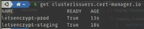

# Настройка HTTPS для web-app в Kubernetes. NGINX Ingress и cert manager. Let's Encrypt

Для начала нам понадобится публичное доменное имя которое можно купить например на Амазон, в нашем случае это имя "
bakavets.com".

Перейдем в выделенную на Амазоне машину с настроенным пустым кластером

Запустим два деплоймента каждый из которых содержит две разные версии одного приложения deploy-svc-app-1.yaml,
deploy-svc-app-2.yaml

    kubectl apply -f deploy-svc-app-1.yaml

    kubectl apply -f deploy-svc-app-2.yaml

## Настройка NGINX Ingress Controller

Является самым универсальным ингресс контроллером и устанавливается на большинство провайдеров. Установим его в наш
кластер чтобы затем настроить при под наши нужды.

    kubectl apply -f https://raw.githubusercontent.com/kubernetes/ingress-nginx/controller-v0.46.0/deploy/static/provider/aws/deploy.yaml

Посмотрим список сервисов который создался контроллером

    kubectl get svc -n ingress-nginx


Как видим был создан LoadBalancer с адресом по которому мы будем обращаться к нему.

Теперь задеплоим настроенный Ingress контроллер для двух наших деплойментов

```yaml
apiVersion: networking.k8s.io/v1
kind: Ingress
metadata:
  name: main-ingress
  annotations:
    kubernetes.io/ingress.class: nginx
    cert-manager.io/cluster-issuer: "letsencrypt-prod" # Имя сервиса ClusterIssuer который создается ниже. 
spec:
  tls:
    - hosts:
        - app-1.bakavets.com
        - app-2.bakavets.com
      secretName: app-tls # Имя файла где хранятся HTTPS наши сертификаты
  rules:
    - host: app-1.bakavets.com # Сабдомен app-1.bakavets.com относится к первому приложению 
      http:
        paths:
          - pathType: Prefix
            path: /
            backend:
              service:
                name: kuber-service-1
                port:
                  number: 80
    - host: app-2.bakavets.com # Сабдомен app-2.bakavets.com относится к второму приложению
      http:
        paths:
          - pathType: Prefix
            path: /
            backend:
              service:
                name: kuber-service-2
                port:
                  number: 80
```

    kubectl apply -f ingress.yaml

Сейчас мы уже можем обращаться к нашему контроллеру и через него к приложениям, попробуем сделать базовый curl на них


И как видим мы получаем ответ от первой версии приложения.

И то же самое для второй версии


Теперь попробуем выяснить IP адрес принадлежащий этому LoadBalancer при помощи команды nslookup. Стоит учесть что
например в Amazon есть такое понятие как Availability Zones и на самом деле ип адресов у LoadBalancer будет столько
сколько есть зон в которых ему дозволено работать, если выполнять команду nslookup несколько раз то рано, или поздно мы
увидим все ip адреса.

    nslookup a9966ee6ed24a49b295675ca5662547c-66fb027b46e6c4c3.elb.eu-north-1.amazonaws.com


Дальше перейдем в настройки нашего хостинга и добавим DNS запись типа А указав ей значение IP адреса балансировщика и
домен app-1 (итоговый адрес будет app-1.bakavets.com, bakavets.com добавится автоматически так как это само доменное
имя) для первого приложения и еще одну запись с доменом app-2 для второго.


Зайдя в браузер мы можем получить доступ к нашему приложению просто из интеренета


## Настройка HTTPS сертификата

cert-manager - нативный Kubernetes менеджер сертификатов. Он будет обращаться к Certificate Authority и получать
сертификат, а так же автоматические его обновлять.


Установим его

    kubectl apply -f https://github.com/jetstack/cert-manager/releases/download/v1.3.1/cert-manager.yaml

Подробную документацию по нему стоит читать на сайте cert-manager, нам же сейчас надо будет создать специальный объект
Issuer. Его спецификация описана в файлах prod_ClusterIssuer и staging_ClusterIssuer. Разница в том что вариант staging
использует staging сервер для получения ключа, такой ключ не является валидным и используется просто для того чтобы
проверить что вы все правильно настроили и все работает.

```yaml
apiVersion: cert-manager.io/v1
kind: ClusterIssuer
metadata:
  name: letsencrypt-prod
spec:
  acme:
    # You must replace this email address with your own.
    # Let's Encrypt will use this to contact you about expiring
    # certificates, and issues related to your account.
    email: aldoran.ua@gmail.com
    server: https://acme-v02.api.letsencrypt.org/directory
    privateKeySecretRef:
      # Secret resource that will be used to store the ACME account's private key.
      name: letsencrypt-prod-private-key
    # Add a single challenge solver, HTTP01 using nginx
    solvers:
      - http01:
          ingress:
            class: nginx
```

    kubectl apply -f staging_ClusterIssuer.yaml

    kubectl apply -f prod_ClusterIssuer.yaml

Посмотрим все ли запутсилось 

    k get clusterissuers.cert-manager.io



Полная схема получения и использования сертификата (https://youtu.be/8ULmDxTzAVQ?list=PL3SzV1_k2H1VDePbSWUqERqlBXIk02wCQ&t=832)

