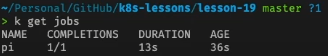

# Использование Jobs в Kubernetes

Джобы нужны для выполнения некоторой задачи результат которой нужно отследить. Джоба создает под, выполняет некоторую
операцию и сообщает о ее успешном исполнении после чего удаляет под. Джоба запустит новый под если старый завалился, или
был удален. Еще джобы хороши для выполнения каких-то задач внутри кластера, например для запуска CI/CD, и прочего.

Пример простой джобы считающей число пи до 2000 знаков после запятой, ее выполнение займет около 10 минут

```yaml
apiVersion: batch/v1
kind: Job
metadata:
  name: pi
spec:
  template:
    spec:
      containers:
        - name: pi
          image: perl
          command: [ "perl",  "-Mbignum=bpi", "-wle", "print bpi(2000)" ]
      restartPolicy: Never
```

И так для начала подготовим простой миникуб кластер

    minikube start

Запустим джобу

    kubectl apply -f 0-job.yaml

Теперь можно запросить список джобов и там должна появиться наша джоба

    kubectl get jobs



## Политики запуска кода в джобе

- OnFailure - если произошла ошибка то пода удалится автоматически
- Never - (создаст backoffLimit + 1 поду) поды не будут удаляться, это неплохой вариант чтобы затем подебажить их и
  узнать что было не так

У джоб по умолчанию установлен параметр backoffLimit равный 6, это количество попыток выполнить джобу при неудаче.

Пример джобы с ошибкой

```yaml
apiVersion: batch/v1
kind: Job
metadata:
  name: job-with-restartpolicy-onfailure
spec:
  backoffLimit: 3
  template:
    spec:
      containers:
        - name: job-with-failure
          image: busybox
          command: [ "/bin/sh", "-c" ]
          args: [ "echo 'Running Job'; sleep 5; exit 1" ]
      restartPolicy: OnFailure
```

Так же есть возможность запускать несколько джоб одну за другой добавив параметр completions

```yaml
apiVersion: batch/v1
kind: Job
metadata:
  name: pi-completions
spec:
  completions: 3 # Запустить джобу 3 раза
  backoffLimit: 4
  template:
    spec:
      containers:
        - name: pi
          image: perl
          command: [ "perl",  "-Mbignum=bpi", "-wle", "print bpi(2000)" ]
      restartPolicy: Never
```

Либо же наоборот параллельно при помощи параметра parallelism

```yaml
apiVersion: batch/v1
kind: Job
metadata:
  name: pi-parallelism
spec:
  parallelism: 2 # Запуск джобов паралельно. 
  backoffLimit: 4
  template:
    spec:
      containers:
        - name: pi
          image: perl
          command: [ "perl",  "-Mbignum=bpi", "-wle", "print bpi(2000)" ]
      restartPolicy: OnFailure
```

Parallelism и completion можно комбинировать

```yaml
apiVersion: batch/v1
kind: Job
metadata:
  name: pi-parallelism-completions
spec:
  parallelism: 3
  completions: 7
  backoffLimit: 4
  template:
    spec:
      containers:
        - name: pi
          image: perl
          command: [ "perl",  "-Mbignum=bpi", "-wle", "print bpi(2000)" ]
      restartPolicy: Never
```

Так же джобам можно устанавливать таймаут на выполнение при помощи activeDeadlineSeconds, в это время включаются так же
попытки на повторное выполнение джобы.

```yaml
apiVersion: batch/v1
kind: Job
metadata:
  name: job-with-failure
spec:
  backoffLimit: 4
  activeDeadlineSeconds: 50 # Общее количество времени для выполнения джобы
  template:
    spec:
      containers:
        - name: job-with-failure
          image: busybox
          command: [ "/bin/sh", "-c" ]
          args: [ "echo 'Running Job'; sleep 5; exit 1" ]
      restartPolicy: Never
```

Еще один таймаут это ttlSecondsAfterFinished, устанавливает сколько, будет существовать джоба после выполнения, неважно
успешного, или нет, а затем удалена.

```yaml
apiVersion: batch/v1
kind: Job
metadata:
  name: pi-with-ttl
spec:
  ttlSecondsAfterFinished: 30
  template:
    spec:
      containers:
      - name: pi
        image: perl
        command: ["perl",  "-Mbignum=bpi", "-wle", "print bpi(2000)"]
      restartPolicy: Never
```

