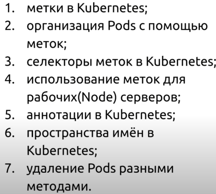
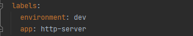
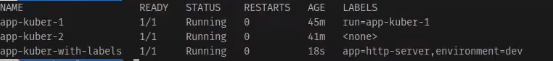
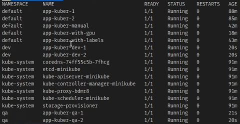

# Метки, аннотации и пространства имён в Kubernetes

## Метки

Создадим наш под добавив в файл метки для того чтобы более грамотно организовать модули и другие объекты Kubernetes.
Которые затем выбираются селектором Каждый ключ должен быть уникален в рамках объекта

    kubectl create -f kuber-pod-with-labels.yaml

Посмотрим список всех подов и их лейблы

    kubectl get po --show-labels

Отфильтруем только нужные нам метки

    kubectl get po -L app,environment

Фильтр по значению метки

    kubectl get po -L app=http-server

    kubectl get po -L app=http-server,environment!=dev

Добавим Метку для миникуб кластера

    kubectl label node minikube gpu=true

### Селекторы и организация Pods при помощи меток

Назначим под на ноду у которой метка gpu=true. Для этого добавим в файл kuber-pod-with-gpu.yaml следующий селектор. Селектор
отвечает за то, чтобы найти узел с подходящей меткой.

И применим его

    kubectl apply -f kuber-pod-with-gpu.yaml

## Аннотации

Представляют собой пару ключ значение и используются для добавления служебной информации модулю, а не для организации
модулей как например метки, селектора аннотаций не существует.

Добавим аннотацию к одной из под

    kubectl annotate pod app-kuber-1 company-name/creator-email="test@gmail.com"

## Пространства имен

Пространства имен используются для более глобальной организации ресурсов. Ресурсы должны быть уникальны в рамках одного
пространства имен. Получим список пространства имен

    kubectl get ns

Создадим свое собственное пространство имен в файле "namespace.yaml" и применим его

    kubectl apply -f namespace.yaml

Либо напрямую через консоль

    kubectl create namespace qa

Теперь создадим несколько подов распределив их между этими пространствами имен

    kubectl apply -f dev-qa-apps.yaml

И посмотрим результат. Как мы видим в пространствах имен dev и qa появились новые поды

Попробуем удалить поды на основе селекторов меток

    kubectl delete po -l app=app-kuber-1

Удалим пространство имен, таким образом все поды в нем будут так же удалены

    kubectl delete ns qa

