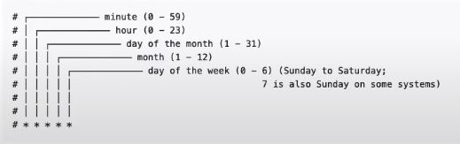

# Использование CronJobs в Kubernetes

В прошлом уроке мы создавали джобы вручную, но обычно их используют не так, а создают периодически и запускают по
определенному графику. Для этого есть существует специальный объект Kubernetes CronJob. Свое время CronJob объект
определяет по времени kube-controller-manager.

Пример простой крон джобы которая будет запускаться каждую минуту, и синтаксиса для задания времени



```yaml
apiVersion: batch/v1beta1 # Версия CronJob
kind: CronJob
metadata:
  name: hello
spec:
  schedule: "*/1 * * * *" # Шаблон для запуска джобы
  jobTemplate:
    spec: # Остальные настройки такие же как и для обычной джобы
      backoffLimit: 4
      activeDeadlineSeconds: 240
      parallelism: 2
      completions: 3
      template:
        spec:
          containers:
            - name: hello
              image: busybox
              imagePullPolicy: IfNotPresent
              command:
                - /bin/sh
                - -c
                - date; echo Hello from the Kubernetes cluster
          restartPolicy: OnFailure
```

Запустим CronJob на кластере

    kubectl apply -f 0-cronjob.yaml

## CronJob concurrency Policy

Может принимать три значения:

- Allow - позволяет запускать следующую джобу через запланированное время даже если предыдущая не закончила работу.
- Forbid - если предыдущая Джоба еще не закончилась, то CronJob пропустит запуск новой задачи и попробует в следующем
  подходящем интервале.
- Replace - если предыдущая задача не успела завершиться, то CronJob остановит ее и заменит новой.

```yaml
apiVersion: batch/v1beta1
kind: CronJob
metadata:
  name: hello-allow
spec:
  schedule: "*/1 * * * *"
  concurrencyPolicy: Allow # Forbid, Replace
  jobTemplate:
    spec:
      template:
        spec:
          containers:
            - name: hello
              image: busybox
              args:
                - /bin/sh
                - -c
                - date; echo "Hello World!"; sleep 140 # Специально задерживаем выполнение джобы больше чем на минуту.
          restartPolicy: OnFailure
```

## successfulJobsHistoryLimit, failedJobsHistoryLimit

Эти параметры задают сколько последних успешных, или не успешных Джобов сохранять.

Создадим контейнер который случайным образом заканчивается либо успешно, либо нет. Запуская эту Джобу несколько раз мы
увидим что в истории будут сохраняться только последние 2 успешные, и последние две неудачные джобы.

```yaml
apiVersion: batch/v1beta1
kind: CronJob
metadata:
  name: hello-suspend
spec:
  schedule: "*/1 * * * *"
  concurrencyPolicy: Allow
  successfulJobsHistoryLimit: 2
  failedJobsHistoryLimit: 2
  suspend: false
  jobTemplate:
    spec:
      backoffLimit: 1
      template:
        spec:
          containers:
            - name: hello
              image: busybox
              args:
                - /bin/sh
                - -c
                - date; echo "Hello World!"; exit $((RANDOM%2)) # Рандомизатор успеха
          restartPolicy: OnFailure
```

## startingDeadlineSeconds

Этот параметр задает время в течении которого джобу можно запустить если она пропустила свой дедлайн

Пример

```yaml
apiVersion: batch/v1beta1
kind: CronJob
metadata:
  name: cronjon-startingdeadlineseconds
spec:
  schedule: "*/5 * * * *" # 1. Ставим запуск каждые 5 минут
  startingDeadlineSeconds: 60 #  2. Разрешаем запуск в течении 60 секунд после пропуска дедлайна
  concurrencyPolicy: Forbid
  jobTemplate:
    spec:
      template:
        spec:
          containers:
            - name: hello
              image: busybox
              args:
                - /bin/sh
                - -c
                - date; echo "Hello World!"; sleep 340 # 3. Делаем задержку завершения джобы больше чем на 5 минут.
          restartPolicy: Never
```

Стоит учитывать что если количество пропущенных таймаутов превысит 100 то мы получим ошибку "Set or decrease
.spec.startingDeadlineSeconds or check clock skew".

Вот пример такой джобы

```yaml
apiVersion: batch/v1beta1
kind: CronJob
metadata:
  name: hello-startingdeadlineseconds
spec:
  schedule: "*/1 * * * *"
  startingDeadlineSeconds: 8200
  concurrencyPolicy: Forbid
  jobTemplate:
    spec:
      backoffLimit: 1
      template:
        spec:
          containers:
            - name: hello
              image: busybox
              args:
                - /bin/sh
                - -c
                - date; echo "Hello World!"; sleep 8000
          restartPolicy: Never
```
