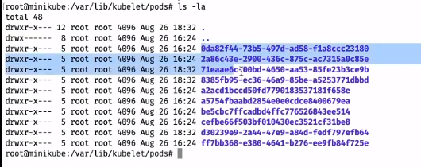
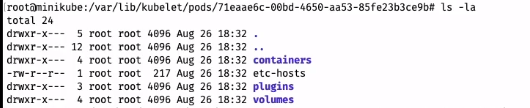
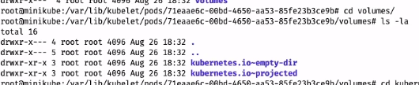

# Volumes в Kubernetes - Часть 1. Сравнение Docker storage driver: overlay2 и volume: emptyDir

Volumes предназначены для сохранения информации между созданиями и удалениями контейнеров, тоесть удалив, или пересоздав
сам под мы так же очистим volume. Создадим простой volume типа emptyDir.

В этом деплойменте поднимем два контейнера к которым привяжем volume типа emptyDir

- emptyDir volume - является самым простым типом volume выделит определенную директорию на ноде куда и будет записывать
  данные с контейнеров.

```yaml
apiVersion: apps/v1
kind: Deployment
metadata:
  name: kuber
  labels:
    app: kuber
spec:
  replicas: 3
  selector:
    matchLabels:
      app: http-server
  template:
    metadata:
      labels:
        app: http-server
    spec:
      containers:
        - name: kuber-app-1
          image: bakavets/kuber
          ports:
            - containerPort: 8000
          volumeMounts: # Volume первого контейнера 
            - mountPath: /cache-1 # Путь где он будет располагаться
              name: cache-volume # Имя, должно совпадать с одним из имен в секции volumes
        - name: nginx
          image: nginx
          ports:
            - containerPort: 80
          volumeMounts: # Создаем volume 
            - mountPath: /cache-2 # Путь где он будет располагаться
              name: cache-volume # Задаем имя volume должно совпадать с одним из имен в секции volumes
              subPath: data # говорит о том что маунтить надо не в рут директорию, а в эту, то есть путь будет /data/cache-2
      volumes:
        - name: cache-volume # Объявляем Volume задавая ему имя
          emptyDir: { } # и тип emptyDir.
```

Применим деплоймент

    kubectl apply -f 0-deploy-kuber.yaml

Теперь посмотрим где же на надо храниться этот emptyDir, для этого на ноде надо перейти по пути

    cd ~/var/lib/kublet/pods/

и затем выполнив команду для просмотра директорий

    ls -la 

мы увидим вот такой вывод с папками чье название совпадает с uuid запущенных подов



взяв ид третьего пода в списке мы можем перейти его в директорию при помощи команды

    cd [uuid] 

затем просмотрим список директорий

    ls -la 



перейдем в volumes и просмотрим директории в ней



как видим там есть наш emptyDir

## WARN

Не стоит указывать в качестве директории для сохранения папку с данными, так как Kubernetes перед сохранением очищает
указанную директорию.

## Часть 2

### hostPath volume

Предназначены для сохранения информации между удалениями, или перезапусками подов. hostPath маунтит папку из ноды в Под.
Этот тип volume не рекомендуется к использованию без особой нужны на то.

Пример использования такого volume

```yaml
apiVersion: v1
kind: Pod
metadata:
  name: test-pd
spec:
  containers:
    - image: bakavets/kuber
      name: test-container
      volumeMounts:
        - mountPath: /test-pd # Путь в контейнере
          name: test-volume # Имя
  volumes:
    - name: test-volume
      hostPath:
        # directory location on host
        path: /data
        # this field is optional
        type: Directory # Позволяет контролировать существует ли нужная 
        # директория, или надо ее создать и некоторые 
        # другие опции. Подробнее смотреть в доках. 
```

Задеплоим под

    kubectl apply -f 3-hostPath-volume.yaml

### awsElasticBlockStore

Другой способ сохранить данные между перезапусками пода. Он маунтит Amazon Web Service EBS volume в Под, под этот тип
volume существуют некоторые ограничения (например, что нода должна быть запущенна на машине EC2 и парочка других), здесь
лучше почитать документацию.

Вот небольшой пример использования такого volume

```yaml
apiVersion: v1
kind: Pod
metadata:
  name: http-server
spec:
  containers:
    - image: bakavets/kuber
      name: http-server
      volumeMounts:
        - mountPath: /cache
          name: aws-volume
  volumes:
    - name: aws-volume
      # This AWS EBS volume must already exist.
      awsElasticBlockStore:
        volumeID: "vol-0111111111111"
        fsType: ext4
```
