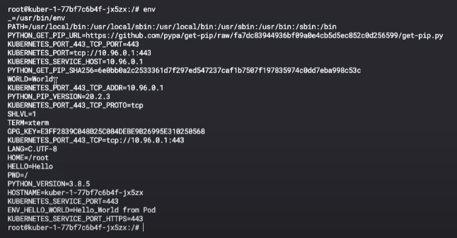
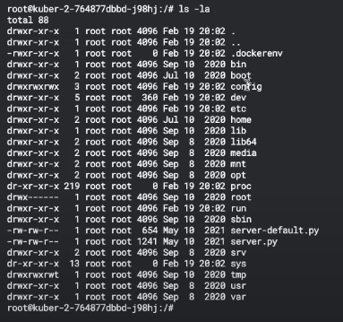

# Использование ConfigMap и переменных окружения в Kubernetes

ConfigMap это объект Kubernetes который позволяет хранить не секретные данные в виде пар ключ-значение.

Для начала запустим minikube кластер

    minikube start 

Теперь рассмотрим как мы, можем определять переменные окружения на примере простого деплоймента

```yaml
apiVersion: apps/v1
kind: Deployment
metadata:
  name: kuber-1
  labels:
    app: kuber-1
spec:
  replicas: 1
  selector:
    matchLabels:
      app: http-server-1
  template:
    metadata:
      labels:
        app: http-server-1
    spec:
      containers:
        - name: kuber-app
          image: bakavets/kuber:v1.0
          ports:
            - containerPort: 8000
          env: # Переменный окружения. 
            - name: HELLO
              value: "Hello"
            - name: WORLD
              value: "World"
            - name: ENV_HELLO_WORLD # Эта переменна я является комбинацией двух предыдущих
              value: "$(HELLO)_$(WORLD) from Pod"
```

Запустим это деплоймент, так как в папке всего один файл можно не указывать его в команде запуска.

    kubectl apply -f exemple-1

Перейдем внутрь пода и выполним команду "env"



Внизу мы увидим наши переменные окружения.

Теперь рассмотрим деплоймент из папки "example-2/kuber-deploy.yaml" здесь мы используем env переменные в качестве
аргументов которые будут переданы приложению.

```yaml
apiVersion: apps/v1
kind: Deployment
metadata:
  name: kuber-args
  labels:
    app: kuber
spec:
  replicas: 1
  selector:
    matchLabels:
      app: http-server-args
  template:
    metadata:
      labels:
        app: http-server-args
    spec:
      containers:
        - name: kuber-app
          image: bakavets/kuber:v1.0-args
          args: [ "$(INTERVAL)","$(COUNT)","$(TEXT_ARG)" ] # Передаем переменные окружения
          ports:
            - containerPort: 8000
          env:
            - name: INTERVAL
              value: "3"
            - name: COUNT
              value: "4"
            - name: TEXT_ARG
              value: "Interval = $(INTERVAL). Desired count of print = $(COUNT)."
```

Теперь попробуем использовать ConfigMap

```yaml
apiVersion: v1
kind: ConfigMap
metadata:
  name: demo-cm
data: # Указываем наши ключи и значения они аналогичны деплойменту выше 
  # property-like keys; each key maps to a simple value
  interval: "5"
  count: "3"
  # file-like keys
  properties: |
    Hello from World!
    This is demo config!
    As an example.
  config.ini: "This is demo config!"
```

Применим его

    kubectl apply -f example-3/cm.yaml

И рассмотрим деплоймент в котором будем его использовать

```yaml
apiVersion: apps/v1
kind: Deployment
metadata:
  name: kuber-2
  labels:
    app: kuber-2
spec:
  replicas: 1
  selector:
    matchLabels:
      app: http-server-2
  template:
    metadata:
      labels:
        app: http-server-2
    spec:
      containers:
        - name: kuber-app
          image: bakavets/kuber:v1.0-args
          args: [ "$(INTERVAL)","$(COUNT)","$(TEXT_ARG)" ]
          ports:
            - containerPort: 8000
          env: # Теперь значения будут браться из ConfigMap
            - name: INTERVAL # Имя переменной внутри приложения
              valueFrom:
                configMapKeyRef:
                  name: demo-cm # Имя ConfigMap 
                  key: interval # ключ 
            - name: COUNT
              valueFrom:
                configMapKeyRef:
                  name: demo-cm
                  key: count
            - name: TEXT_ARG
              valueFrom:
                configMapKeyRef:
                  name: demo-cm
                  key: properties
          volumeMounts: # Создаем volume  
            - name: config # c именем config
              mountPath: "/config" # который будет маунтиться в директорию /config
              readOnly: true
      volumes:
        - name: config
          # Ниже мы делаем следующее: пробрасываем в качестве файлов внутрь пода
          # некоторые ключи из ConfigMap. Этот пример это никак не использует но
          # сама возможность есть.
          configMap:
            # Provide the name of the ConfigMap you want to mount.
            name: demo-cm
            # An array of keys from the ConfigMap to create as files
            items:
              - key: "properties"
                path: "properties"
              - key: "config.ini"
                path: "config.ini"
```

Задеплоим это все

    kubectl apply -f example-3/deploy.yaml

Теперь если перейти внутрь докера и выполнить

    ls -la



Мы увидим папку конфиг в которой будет два файла внутри которых хранятся значения из ConfigMap

И рассмотрим еще один вариант использования на этот раз мы будем использовать ConfigMap не в Deployment а в Поде.

```yaml
apiVersion: v1
kind: Pod
metadata:
  name: demo-pod
spec:
  containers:
    - name: container
      image: busybox
      command: [ "/bin/sh", "-c", "echo Interval = $(INTERVAL). Desired count of print = $(COUNT). Text: $(TEXT_ARG)" ]
      env:
        - name: INTERVAL
          valueFrom:
            configMapKeyRef:
              name: demo-cm
              key: interval
        - name: COUNT
          valueFrom:
            configMapKeyRef:
              name: demo-cm
              key: count
        - name: TEXT_ARG
          valueFrom:
            configMapKeyRef:
              name: demo-cm
              key: config.ini
  restartPolicy: Never
```

Применим его и посмотрев логи мы просто увидим строку с использованием значений из ConfigMap.


