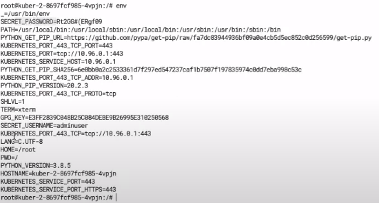
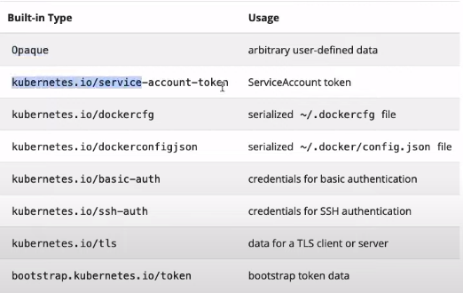

# Secrets в Kubernetes

Секреты используются для хранения небольшого объема секретных данных.

Секреты могут быть использованы тремя способами:

- Смонтированы как файлы в volume
- Использованы как переменные окружения для контейнеров
- kubelet agent может извлекать секреты из приватных репозиториев

Warn: по умолчанию секреты хранятся в незашифрованном виде.

Создадим два файла юзернейм и пароль

```bash
echo -n 'admin' > ./username.txt
echo -n 'superpass12345&*' > ./password.txt
```

Теперь создадим секрет типа дженерик с именем "db-user-pass-from-file" используя предыдущие файлы

```bash
kubectl create secret generic db-user-pass-from-file \
  --from-file=./username.txt \
  --from-file=./password.txt
```

Посмотрим в каком виде секреты записаны в файле. Кстати значения имени и пароля отличаются потому что закодированы в
base64.

```bash
kubectl get secret db-user-pass-from-file -o yaml
```

Декодировать данные можно вот так

```bash
kubectl get secret db-user-pass-from-file -o jsonpath='{.data}'
```

Секрет можно создать так же напрямую не используя файлы

```bash
kubectl create secret generic db-user-pass-from-literal \
  --from-literal=username=devuser \
  --from-literal=password='P!S?*r$zDsY'
```

Теперь создадим секрет используя yaml файлы

```yaml
# echo -n 'adminuser' | base64
# echo -n 'Rt2GG#(ERgf09' | base64
apiVersion: v1
kind: Secret
metadata:
  name: secret-data
type: Opaque
data:
  username: YWRtaW51c2Vy
  password: UnQyR0cjKEVSZ2YwOQ==
# echo -n 'YWRtaW51c2Vy' | base64 --decode
# echo -n 'UnQyR0cjKEVSZ2YwOQ==' | base64 --decode
```

Применим его

    kubectl apply -f secret-data.yaml

Рассмотрим деплоймент использующий этот секрет и второй деплоймент использующий "secret-stringData.yaml"

```yaml
apiVersion: apps/v1
kind: Deployment
metadata:
  name: kuber-1
  labels:
    app: kuber-1
spec:
  replicas: 1
  selector:
    matchLabels:
      app: http-server-1
  template:
    metadata:
      labels:
        app: http-server-1
    spec:
      containers:
        - name: kuber-app
          image: bakavets/kuber:v1.0
          ports:
            - containerPort: 8000
          envFrom: # Используем наш secret. Переменные из него будут добавлены 
            - secretRef: # в переменные окружения с именами как в секрете.
                name: secret-data
```

```yaml
apiVersion: apps/v1
kind: Deployment
metadata:
  name: kuber-2
  labels:
    app: kuber-2
spec:
  replicas: 1
  selector:
    matchLabels:
      app: http-server-2
  template:
    metadata:
      labels:
        app: http-server-2
    spec:
      containers:
        - name: kuber-app
          image: bakavets/kuber:v2.0
          ports:
            - containerPort: 8000
          env: # Здесь секрет используем другим способом сохраняя его данные 
            - name: SECRET_USERNAME # под нужными нам именами.
              valueFrom:
                secretKeyRef:
                  name: secret-stringdata
                  key: username
            - name: SECRET_PASSWORD
              valueFrom:
                secretKeyRef:
                  name: secret-stringdata
                  key: password
```

Применим их

    kubectl apply -f deploy-1.yaml

    kubectl apply -f deploy-2.yaml

Перейдем внутрь второго пода и посмотрим файл env



## Типы секретов



- dockercfg и dockercfgjson - используются, для того чтобы хранить credentials для доступа к container registry. Нужны
  если мы например используем приватный registry.

Вот пример такого секрета

```bash
kubectl create secret docker-registry secret-docker-registry \
  --docker-email=bakavets.com@gmail.com \
  --docker-username=bakavets \
  --docker-password=password \
  --docker-server=https://index.docker.io/v1/
```

И деплоймента использующего его "example3/deploy-private.yaml"

```yaml
apiVersion: apps/v1
kind: Deployment
metadata:
  name: kuber-private
  labels:
    app: kuber-private
spec:
  replicas: 1
  selector:
    matchLabels:
      app: http-server-private
  template:
    metadata:
      labels:
        app: http-server-private
    spec:
      imagePullSecrets: # Сообщаем registry и credentials откуда будем брать images.
        - name: secret-docker-registry
      containers:
        - name: kuber-app
          image: bakavets/kuber-private
          ports:
            - containerPort: 8000
```

Примеры остальных секретов есть в папке example3
