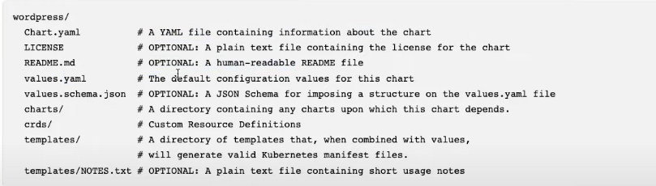
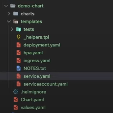
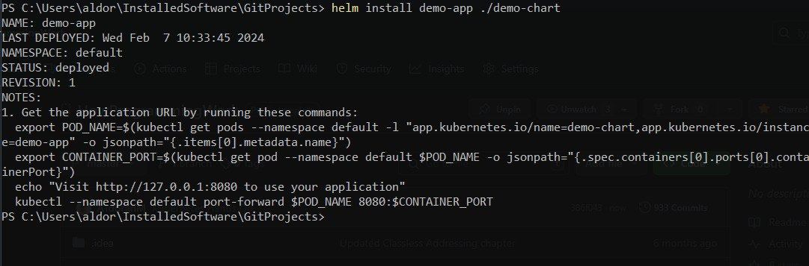
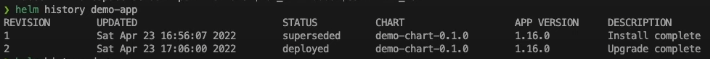

# Helm введение

Helm - пакетный менеджер для Kubernetes как например npm для NodeJS, он позволяет устанавливать и управлять жизненным
циклом приложений.

Установив Helm (смотри файл README.md) и создав простой кластер Minikube мы можем приступить к работе. Базовой
структурой которая управляет Helm, является Chart. В нем находятся все необходимые ресурсы которые будут добавлены в
кластер.

Создадим базовый чарт.

```bash
helm create demo-chart
```

Как видим у нас появилась следующая структура папок и файлов которую создал Helm.





Подробнее ее можно изучить тут. https://helm.sh/docs/topics/charts/#the-chart-file-structure

Папка charts хранит чарты от которых зависит наш Chart, а папка templates хранит все то что в конечном итоге будет
задеплоино на кластер. Как видим она содержит все, от сервис-аккаунта до ингрес и horizontal pod autoscaler-a.

## Helm syntax

Рассмотри для примера файл deployment из папки templates

Вот такая конструкция "{{ что-то }}" задает динамические поля значения которым мы можем установить в value файле. Если
значение в фигурных скобках указанно обернуто в "", "demo-chart.labels", то это имеется в виду имя глобальной переменной
такие переменные объявляются в файле _helpers.tpl, в остальных случаях первое слово в названии переменной например { { -
if not .Values.autoscaling.enabled } } имеет в виду название yaml файла из которого эта переменная будет взята, в данном
случае из файла values.yaml. А вот такая конструкция "{{ .Values.image.tag | default .Chart.AppVersion }}" пробует взять
значение из values.yaml но если не найдет, будет смотреть в chart.yaml

```yaml
apiVersion: apps/v1
kind: Deployment
metadata:
  name: { { include "demo-chart.fullname" . } }
  labels:
    { { - include "demo-chart.labels" . | nindent 4 } }
spec:
  { { - if not .Values.autoscaling.enabled } }
  replicas: { { .Values.replicaCount } }
  { { - end } }
  selector:
    matchLabels:
      { { - include "demo-chart.selectorLabels" . | nindent 6 } }
  template:
    metadata:
      { { - with .Values.podAnnotations } }
      annotations:
        { { - toYaml . | nindent 8 } }
      { { - end } }
      labels:
        { { - include "demo-chart.labels" . | nindent 8 } }
          { { - with .Values.podLabels } }
          { { - toYaml . | nindent 8 } }
          { { - end } }
    spec:
      { { - with .Values.imagePullSecrets } }
      imagePullSecrets:
        { { - toYaml . | nindent 8 } }
      { { - end } }
      serviceAccountName: { { include "demo-chart.serviceAccountName" . } }
      securityContext:
        { { - toYaml .Values.podSecurityContext | nindent 8 } }
      containers:
        - name: { { .Chart.Name } }
          securityContext:
            { { - toYaml .Values.securityContext | nindent 12 } }
          image: "{{ .Values.image.repository }}:{{ .Values.image.tag | default .Chart.AppVersion }}"
          imagePullPolicy: { { .Values.image.pullPolicy } }
          ports:
            - name: http
              containerPort: { { .Values.service.port } }
              protocol: TCP
          livenessProbe:
            httpGet:
              path: /
              port: http
          readinessProbe:
            httpGet:
              path: /
              port: http
          resources:
            { { - toYaml .Values.resources | nindent 12 } }
          { { - with .Values.volumeMounts } }
          volumeMounts:
            { { - toYaml . | nindent 12 } }
          { { - end } }
      { { - with .Values.volumes } }
      volumes:
        { { - toYaml . | nindent 8 } }
      { { - end } }
      { { - with .Values.nodeSelector } }
      nodeSelector:
        { { - toYaml . | nindent 8 } }
      { { - end } }
      { { - with .Values.affinity } }
      affinity:
        { { - toYaml . | nindent 8 } }
      { { - end } }
      { { - with .Values.tolerations } }
      tolerations:
        { { - toYaml . | nindent 8 } }
      { { - end } }
```

Так же стоит обратить внимание на файлы начинающиеся с нижнего подчеркивания, например _helpers.tpl в папке templates,
все файлы начинающиеся с нижнего подчеркивания не будут задеплоены на кластер. Конкретно этот файл задает дефолтные
значения для переменных которые будут использованы в deployment и других файлах из папки templates если их не
переопределить, его главное назначение это задавать глобальные переменные которые будут затем использоваться по всему
пакету.

Например вот кусочек из него задающий переменную "demo-chart.fullname" которая затем вот так используется в deployment
"{{ include "demo-chart.fullname" . }}"

```text

{{/*
Create a default fully qualified app name.
We truncate at 63 chars because some Kubernetes name fields are limited to this (by the DNS naming spec).
If release name contains chart name it will be used as a full name.
*/}}
{{- define "demo-chart.fullname" -}}
{{- if .Values.fullnameOverride }}
{{- .Values.fullnameOverride | trunc 63 | trimSuffix "-" }}
{{- else }}
{{- $name := default .Chart.Name .Values.nameOverride }}
{{- if contains $name .Release.Name }}
{{- .Release.Name | trunc 63 | trimSuffix "-" }}
{{- else }}
{{- printf "%s-%s" .Release.Name $name | trunc 63 | trimSuffix "-" }}
{{- end }}
{{- end }}
{{- end }}
```

Установим наш пакет в кластер, для этого надо чтобы текущий контекст kubernetes ссылался на этот кластер, в нашем случае
minikube, убедимся в этом и установим пакет.

    kubectl config current-context

    helm install demo-app ./demo-chart



Как видим все успешно задеплоилось и helm показывает простую инструкцию которую надо выполнить, для того чтобы увидеть
наше приложение.

Теперь попробуем обновить приложение используя helm, выпустив его новую версию. Для этого в файле values проставим любое
значение в переменную tag.

```yaml
image:
  repository: nginx
  pullPolicy: IfNotPresent
  # Overrides the image tag whose default is the chart appVersion.
  tag: "99.99" # Наша новая версия 
```

Для начала убедимся что приложение рабочее и без проблем установится для этого добавим в конец команды "--dry-run" это
такой себе холостой прогон приложения без реальной установки в кластер.

    helm upgrade demo-app ./demo-chart --debug --dry-run

После выполнения этой команды helm выдаст нам все файлы которые будут задеплоены с проставленными значениями для
переменных. Кстати стоит обратить внимание что в выводе не будет ничего про ingress и horizontal auto scaler, это из-за
того что в файле values переменные отвечающие за них имеют значени "false", а в самих файлах есть инструкции вот такого
типа "{{- if .Values.autoscaling.enabled }}" которые реагируют на эти переменные.

Убедившись что все ОК обновим наше приложение

    helm upgrade demo-app ./demo-chart

И посмотрим историю ревизий (helm хранит до 10 ревизий)

    helm history demo-app

Как мы видим в истории появится вторая ревизия



Попробуем откатиться на предыдущую версию

    helm rollback demo-app 1

Можно так же попросить Helm следить за обновлением и откатываться на другую ревизию если обновление неудачно.

    helm upgrade demo-app ./demo-chart --debug --atomic --timeout 20s --set image.tag=1.212121

## Переопределение дефолтных параметров в heml values.yaml

Предположим мы, хотим задеплоить наше приложение в другой кластер и под него создадим новый values-dev.yaml файл
переопределим в нем то что нам нравится и используем в helm явно указав какой value файл использовать.

Для начала прогоним в холостую

    helm upgrade --install demo-app-test ./demo-chart -f demo-chart/values-dev.yaml -n app --create-namespace --dry-run

А теперь задеплоим создав неймспейс если его не существует

    helm upgrade --install demo-app-test ./demo-chart -f demo-chart/values-dev.yaml -n app --create-namespace

Для того чтобы проверить наши файлы на синтаксические ошибки можно использовать команду

    helm lint demo-chart

Для того чтобы упаковать все в архив с определенной версией приложения используется вот такая команда

    helm package demo-chart


