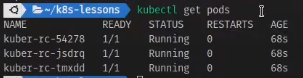

# ReplicationController и ReplicaSet в Kubernetes

## Replication Controller

Считается устаревшим и лучше использовать ReplicaSet вместо него. Отвечает за поддержание работы кластера в соответствии
с требованиями. Например: если запущенно слишком мало экземпляров то запустит новые, если слишком много, уберет лишнее.

```yaml
apiVersion: v1
kind: ReplicationController # Имя ресурса
metadata:
  name: kuber-rc # Имя ресурса
spec:
  replicas: 3 # Желаемое количество реплик
  selector: # Селектор определяет какими приложениями контроллер управляет
    app: http-server
  template: # Задает шаблон для создания новых модулей
    metadata:
      name: kuber-app
      labels: # Метка должна совпадать с селектором
        app: http-server
    spec: # Спецификация самого приложения 
      containers:
        - name: http-server-image
          image: bokovets/kuber
          ports:
            - containerPort: 8000
```

Создадим контроллер

    kubectl apply -f rc-kuber.yaml

И как видим было создано 3 пода согласно спецификации



Теперь создадим под который будет попадать под селектор нашего контроллера

```yaml
apiVersion: v1
kind: Pod
metadata:
  name: kuber-app-manual
  labels:
    app: kuber
spec:
  containers:
    - name: kuber-app-image
      image: bokovets/kuber
      ports:
        - containerPort: 8000
```

    kubectl apply -f kuber-pod.yaml

И выполнил kubectl get pods мы увидим что новый под не создается, так как контроллер следит за создаваемыми подами с
меткой name: kuber

Кстати если зайти в контроллер и поменять селектор, то старые поды не удалятся, а продолжат работать, они просто выпадут
из области видимости контроллера и он создаст новые основываясь на шаблоне. Тоже самое будет если например взять и
переписать поле на которое ориентируется селектор тогда под так же выпадет из области видимости и контроллер создаст
другой под вместо него.

Так же стоит учесть что просто меняя шаблон подов, например изменив поле image контроллер не пересоздаст старые поды, но
для всех последующих подов будет использовать уже новые image

## Replica Set

Полностью заменяет контроллер и является его более продвинутой версией. ReplicaController считается устаревшим и не
рекомендуется к использованию, но обычно не создается на прямую пользователем, а используется другими более
высокоуровневыми объектами, например Deployment.

```yaml
apiVersion: apps/v1
kind: ReplicaSet # Используем ReplicaSet
metadata:
  name: kuber-rs-1
  labels:
    app: kuber-rs
spec:
  replicas: 3
  selector:
    matchLabels: # Так же в ReplicaSet используется другой селектор  
      env: dev
  template:
    metadata:
      labels:
        env: dev
    spec:
      containers:
        - name: kuber-app
          image: bokovets/kuber
```

Теперь же рассмотрим более сложный вариант ReplicaSet

```yaml
apiVersion: apps/v1
kind: ReplicaSet
metadata:
  name: kuber-rs-2
spec:
  replicas: 3
  selector:
    matchExpressions: # ReplicaSet позволяет строить более комплексные селекторы 
      - key: app # Имя ключа метки на которую мы ориентируемся. Например app: kuber, app: http-server, name: test, ...
        operator: In # Всего операторов 4: In, NotIn, Exist, DoesNotExist 
        values: # Ограничиваем список возможных значений для ключа. В этом случае он может быть либо kuber либо http-server
          - kuber
          - http-server
      - key: env # Следующий ключ на который мы ориентируемся. 
        operator: Exists # Сообщаем что ключ обязан быть но какое у него значение не важно 
  template: # Задаем шаблон 
    metadata:
      labels: # Проставляем ключи и значения меток
        app: kuber
        env: dev
    spec:
      containers:
        - name: kuber-app
          image: bokovets/kuber
```

Применим файл выше

    kubectl apply -f rs-kuber-matchExpressions.yaml

