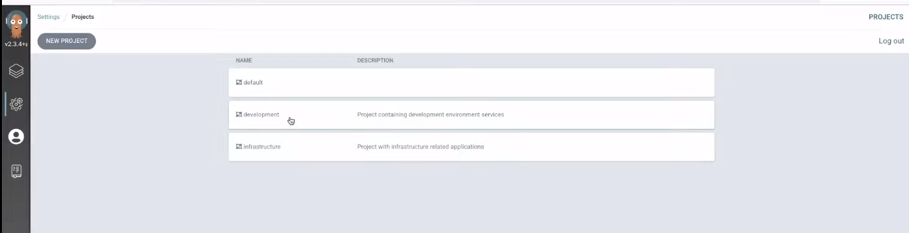

# AgroCD in Kubernetes, GitOps

ArgoCD это декларативный инструмент непрерывной доставки для Kubernetes.


Для этого урока лучше дополнительно сконфигурировать Lens - это такой UI для управления кластером в Kubernetes.

Установим ArgoCD в наш minikube кластер

    kubectl create namespace argocd
    kubectl apply -n argocd -f https://raw.githubusercontent.com/argoproj/argo-cd/stable/manifests/install.yaml

В Lens видим что создались все нужные объекты ArgoCD


Теперь выполним port-forward, чтобы сделать наш кластер доступным из вне.

    kubectl port-forward svc/argocd-server -n argocd 8080:443

Теперь получим пароль при помощи которого мы сможем залогиниться в ArgoCD UI

    kubectl get pods -n argocd -l app.kubernetes.io/name=argocd-server -o name | cut -d'/' -f 2

Перейдя по адресу https://localhost:8080 мы можем залогиниться использую имя пользователя и пароль.


Если мы вернемся в Lens и перейдем во вкладку Custom Resources то увидим что там появилась вкладка argoproj.io которая
создала несколько ресурсов: Application, ApplicationSet, AppProject.

### AppProject

Представляет собой логическую группу ArgoCD приложений. Если мы посмотрим на структуру папок то увидим что в папке
argocd есть две папки applications и projects (приатачивается автоматически для всех проектов argocd для которых мы не
указываем проект в yaml файле)

Создадим проект в папке projects, в файле dev.yaml, файл infra.yaml это дефолтный проект созданный argocd.

```yaml
# https://argo-cd.readthedocs.io/en/stable/operator-manual/declarative-setup/#projects
apiVersion: argoproj.io/v1alpha1
kind: AppProject # Указываем AppProject
metadata:
  name: development # Название проекта
  namespace: argocd # В какой неймспейс устанавливаем этот проект
  # Finalizer that ensures that project is not deleted until it is not referenced by any application
  finalizers:
    - resources-finalizer.argocd.argoproj.io
spec:
  description: Project containing development environment services
  sourceRepos: # Ссылка на репозиторий из которого приложения в рамках проекта могут
    - '*'      # извлекать chart, manifest, и прочие файлы. '*' - означает что можно использовать любой репозиторий. 
  destinations: # Указываем кластера куда argocd может деплоить kubernetes ресурсы относящиеся к этому проекту
    - namespace: '*'
      server: '*'
  clusterResourceWhitelist: # Какие объекты argocd может создавать в рамках этого 
    - group: '*'            # проекта (неймспейсы, балансировщики и т.д.)
      kind: '*'
```

Применим все проекты которые есть в папке projects к кластеру

    kubectl apply -f argocd/projects/

Мы можем видеть их в Lens и в argoCD ui.



В целом структура разворачивания чего-либо в ArgoCD имеет следующий флоу:

- Определить один, или несколько проектов, которые группируют в себе приложения и отвечают за выбор кластера и
  разрешения на создание объектов в этом кластере
- Создать сами приложения (Applications) привязав их к нужному проекту и определив для них репозиторий с Kubernetes
  объектами, которые эти приложения развернут на кластере в рамках проекта, и за жизненным циклом которых будут следить.

## Application

Теперь создадим ArgoCD Application и задеплоим его. Application отвечает за установку kubernetes объектов (ingress,
deployment, и т.д) и их жизненный цикл, application будет следить за тем чтобы состояние объектов в кластере было таким
же как и в репозитории откуда оно их взяло.

Рассмотрим приложение kuber.yaml из папки applications

```yaml
apiVersion: argoproj.io/v1alpha1
kind: Application # Указываем что это application
metadata:
  name: kuber
  # You'll usually want to add your resources to the argocd namespace.
  namespace: argocd
  # Если мы удаляем приложение из ArgoCD то и объекты Kubernetes которые были под него созданы
  # так же будут удалены.
  finalizers:
    - resources-finalizer.argocd.argoproj.io
spec:
  project: development # AppProject к которому относится этот application.
  # Указываем откуда будем брать исходный код (пример приложения находится в папке dev ниже)
  source:
    repoURL: https://github.com/bakavets/k8s-lessons.git  # Can point to either a Helm chart repo or a git repo.
    targetRevision: master  # For Helm, this refers to the chart version.
    path: lesson-30/dev/kuber  # This has no meaning for Helm charts pulled directly from a Helm repo instead of git.

  # Destination cluster and namespace to deploy the application
  destination:
    server: https://kubernetes.default.svc
    namespace: kuber

  # Sync policy
  syncPolicy:
    automated: # automated sync by default retries failed attempts 5 times with following delays between attempts ( 5s, 10s, 20s, 40s, 80s ); retry controlled using `retry` field.
      prune: true # Specifies if resources should be pruned during auto-syncing ( false by default ).
      selfHeal: true # Specifies if partial app sync should be executed when resources are changed only in target Kubernetes cluster and no git change detected ( false by default ).
    syncOptions: # Sync options which modifies sync behavior
      - CreateNamespace=true # Namespace Auto-Creation ensures that namespace specified as the application destination exists in the destination cluster.
```

Задеплоим его

    kubectl apply -f argocd/applications/kuber.yaml

В AgroCD UI появилось новое приложение


## Создание ArgoCD Application используя Helm chart из GitHub

Для начала создадим приложение, Helm chart для него приведен в папке charts.

```yaml
apiVersion: argoproj.io/v1alpha1
kind: Application
metadata:
  name: demo-app
  namespace: argocd
  finalizers:
    - resources-finalizer.argocd.argoproj.io
spec:
  project: default

  source:
    repoURL: https://github.com/bakavets/k8s-lessons.git
    targetRevision: master
    path: lesson-30/charts/demo

    # Секция где мы определяем данные для helm их можно задавать в 3 вариантах, 
    # используя parameters, values, valueFiles, они имеют приоритет друг над другом
    # в порядке перечисления.  
    helm:
      # Extra parameters to set (same as setting through values.yaml, but these take precedence)
      parameters:
        - name: "service.port"
          value: "8082"
      # - name: "replicaCount"
      #   value: "4"

      # Helm values files for overriding values in the helm chart
      # The path is relative to the spec.source.path directory defined above
      valueFiles:
        - values-dev.yaml

      # Values file as block file
      values: |
        # replicaCount: 2
        serviceAccount:
          create: true
          annotations:
            demo/role: demo-annotation
          name: sa-custom-name

  # Destination cluster and namespace to deploy the application
  destination:
    server: https://kubernetes.default.svc
    namespace: demo

  # Sync policy
  syncPolicy:
    automated:
      prune: true
      selfHeal: true
    syncOptions:
      - CreateNamespace=true
```

## Создание ArgoCD Application используя Helm chart из ChartRepository

В данном примере вместо Github будет использоваться ChartRepository, мы добавим ingress контроллер в наш кластер.

```yaml
apiVersion: argoproj.io/v1alpha1
kind: Application
metadata:
  name: ingress-nginx
  namespace: argocd
  finalizers:
    - resources-finalizer.argocd.argoproj.io
spec:
  project: infrastructure

  source:
    repoURL: 'https://kubernetes.github.io/ingress-nginx' # ChartRepository
    targetRevision: 4.1.1
    chart: ingress-nginx
    helm:
      parameters:
        - name: "controller.replicaCount"
          value: "2"
        - name: "controller.service.type"
          value: "NodePort"

  destination:
    namespace: ingress-nginx
    server: https://kubernetes.default.svc

  # Sync policy
  syncPolicy:
    automated:
      prune: true
      selfHeal: true
    syncOptions:
      - CreateNamespace=true
```

Задеплоим его 

    kubectl apply -f  argocd/applications/ingress-nginx.yaml


