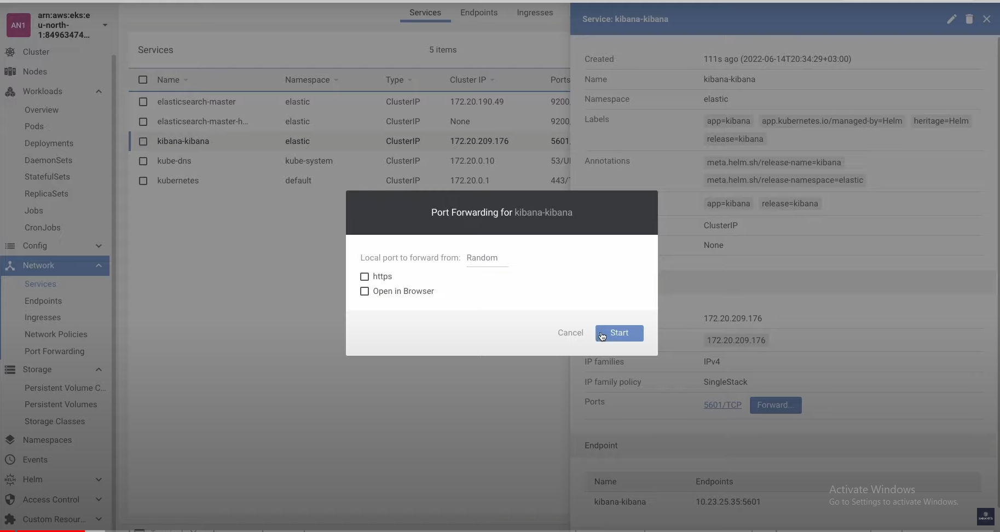

# Сбор, анализ и отправка Pod логов в ElasticSearch, используя Fluentd. EFK Stack

Fluentd - это сборщик данных для унифицированного сбора и ведения логов.

Вначале идет часть про Терраформ и разворачивание кластера с установкой Lens

(https://www.youtube.com/watch?v=d7IATODGxUI&list=PL3SzV1_k2H1VDePbSWUqERqlBXIk02wCQ&index=35)

После этого нам надо установить Elastic Search и Kibana - интерфес для эластика.

    helm repo add elastic https://helm.elastic.co

    helm upgrade --install elasticsearch --version 7.17.3 elastic/elasticsearch --set replicas=1 -n elastic --create-namespace --debug

    helm upgrade --install kibana --version 7.17.3 elastic/kibana -n elastic --debug

Затем выполнив порт форвард для кибаны



Зайдя на адрес кибаны увидим что ElasticSearch установился


Теперь задеплоим в кластер наше первое приложение которое просто будет спамить логи

```yaml
apiVersion: apps/v1
kind: Deployment
metadata:
  name: counter-1
  labels:
    app: counter-1
spec:
  replicas: 1
  selector:
    matchLabels:
      app: counter-1
  template:
    metadata:
      labels:
        app: counter-1
    spec:
      containers:
        - name: count
          image: busybox
          # Спам логов
          args: [ /bin/sh, -c, 'i=0; while true; do echo "$i: $(date)"; i=$((i+1)); sleep 1; done' ]
```

Деплой

    kubectl apply -f apps/deploy-1.yaml

Теперь установим Fluentd используя DaemonSet так как мы хотим чтобы Fluentd располагались на каждой ноде кластера.

Для начала создадим Namespace

```yaml
apiVersion: v1
kind: Namespace
metadata:
  name: fluentd
```

    kubectl apply -f fluentd/namespace.yaml

После чего создадим ServiceAccount и ClusterRole c ClusterRoleBinding (подробнее рассказано в уроке 34)

```yaml
---
apiVersion: v1
kind: ServiceAccount
metadata:
  name: fluentd
  namespace: fluentd
---
apiVersion: rbac.authorization.k8s.io/v1
kind: ClusterRole
metadata:
  name: fluentd
rules:
  - apiGroups:
      - ""
    resources:
      - pods
      - namespaces
    verbs:
      - get
      - list
      - watch
---
kind: ClusterRoleBinding
apiVersion: rbac.authorization.k8s.io/v1
metadata:
  name: fluentd
roleRef:
  kind: ClusterRole
  name: fluentd
  apiGroup: rbac.authorization.k8s.io
subjects:
  - kind: ServiceAccount
    name: fluentd
    namespace: fluentd
```

     kubectl apply -f fluentd/rbac.yaml

Затем создадим DaemonSet ниже по ссылке с 6 по 10 минуту разбор параметров контейнера.

(https://youtu.be/d7IATODGxUI?list=PL3SzV1_k2H1VDePbSWUqERqlBXIk02wCQ&t=545)

```yaml
apiVersion: apps/v1
kind: DaemonSet
metadata:
  name: fluentd
  namespace: fluentd # Устанавливаем ранее созданный namespace 
spec:
  selector: # Определяем селектор который будет выбирать поды с fluentd
    matchLabels:
      k8s-app: fluentd-logging
      version: v1
  template: # Определяем шаблон для fluentd подов
    metadata:
      labels:
        k8s-app: fluentd-logging
        version: v1
    spec:
      # Указываем ServiceAccount для нашего DaemonSet он будет добавлен к поду 
      serviceAccount: fluentd
      serviceAccountName: fluentd
      containers: # И описываем контейнер c fluentd который будет запущен в подах 
        - name: fluentd
          image: fluent/fluentd-kubernetes-daemonset:v1.14-debian-elasticsearch7-1
          env:
            - name: FLUENT_ELASTICSEARCH_HOST
              value: "elasticsearch-master.elastic.svc.cluster.local"
            - name: FLUENT_ELASTICSEARCH_PORT
              value: "9200"
            - name: FLUENT_ELASTICSEARCH_SCHEME
              value: "http"
            # If the name of the Kubernetes node the plugin is running on is set as an environment variable with the name K8S_NODE_NAME, it will reduce cache misses and needless calls to the Kubernetes API.
            - name: K8S_NODE_NAME
              valueFrom:
                fieldRef:
                  fieldPath: spec.nodeName
            # - name: FLUENT_CONTAINER_TAIL_EXCLUDE_PATH
            #   value: >
            #     [
            #     "/var/log/containers/fluentd-*",
            #     "/var/log/containers/kube-proxy-*"
            #     ]
          resources:
            limits:
              memory: 200Mi
            requests:
              cpu: 100m
              memory: 200Mi
          # Указываем папки которые хотим вмонтировать внутрь каждого fluentd агента.
          volumeMounts:
            - name: fluentd-config
              mountPath: /fluentd/etc
            - name: varlog
              mountPath: /var/log
            - name: dockercontainerlogdirectory
              mountPath: /var/lib/docker/containers
              readOnly: true
      terminationGracePeriodSeconds: 30
      volumes:
        - name: fluentd-config
          configMap:
            name: fluentd-config
        - name: varlog
          hostPath:
            path: /var/log
        - name: dockercontainerlogdirectory
          hostPath:
            path: /var/lib/docker/containers
```

Перед деплоем этого фала стоит так же задеплоить configmap.yaml

    kubectl apply -f fluentd/configmap.yaml

    kubectl apply -f fluentd/daemonset-elasticsearch.yaml

Разбор файла configmap.yaml c 12 по 22 минуту

(https://www.youtube.com/watch?v=d7IATODGxUI&list=PL3SzV1_k2H1VDePbSWUqERqlBXIk02wCQ&index=35)

```yaml
apiVersion: v1
kind: ConfigMap
metadata:
  name: fluentd-config
  namespace: fluentd
data:
  # Сообщаем какие файлы дополнительно хотим включить в конфиг мы можем
  # закомментировать какие-то из них если не хотим использовать в fluentd
  fluent.conf: |-
    @include ignore_fluent_logs.conf
    @include containers.conf
    @include kubernetes.conf
    #@include pods-with-annotation.conf # Закомментировали вот этот
    #@include file-fluent.conf          # И вот этот
    @include elasticsearch.conf
  # Описание конфиг файлов которые включаются выше
  ignore_fluent_logs.conf: |-
    # Do not collect fluentd logs
    <label @FLUENT_LOG>
      <match fluent.**>
        @type null
        @id ignore_fluent_logs
      </match>
    </label>
  tail_container_parse.conf: |-
    <parse>
      @type "#{ENV['FLUENT_CONTAINER_TAIL_PARSER_TYPE'] || 'json'}"
      time_format "#{ENV['FLUENT_CONTAINER_TAIL_PARSER_TIME_FORMAT'] || '%Y-%m-%dT%H:%M:%S.%NZ'}"
    </parse>
  containers.conf: |-
    <source>
      @type tail
      @id in_tail_container_logs
      path "#{ENV['FLUENT_CONTAINER_TAIL_PATH'] || '/var/log/containers/*.log'}"
      pos_file /var/log/fluentd-containers.log.pos
      tag "#{ENV['FLUENT_CONTAINER_TAIL_TAG'] || 'kubernetes.*'}"
      exclude_path "#{ENV['FLUENT_CONTAINER_TAIL_EXCLUDE_PATH'] || use_default}"
      read_from_head true
      @include tail_container_parse.conf
    </source>
  kubernetes.conf: |-
    <filter kubernetes.**>
      @type kubernetes_metadata
      @id filter_kube_metadata
      annotation_match [ "fluentd.active"]
      de_dot false
      kubernetes_url "#{ENV['FLUENT_FILTER_KUBERNETES_URL'] || 'https://' + ENV.fetch('KUBERNETES_SERVICE_HOST') + ':' + ENV.fetch('KUBERNETES_SERVICE_PORT') + '/api'}"
      verify_ssl "#{ENV['KUBERNETES_VERIFY_SSL'] || true}"
      ca_file "#{ENV['KUBERNETES_CA_FILE']}"
      skip_labels "#{ENV['FLUENT_KUBERNETES_METADATA_SKIP_LABELS'] || 'false'}"
      skip_container_metadata "#{ENV['FLUENT_KUBERNETES_METADATA_SKIP_CONTAINER_METADATA'] || 'false'}"
      skip_master_url "#{ENV['FLUENT_KUBERNETES_METADATA_SKIP_MASTER_URL'] || 'false'}"
      skip_namespace_metadata "#{ENV['FLUENT_KUBERNETES_METADATA_SKIP_NAMESPACE_METADATA'] || 'false'}"
      watch "#{ENV['FLUENT_KUBERNETES_WATCH'] || 'true'}"
    </filter>
  pods-with-annotation.conf: |-
    # Filter records with annotation fluentd.active=true
    <filter kubernetes.**>
      @type grep
      <regexp>
        key $["kubernetes"]["annotations"]["fluentd.active"]
        pattern "^true$"
      </regexp>
    </filter> 
    <filter kubernetes.**>
      @type record_transformer
      remove_keys $.docker.container_id,$.kubernetes.container_image_id,$.kubernetes.pod_id,$.kubernetes.namespace_id,$.kubernetes.master_url,$.kubernetes.labels.pod-template-hash
    </filter>
  file-fluent.conf: |-
    <match **>
      @type file
      path /tmp/file-test.log
    </match>
  elasticsearch.conf: |-
    <match **>
      @type elasticsearch
      @id out_es
      @log_level info
      include_tag_key true
      host "#{ENV['FLUENT_ELASTICSEARCH_HOST']}"
      port "#{ENV['FLUENT_ELASTICSEARCH_PORT']}"
      path "#{ENV['FLUENT_ELASTICSEARCH_PATH']}"
      scheme "#{ENV['FLUENT_ELASTICSEARCH_SCHEME'] || 'http'}"
      ssl_verify "#{ENV['FLUENT_ELASTICSEARCH_SSL_VERIFY'] || 'true'}"
      ssl_version "#{ENV['FLUENT_ELASTICSEARCH_SSL_VERSION'] || 'TLSv1_2'}"
      user "#{ENV['FLUENT_ELASTICSEARCH_USER'] || use_default}"
      password "#{ENV['FLUENT_ELASTICSEARCH_PASSWORD'] || use_default}"
      reload_connections "#{ENV['FLUENT_ELASTICSEARCH_RELOAD_CONNECTIONS'] || 'false'}"
      reconnect_on_error "#{ENV['FLUENT_ELASTICSEARCH_RECONNECT_ON_ERROR'] || 'true'}"
      reload_on_failure "#{ENV['FLUENT_ELASTICSEARCH_RELOAD_ON_FAILURE'] || 'true'}"
      log_es_400_reason "#{ENV['FLUENT_ELASTICSEARCH_LOG_ES_400_REASON'] || 'false'}"
      logstash_prefix "#{ENV['FLUENT_ELASTICSEARCH_LOGSTASH_PREFIX'] || 'fluentd'}"
      logstash_dateformat "#{ENV['FLUENT_ELASTICSEARCH_LOGSTASH_DATEFORMAT'] || '%Y.%m.%d'}"
      logstash_format "#{ENV['FLUENT_ELASTICSEARCH_LOGSTASH_FORMAT'] || 'true'}"
      index_name "#{ENV['FLUENT_ELASTICSEARCH_LOGSTASH_INDEX_NAME'] || 'fluentd'}"
      target_index_key "#{ENV['FLUENT_ELASTICSEARCH_TARGET_INDEX_KEY'] || use_nil}"
      type_name "#{ENV['FLUENT_ELASTICSEARCH_LOGSTASH_TYPE_NAME'] || 'fluentd'}"
      include_timestamp "#{ENV['FLUENT_ELASTICSEARCH_INCLUDE_TIMESTAMP'] || 'false'}"
      template_name "#{ENV['FLUENT_ELASTICSEARCH_TEMPLATE_NAME'] || use_nil}"
      template_file "#{ENV['FLUENT_ELASTICSEARCH_TEMPLATE_FILE'] || use_nil}"
      template_overwrite "#{ENV['FLUENT_ELASTICSEARCH_TEMPLATE_OVERWRITE'] || use_default}"
      sniffer_class_name "#{ENV['FLUENT_SNIFFER_CLASS_NAME'] || 'Fluent::Plugin::ElasticsearchSimpleSniffer'}"
      request_timeout "#{ENV['FLUENT_ELASTICSEARCH_REQUEST_TIMEOUT'] || '5s'}"
      application_name "#{ENV['FLUENT_ELASTICSEARCH_APPLICATION_NAME'] || use_default}"
      suppress_type_name "#{ENV['FLUENT_ELASTICSEARCH_SUPPRESS_TYPE_NAME'] || 'true'}"
      enable_ilm "#{ENV['FLUENT_ELASTICSEARCH_ENABLE_ILM'] || 'false'}"
      ilm_policy_id "#{ENV['FLUENT_ELASTICSEARCH_ILM_POLICY_ID'] || use_default}"
      ilm_policy "#{ENV['FLUENT_ELASTICSEARCH_ILM_POLICY'] || use_default}"
      ilm_policy_overwrite "#{ENV['FLUENT_ELASTICSEARCH_ILM_POLICY_OVERWRITE'] || 'false'}"
      <buffer>
        flush_thread_count "#{ENV['FLUENT_ELASTICSEARCH_BUFFER_FLUSH_THREAD_COUNT'] || '8'}"
        flush_interval "#{ENV['FLUENT_ELASTICSEARCH_BUFFER_FLUSH_INTERVAL'] || '5s'}"
        chunk_limit_size "#{ENV['FLUENT_ELASTICSEARCH_BUFFER_CHUNK_LIMIT_SIZE'] || '2M'}"
        queue_limit_length "#{ENV['FLUENT_ELASTICSEARCH_BUFFER_QUEUE_LIMIT_LENGTH'] || '32'}"
        retry_max_interval "#{ENV['FLUENT_ELASTICSEARCH_BUFFER_RETRY_MAX_INTERVAL'] || '30'}"
        retry_forever true
      </buffer>
    </match>
```
