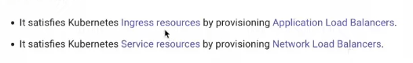

# AWS Load Balancer Controller в Kubernetes. Target type: IP vs Instance. Настройка HTTPS.

AWS Load Balancer Controller - контроллер, для того чтобы упростить Elastic Load Balancer для Кубернетс кластеров на
Амазон он работает на 7 уровне модели OSI.



Конфигурация кластера приведена в terraform. Сам кластер будет разворачиваться в Амазон.

Вот здесь разбор с 1 по 4 минуту

(https://www.youtube.com/watch?v=8g-C8miu5Is&list=PL3SzV1_k2H1VDePbSWUqERqlBXIk02wCQ&index=35)

Рассмотрим первый пример из паки k8s. В нем мы создаем неймспейс и в его рамках создаем деплоймент и сервис типа
LoadBalancer.

```yaml
apiVersion: v1
kind: Namespace
metadata:
  name: example-1
  labels:
    elbv2.k8s.aws/pod-readiness-gate-inject: enabled
---
apiVersion: apps/v1
kind: Deployment
metadata:
  name: kuber
  namespace: example-1
  labels:
    app: kuber
spec:
  replicas: 3
  selector:
    matchLabels:
      app: http-server
  template:
    metadata:
      labels:
        app: http-server
    spec:
      containers:
        - name: kuber-app
          image: bakavets/kuber
          ports:
            - containerPort: 8000
---
# https://cloud-provider-aws.sigs.k8s.io/service_controller/
apiVersion: v1
kind: Service
metadata:
  name: kuber-service-legacy
  namespace: example-1
  annotations:
    service.beta.kubernetes.io/aws-load-balancer-type: nlb
spec:
  selector:
    app: http-server
  ports:
    - protocol: TCP
      port: 80
      targetPort: 8000
  type: LoadBalancer
---
apiVersion: v1
kind: Service
metadata:
  name: kuber-service-albc
  namespace: example-1
  annotations:
    service.beta.kubernetes.io/aws-load-balancer-type: external
    service.beta.kubernetes.io/aws-load-balancer-nlb-target-type: instance
    service.beta.kubernetes.io/aws-load-balancer-scheme: internet-facing
spec:
  selector:
    app: http-server
  ports:
    - protocol: TCP
      port: 80
      targetPort: 8000
  type: LoadBalancer
```

Эту лекцию довольно трудно конспектировать и для полного понимания лучше посмотреть

https://www.youtube.com/watch?v=8g-C8miu5Is&list=PL3SzV1_k2H1VDePbSWUqERqlBXIk02wCQ&index=35
