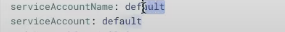
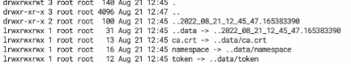
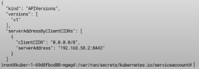
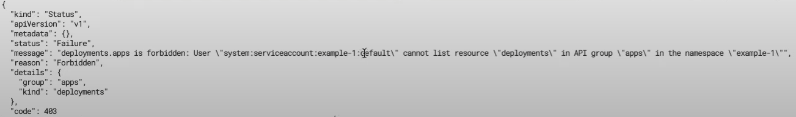

# ServiceAccount, Role, RoleBinding, ClusterRole, ClusterRoleBinding

### ServiceAccount

Это учетная запись которая позволяет приложениям напрямую общаться с Kubernetes API без необходимости предоставления
учетных данных.

### Role и ClusterRole

Представляют собой набор разрешений, то есть определяют что можно сделать находясь под той, или иной учетной записью.
Роль всегда устанавливает разрешения для определенного Namespace который надо обязательно указать при создании роли.

В свою же очередь ClusterRole это объект кластерного уровня который не зависит от неймспейса и нужен для управления
другими объектами кластерного уровня.

### RoleBinding

Привязывает роль к определенному пользователю, или группе пользователей. И так же как и роль является объектом
неймспейсного уровня и может ссылаться на любую роль в том же неймспейсе где сам определен, а так же на ClusterRole в
таком случае ClusterRole будет работать только в рамках неймспейса где определен RoleBinding.

### ClusterRoleBinding

Привязывает роль ко всем пространствам имен в кластере.

Рассмотрим первый пример, в файле app.yaml определены Namespace, Deployment, Service. Задеплоим этот файл как есть и
посмотрим что происходит с подами для которых не указывается явно ServiceAccount.

```yaml
---
apiVersion: v1
kind: Namespace
metadata:
  name: example-1
---
apiVersion: apps/v1
kind: Deployment
metadata:
  name: kuber-1
  namespace: example-1
  labels:
    app: kuber-1
spec:
  replicas: 1
  selector:
    matchLabels:
      app: http-server-1
  template:
    metadata:
      labels:
        app: http-server-1
    spec:
      serviceAccountName: app-sa
      containers:
        - name: kuber-app
          image: bakavets/kuber:v1.0
          ports:
            - containerPort: 8000
---
apiVersion: v1
kind: Service
metadata:
  name: kuber-service-1
  namespace: example-1
spec:
  selector:
    app: http-server-1
  ports:
    - protocol: TCP
      port: 80
      targetPort: 8000
```

    kubectl apply -f example-1/app.yaml

Если затем просмотреть информацию о поде в Lens, то мы увидим что для этого пода был задан ServiceAccount по умолчанию



В каждом неймспейсе по умолчанию существует default ServiceAccount с набором credentials которые позволяют обращаться в
kubernetes API.

Перейдем внутрь пода и попробуем взаимодействовать c Kubernetes API, выполним команду

    ls 0al /var/run/secrets/kubernetes.io/serviceaccount/        



И увидим файл сертификата (crt) и token, кстати токен внутри пода и внутри секрета отличаются.

Теперь добавим пару переменных которые нужны для создания запроса к API, они дополнительно перечисленны в файле
example-1/README.md. Их просто можно скопировать и вставить в консоль.

```yaml
# Point to the internal API server hostname
APISERVER=https://kubernetes.default.svc

  # Path to ServiceAccount token
SERVICEACCOUNT=/var/run/secrets/kubernetes.io/serviceaccount

  # Read this Pod's namespace
NAMESPACE=$(cat ${SERVICEACCOUNT}/namespace)

  # Read the ServiceAccount bearer token
TOKEN=$(cat ${SERVICEACCOUNT}/token)

  # Reference the internal certificate authority (CA)
CACERT=${SERVICEACCOUNT}/ca.crt
```

И теперь выполним запрос

    curl --cacert ${CACERT} --header "Authorization: Bearer ${TOKEN}" -X GET ${APISERVER}/api

И получим вот такой ответ



А сейчас попробуем сделать другой запрос, который выведет список всех деплойментов в Namespace

    curl --cacert ${CACERT} --header "Authorization: Bearer ${TOKEN}" -X GET ${APISERVER}/apis/apps/v1/namespaces/${NAMESPACE}/deployments

И получим ошибку доступа потому что у нас нет прав 




