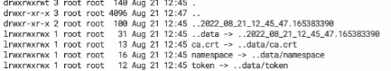
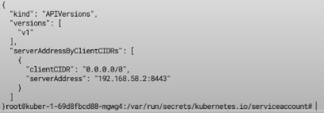
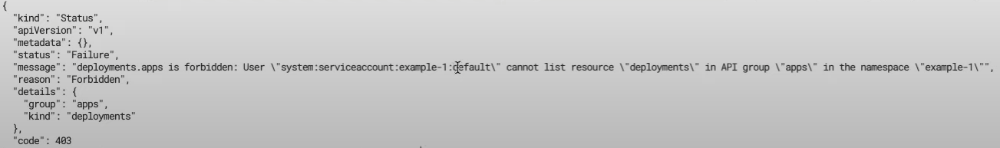

# ServiceAccount, Role, RoleBinding, ClusterRole, ClusterRoleBinding

### ServiceAccount

Это учетная запись которая позволяет приложениям напрямую общаться с Kubernetes API без необходимости предоставления
учетных данных.

### Role и ClusterRole

Представляют собой набор разрешений, то есть определяют что можно сделать находясь под той, или иной учетной записью.
Роль всегда устанавливает разрешения для определенного Namespace который надо обязательно указать при создании роли.

В свою же очередь ClusterRole это объект кластерного уровня который не зависит от неймспейса и нужен для управления
другими объектами кластерного уровня.

### RoleBinding

Привязывает роль к определенному пользователю, или группе пользователей. И так же как и роль является объектом
неймспейсного уровня и может ссылаться на любую роль в том же неймспейсе где сам определен, а так же на ClusterRole в
таком случае ClusterRole будет работать только в рамках неймспейса где определен RoleBinding.

### ClusterRoleBinding

Привязывает роль ко всем пространствам имен в кластере.

Рассмотрим первый пример, в файле app.yaml определены Namespace, Deployment, Service. Задеплоим этот файл как есть и
посмотрим что происходит с подами для которых не указывается явно ServiceAccount.

```yaml
---
apiVersion: v1
kind: Namespace
metadata:
  name: example-1
---
apiVersion: apps/v1
kind: Deployment
metadata:
  name: kuber-1
  namespace: example-1
  labels:
    app: kuber-1
spec:
  replicas: 1
  selector:
    matchLabels:
      app: http-server-1
  template:
    metadata:
      labels:
        app: http-server-1
    spec:
      #      serviceAccountName: app-sa # ServiceRole которую мы хотим назначить (нужна будет позже)
      containers:
        - name: kuber-app
          image: bakavets/kuber:v1.0
          ports:
            - containerPort: 8000
---
apiVersion: v1
kind: Service
metadata:
  name: kuber-service-1
  namespace: example-1
spec:
  selector:
    app: http-server-1
  ports:
    - protocol: TCP
      port: 80
      targetPort: 8000
```

    kubectl apply -f example-1/app.yaml

Если затем просмотреть информацию о поде в Lens, то мы увидим что для этого пода был задан ServiceAccount по умолчанию


В каждом неймспейсе по умолчанию существует default ServiceAccount с набором credentials которые позволяют обращаться в
kubernetes API.

Перейдем внутрь пода и попробуем взаимодействовать c Kubernetes API, выполним команду

    ls 0al /var/run/secrets/kubernetes.io/serviceaccount/        



И увидим файл сертификата (crt) и token, кстати токен внутри пода и внутри секрета отличаются.

Теперь добавим пару переменных которые нужны для создания запроса к API, они дополнительно перечисленны в файле
example-1/README.md. Их просто можно скопировать и вставить в консоль.

```yaml
# Point to the internal API server hostname
APISERVER=https://kubernetes.default.svc

  # Path to ServiceAccount token
SERVICEACCOUNT=/var/run/secrets/kubernetes.io/serviceaccount

  # Read this Pod's namespace
NAMESPACE=$(cat ${SERVICEACCOUNT}/namespace)

  # Read the ServiceAccount bearer token
TOKEN=$(cat ${SERVICEACCOUNT}/token)

  # Reference the internal certificate authority (CA)
CACERT=${SERVICEACCOUNT}/ca.crt
```

И теперь выполним запрос

    curl --cacert ${CACERT} --header "Authorization: Bearer ${TOKEN}" -X GET ${APISERVER}/api

И получим вот такой ответ



А сейчас попробуем сделать другой запрос, который выведет список всех деплойментов в Namespace

    curl --cacert ${CACERT} --header "Authorization: Bearer ${TOKEN}" -X GET ${APISERVER}/apis/apps/v1/namespaces/${NAMESPACE}/deployments

И получим ошибку доступа потому что у нас нет прав



Точно так же завалится и вот такой запрос который меняет количество реплик для определенного деплоймента

```
curl -s --retry 3 --retry-delay 3 \
    --cacert ${CACERT} \
    -X PATCH \
    -H "Content-Type: application/strategic-merge-patch+json" \
    -H "Authorization: Bearer ${TOKEN}" \
    --data '{"spec":{"replicas":3}}' \
    ${APISERVER}/apis/apps/v1/namespaces/${NAMESPACE}/deployments/nginx-deployment
```

Для того чтобы решить эти проблемы нам необходимо создать ServiceAccount, Role, RoleBinding где мы предоставим нужные
разрешения.

```yaml
apiVersion: v1
kind: ServiceAccount # ServiceAccount 
metadata:
  name: app-sa       # c именем 
  namespace: example-1 # для Namespace.
---
apiVersion: rbac.authorization.k8s.io/v1
kind: Role # Role 
metadata:
  namespace: example-1 # Для Namespace 
  name: role-app
rules: # Описываем разрешения для этой роли
  - apiGroups: [ "apps" ] # Cюда вписываем apiVersions до слеша из Deployment ("apiVersion: apps/v1")
    resources: [ "deployments" ] # Ресурсы которые роль затронет, тоесть деплойменты
    verbs: [ "list", "patch" ] # Что она может с ними делать (смотреть, изменять)
  - apiGroups: [ "" ] # "" indicates the core API group
    resources: [ "services" ]
    verbs: [ "get", "list" ]
  # https://kubernetes.io/docs/reference/access-authn-authz/rbac/#referring-to-resources
  - apiGroups: [ "" ]
    resources: [ "pods", "pods/log" ]
    verbs: [ "get", "list" ]
  - apiGroups: [ "apps" ]
    resources: [ "deployments" ]
    resourceNames: [ "nginx-deployment" ]
    verbs: [ "get" ]
---
apiVersion: rbac.authorization.k8s.io/v1
kind: RoleBinding # Описываем что к чему хотим привязать
metadata:
  name: example-1-rb
  namespace: example-1
# Список субъектов к которым мы привяжем роли
subjects:
  - kind: ServiceAccount
    name: app-sa
    namespace: example-1
  - kind: ServiceAccount
    name: default
    namespace: default
# Список ролей который хотим к ним привязать
roleRef:
  kind: Role
  name: role-app
  apiGroup: rbac.authorization.k8s.io
```

Теперь раскомментируем строку с serviceAccountName в деплойменете и применим оба файла к кластеру

    kubectl apply -f example-1/app.yaml -f exaple-1/sa.yaml

Теперь у пода новый токен который относится к новому сервис аккаунту. И мы можем еще раз повторить все теже действия с
переходом в под, объявлением переменных в консоли и запросами, но на этот раз успешно получим результаты.

Так же для таких запросов отлично подходит Postman вот тут с 14 по 15 минуту есть описание как настроить.

https://www.youtube.com/watch?v=SSL4NmoOOb0&list=PL3SzV1_k2H1VDePbSWUqERqlBXIk02wCQ&index=35

Теперь перейдем к примеру два в нем мы будем использовать ClusterRole и ClusterRoleBinding, для того чтобы, создать
роль, которая сможет просматривать все деплойменты во всех Namespace. В целом кроме названия ролей все остальное
остается прежним.

```yaml
apiVersion: v1
kind: ServiceAccount
metadata:
  name: app-sa-2
  namespace: example-2
---
apiVersion: rbac.authorization.k8s.io/v1
kind: ClusterRole
metadata:
  # "namespace" omitted since ClusterRoles are not namespaced
  name: example-2-cr
rules:
  - apiGroups: [ "apps" ]
    resources: [ "deployments" ]
    verbs: [ "list" ]
---
apiVersion: rbac.authorization.k8s.io/v1
kind: ClusterRoleBinding
metadata:
  name: example-2-crb
subjects:
  - kind: ServiceAccount
    name: app-sa-2
    namespace: example-2
roleRef:
  kind: ClusterRole
  name: example-2-cr
  apiGroup: rbac.authorization.k8s.io
```

```yaml
---
apiVersion: v1
kind: Namespace
metadata:
  name: example-2
---
apiVersion: apps/v1
kind: Deployment
metadata:
  name: kuber-2
  namespace: example-2
  labels:
    app: kuber-2
spec:
  replicas: 1
  selector:
    matchLabels:
      app: http-server-2
  template:
    metadata:
      labels:
        app: http-server-2
    spec:
      serviceAccountName: app-sa-2
      containers:
        - name: kuber-app
          image: bakavets/kuber:v2.0
          ports:
            - containerPort: 8000
---
apiVersion: v1
kind: Service
metadata:
  name: kuber-service-2
  namespace: example-2
spec:
  selector:
    app: http-server-2
  ports:
    - protocol: TCP
      port: 80
      targetPort: 8000
```

    kubectl apply -f app.yaml -f sa.yaml

Затем мы можем пройти теже пути для получения списка деплойментов перейдя в под, но на этот раз получим деплойменты из
нейспейса к которому раньше не имели доступ указав namespace "example-2".

    curl --cacert ${CACERT} --header "Authorization: Bearer ${TOKEN}" -X GET ${APISERVER}/apis/apps/v1/namespaces/example-2/deployments

В третьем примере мы привяжем ClusterRole используя RoleBinding, а не ClusterRoleBinding, таким образом ClusterRole
будет действовать только в рамках неймспейса, практически как обычная Role.

В четвертом примере мы рассмотрим генерацию токена для Service Account вручную. Для этого мы создадим вот такой yaml
файл с секретом

```yaml
apiVersion: v1
kind: Secret
type: kubernetes.io/service-account-token # Тип секрета service-account-token
metadata:
  name: mysa-token # Имя секрета
  annotations:
    kubernetes.io/service-account.name: "mysa" # Имя ServiceAccount к которому он относится
```

И сам деплоймент с сервис аккаунтом

```yaml
apiVersion: v1
kind: ServiceAccount
metadata:
  name: mysa
---
apiVersion: apps/v1
kind: Deployment
metadata:
  name: kuber
  labels:
    app: kuber
spec:
  replicas: 1
  selector:
    matchLabels:
      app: http-server
  template:
    metadata:
      labels:
        app: http-server
    spec:
      serviceAccountName: mysa
      containers:
        - name: kuber-app
          image: bakavets/kuber:v1.0
          ports:
            - containerPort: 8000
```

    kubectl apply -f example-4/app.yaml -f example-4/sa-secret.yaml

После этого кубернетс автоматически создаст Secret где, будет находиться токен, сертификат и Namespace.
