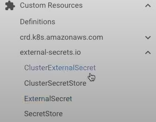
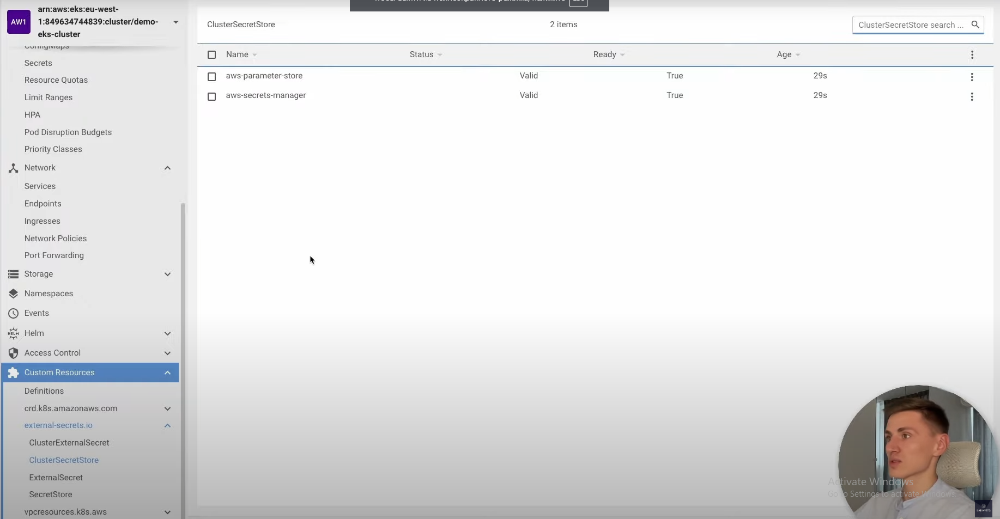

# Что такое External Secrets Operator в Kubernetes. AWS: Parameter Store и Secrets Manager

Kubernetes External Secrets Operator позволяет извлекать секреты из внешних API и строить по ним обычные секреты.

Извлекаться секреты будут из AWS Parameter Store его конфигурация описана в terraform/irsa-external-secrets.tf

```tf
resource "aws_iam_policy" "external_secrets" {
  name        = "${local.cluster_name}-external-secrets-policy"
  description = "EKS AWS External Secrets policy for cluster ${local.cluster_name}"

  policy = <<EOF
{
    "Version": "2012-10-17",
    "Statement": [
        {
            "Effect": "Allow",
            "Action": [
                "secretsmanager:GetResourcePolicy",
                "secretsmanager:GetSecretValue",
                "secretsmanager:DescribeSecret",
                "secretsmanager:ListSecretVersionIds"
            ],
            "Resource": [
                "arn:aws:secretsmanager:${data.aws_region.current.name}:${data.aws_caller_identity.account.account_id}:secret:${var.deployment_prefix}-*"
            ]
        },
        {
            "Effect": "Allow",
            "Action": [
                "ssm:GetParameter*"
            ],
            "Resource": "arn:aws:ssm:${data.aws_region.current.name}:${data.aws_caller_identity.account.account_id}:parameter/${var.deployment_prefix}-*"
        }
    ]
}
EOF
}
```

Для начала установим ESO внутрь нашего WS кластера

    helm repo add external-secrets https://charts.external-secrets.io

    helm repo update external-secrets

    helm upgrade --install external-secrets external-secrets/external-secrets --version 0.6.0 -n external-secrets --create-namespace

Открыв наш кластер в Lens мы увидим что external-secrets создал 4 Custom Resource Definition после установки.



Это позволяет создавать нам объекты созданных типов которые приведены в папке k8s/common рассмотрим их:

ClusterSecretStore - представляет собой gateway который позволяет ClusterSecret-у взаимодействовать с провайдером (в
нашем случае AWS)

```yaml
apiVersion: external-secrets.io/v1beta1
kind: ClusterSecretStore
metadata:
  name: aws-parameter-store
spec:
  provider:
    aws:
      service: ParameterStore # В качестве сервиса используем ParameterStore
      region: eu-west-1
      auth: # Для аутентификации используем сервис аккаунт 
        jwt:
          serviceAccountRef:
            name: external-secrets-sa
            namespace: external-secrets
```

ServiceAccount для аутентификации

```yaml
apiVersion: v1
kind: ServiceAccount
metadata:
  name: external-secrets-sa
  namespace: external-secrets
  annotations:
    eks.amazonaws.com/role-arn: arn:aws:iam::849634744839:role/demo-eks-cluster-external-secrets-role
```

И последний объект это ClusterSecretStore для SecretManager

```yaml
apiVersion: external-secrets.io/v1beta1
kind: ClusterSecretStore
metadata:
  name: aws-secrets-manager
spec:
  provider:
    aws:
      service: SecretsManager
      region: eu-west-1
      auth:
        jwt:
          serviceAccountRef:
            name: external-secrets-sa
            namespace: external-secrets
```

Задеплоим все

    kubectl apply -f k8s/common

Как видим все прошло удачно и теперь мы можем взаимодействовать с SecretStore



Рассмотрим первый пример

Для взаимодействия нам надо создать объект ExternalSecret который описывает что должно быть извлечено из бэкенда к
которому мы обращаемся.

```yaml
apiVersion: external-secrets.io/v1beta1
kind: ExternalSecret
metadata:
  name: api-token
  namespace: default
spec:
  refreshInterval: "0" # Как часто мы будем извлекать значение с бэка
  # refreshInterval: "1m"
  secretStoreRef: # Используем наш SecretStore
    name: aws-parameter-store
    kind: ClusterSecretStore
  target: # Создаем обычный Secret 
    name: k8s-secret-api-token # со следующим именем
    creationPolicy: Owner
  data: # В самом секрете будет создан ключ token
    - secretKey: token
      remoteRef: # Описываем данные которые извлечем и запишем в ключ
        key: demo-api-token
```

Для того чтобы правильно использовать пример выше на Амазон надо предварительно создать ParameterStore c именем
demo-api-token

И используем этот Secret в Deployment

```yaml
apiVersion: apps/v1
kind: Deployment
metadata:
  name: kuber
  labels:
    app: kuber
spec:
  replicas: 1
  selector:
    matchLabels:
      app: http-server
  template:
    metadata:
      labels:
        app: http-server
    spec:
      containers:
        - name: kuber-app
          image: bakavets/kuber
          ports:
            - containerPort: 8000
          env:
            - name: API_TOKEN
              valueFrom:
                secretKeyRef:
                  name: k8s-secret-api-token # Обращемся к секрету по имени 
                  key: token # и берем следующий ключ
```

Если же у нас есть необходимость создавать секреты только в конкретном неймспейсе то для этого подходит объект
ClusterExternalSecret пример номер 3.

```yaml
apiVersion: external-secrets.io/v1beta1
kind: ClusterExternalSecret
metadata:
  name: demo-common-secret
spec:
  # The name to be used on the ExternalSecrets
  externalSecretName: demo-common-secret

  # This is a basic label selector to select the namespaces to deploy ExternalSecrets to.
  # you can read more about them here https://kubernetes.io/docs/concepts/overview/working-with-objects/labels/#resources-that-support-set-based-requirements
  namespaceSelector: # Выбираем пространства имен по лейблам
    matchLabels:
      demo: my-secret

  # How often the ClusterExternalSecret should reconcile itself
  # This will decide how often to check and make sure that the ExternalSecrets exist in the matching namespaces
  refreshTime: "1m"

  # This is the spec of the ExternalSecrets to be created
  # The content of this was taken from our ExternalSecret example
  externalSecretSpec:
    secretStoreRef:
      name: aws-parameter-store
      kind: ClusterSecretStore

    refreshInterval: "1h"
    target:
      name: demo-common
      creationPolicy: Owner

    data:
      - secretKey: DEMO
        remoteRef:
          key: demo-mysql
          property: name.last
```

В четвертом примере рассматривается SecretStore, по факту это то же самое что и ClusterSecretStore, но привязанное к
конкретному Namespace.
