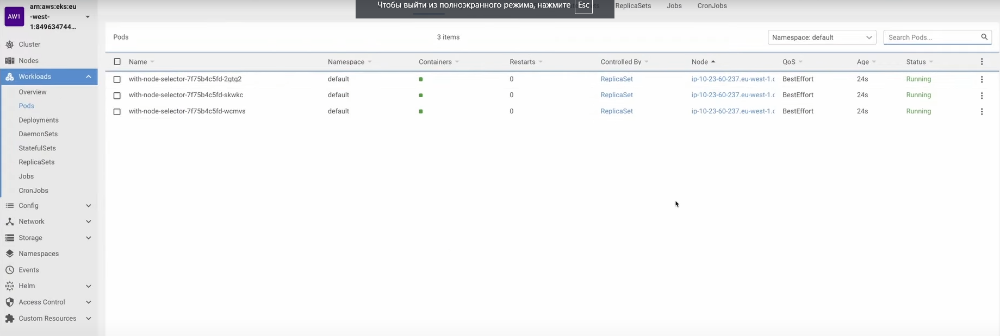
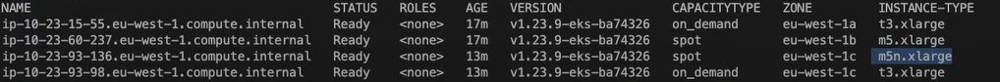

# 38. Node affinity и anti-affinity vs nodeSelector. podAffinity и podAntiAffinity в Kubernetes

## Node affinity и anti-affinity

Для начала посмотрим на простой деплоймент из папки k8s/example-1. Здесь мы разворачиваем 3 реплики выбирая ноды в
определенной availability zone.

```yaml
apiVersion: apps/v1
kind: Deployment
metadata:
  name: with-node-selector
  labels:
    app: kuber
spec:
  replicas: 3
  selector:
    matchLabels:
      app: http-server
  template:
    metadata:
      labels:
        app: http-server
    spec:
      containers:
        - name: kuber-app
          image: bakavets/kuber
          ports:
            - containerPort: 8000
      nodeSelector:
        topology.kubernetes.io/zone: eu-west-1b
        capacityType: spot
```

На кластере под приведенные выше параметры подпадает только одна нода, на которую и задеплоятся все три реплики.



В целом по прошлому примеру это все, но если мы например на кластере не окажется подходящей ноды то ничего задеплоено не
будет.

Теперь попробуем использовать node affinity это расширенный функционал для node selector, для этого создадим следующий
деплоймент. Мы хотим создать 5 реплик и распределить их по двум зонам

```yaml
apiVersion: apps/v1
kind: Deployment
metadata:
  name: with-node-affinity-hard
  labels:
    app: kuber
spec:
  replicas: 5
  selector:
    matchLabels:
      app: http-server
  template:
    metadata:
      labels:
        app: http-server
    spec:
      containers:
        - name: kuber-app
          image: bakavets/kuber
          ports:
            - containerPort: 8000
      affinity: # Описываем affinity которые будем использовать 
        nodeAffinity: # nodeAffinity
          # Вместо nodeSelector используем requiredDuringSchedulingIgnoredDuringExecution
          # это так называемый hardSelector так как под не будет размещен вообще если ни одна
          # нода не подойдет под селектор.
          # Есть еще softSelector preferredDuringSchedulingIgnoredDuringExecution, оно позволяет
          # найти наиболее подходящую ноду но если ничего не нашлось то Под все равно будет размещен
          requiredDuringSchedulingIgnoredDuringExecution:
            nodeSelectorTerms: # Описываем один и больше селекторов
              # Здесь говорим разместить Поды на нодах имеющих определенный лейбл
              # значение которого интерпретируется в зависимости от опреатора
              - matchExpressions:
                  - key: topology.kubernetes.io/zone # имя лейблы
                    # Оператор сообщает как воспринимать значения ключа
                    # In - разместить там где значение в из values
                    # NotIn (anti-affinity) - разместить везде где значение не из списка values
                    # ... и т.д.
                    operator: In # NotIn, Exists, DoesNotExist, Gt, Lt
                    values: # значения лейблы
                      - eu-west-1a
                      - eu-west-1c
              - matchExpressions:
                  - key: node.kubernetes.io/instance-type
                    operator: In
                    values:
                      - m5.xlarge
                      - m5n.xlarge
              - matchExpressions:
                  - key: capacityType
                    operator: In
                    values:
                      - spot
```

Важно понимать как работает перечисление правил в nodeSelectorTerms matchExpressions работают по правилу "ИЛИ" то есть
если написать вот так, то выполниться должно либо первое, либо второе, либо третье правило и в зависимости от того какое
выполнилось там и разместятся поды.

Для наглядности приведем список машин (нод) с их availability zone, instace type и capacity type



Читается оно следующим образом разместить Под можно на машине с availability zone "eu-west-1a", или "eu-west-1c", либо
на машине с instance-type "m5.xlarge", или "m5n.xlarge", либо на машине у которой capacityType установлен "spot".

```yaml
 - matchExpressions:
     - key: topology.kubernetes.io/zone
       operator: In
       values:
         - eu-west-1a
         - eu-west-1c
 - matchExpressions:
     - key: node.kubernetes.io/instance-type
       operator: In
       values:
         - m5.xlarge
         - m5n.xlarge
 - matchExpressions:
     - key: capacityType
       operator: In
       values:
         - spot
```

А если переписать этот пример вот в таком виде то тогда правила будут работать как "И"

```yaml
 - matchExpressions:
     - key: topology.kubernetes.io/zone
       operator: In
       values:
         - eu-west-1a
         - eu-west-1c
     - key: node.kubernetes.io/instance-type
       operator: In
       values:
         - m5.xlarge
         - m5n.xlarge
     - key: capacityType
       operator: In
       values:
         - spot
```

То все правила должны выполниться чтобы Под можно было разместить на ноде (под такой селектор попадает только 3 нода)

Теперь рассмотрим softSelector для этого откроем деплоймент из примера 3. На кластере у ноды с availability zone
eu-west-1a всего 4 CPU мы же пытаемся расположить на этой ноде 5 реплик каждой из которых нужен 1 CPU.

```yaml
apiVersion: apps/v1
kind: Deployment
metadata:
  name: with-node-affinity-soft
  labels:
    app: kuber
spec:
  replicas: 5
  selector:
    matchLabels:
      app: http-server
  template:
    metadata:
      labels:
        app: http-server
    spec:
      containers:
        - name: kuber-app
          image: bakavets/kuber
          ports:
            - containerPort: 8000
          resources:
            limits:
              cpu: '1'
              memory: 2Gi
            requests:
              cpu: '1'
              memory: 512Mi
      affinity:
        nodeAffinity:
          preferredDuringSchedulingIgnoredDuringExecution: # softSelector
            - weight: 1
              preference:
                matchExpressions:
                  - key: topology.kubernetes.io/zone
                    operator: In
                    values:
                      - eu-west-1a
```

Благодаря тому что мы используем softSelector на ноде eu-west-1a будут размещены 4 реплики, а 5 установится на другую
свободную ноду.

Обратим внимание на параметр weight он позволяет задать приоритетность правил для селектора, переписав его под такой вид
мы заставим селектор использовать вначале правило с наибольшим весом - 70, затем для Под которые не получилось
разместить по первому правилу он применит правило с весом 50, и в последнюю очередь правило с весом 1.

```yaml
- weight: 1
  preference:
    matchExpressions:
      - key: topology.kubernetes.io/zone
        operator: In
        values:
          - eu-west-1a
- weight: 50
  preference:
    matchExpressions:
      - key: topology.kubernetes.io/zone
        operator: In
        values:
          - eu-west-1b
- weight: 70
  preference:
    matchExpressions:
      - key: topology.kubernetes.io/zone
        operator: In
        values:
          - eu-west-1c
```

Так же soft и hard селекторы можно комбинировать получая вариант при котором soft limit работает в рамках определенных
hard limit на примере ниже мы при помощи hard limit разрешаем размещение подов только на нодах с availability zone
eu-west-1a, eu-west-1b.

```yaml
      affinity:
        nodeAffinity:
          requiredDuringSchedulingIgnoredDuringExecution:
            nodeSelectorTerms:
              - matchExpressions:
                  - key: topology.kubernetes.io/zone
                    operator: In
                    values:
                      - eu-west-1a
                      - eu-west-1b
          preferredDuringSchedulingIgnoredDuringExecution:
            - weight: 1
              preference:
                matchExpressions:
                  - key: topology.kubernetes.io/zone
                    operator: In
                    values:
                      - eu-west-1a
            - weight: 50
              preference:
                matchExpressions:
                  - key: topology.kubernetes.io/zone
                    operator: In
                    values:
                      - eu-west-1b
            - weight: 70
              preference:
                matchExpressions:
                  - key: topology.kubernetes.io/zone
                    operator: In
                    values:
                      - eu-west-1c
```

## Pod affinity и anty-affinity

Рассмотрим четвертый пример по сути функционал и идея тут та же самая, но нужна уже, для того чтобы размещать под
относительно других подов которые уже размещены на ноде, а не относительно нод как было до этого.

Ниже мы при помощи hard limit заставляем все поды c лейблой аpp: http-server разместиться на одном хосте topologyKey:
kubernetes.io/hostname.

```yaml
apiVersion: apps/v1
kind: Deployment
metadata:
  name: with-pod-affinity
  labels:
    app: kuber
spec:
  replicas: 5
  selector:
    matchLabels:
      app: http-server
  template:
    metadata:
      labels:
        app: http-server
    spec:
      containers:
        - name: kuber-app
          image: bakavets/kuber
          ports:
            - containerPort: 8000
          resources:
            limits:
              cpu: 1500m
              memory: 2Gi
            requests:
              cpu: 1500m
              memory: 512Mi
      affinity:
        podAffinity: # Указываем podAffinity
          requiredDuringSchedulingIgnoredDuringExecution:
            - labelSelector:
                matchExpressions:
                  - key: app
                    operator: In
                    values:
                      - http-server
              topologyKey: "kubernetes.io/hostname"
          # preferredDuringSchedulingIgnoredDuringExecution:
          # - weight: 100
          #   podAffinityTerm:
          #     labelSelector:
          #       matchExpressions:
          #       - key: app
          #         operator: In
          #         values:
          #         - http-server
          #     topologyKey: kubernetes.io/hostname
```

А вот пример с anti-affinity где мы наоборот не даем подам располагаться на одном хосте

```yaml
apiVersion: apps/v1
kind: Deployment
metadata:
  name: with-pod-anti-affinity
  labels:
    app: kuber
spec:
  replicas: 5
  selector:
    matchLabels:
      app: http-server
  template:
    metadata:
      labels:
        app: http-server
    spec:
      containers:
        - name: kuber-app
          image: bakavets/kuber
          ports:
            - containerPort: 8000
      affinity:
        podAntiAffinity:
          requiredDuringSchedulingIgnoredDuringExecution:
            - labelSelector:
                matchExpressions:
                  - key: app
                    operator: In
                    values:
                      - http-server
              topologyKey: "kubernetes.io/hostname"
```
