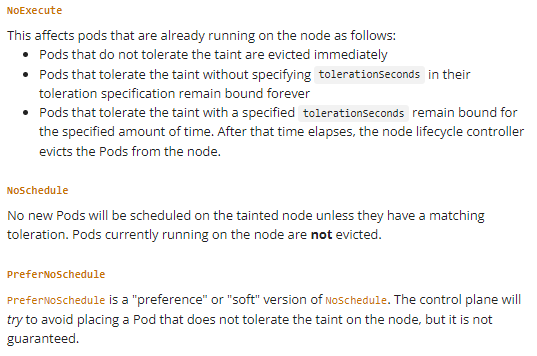
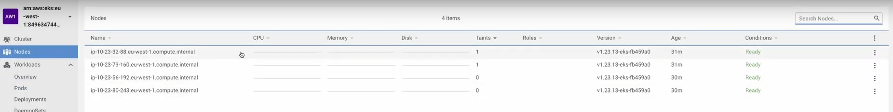

# Taints и Tolerations в Kubernetes. NoSchedule, PreferNoSchedule и NoExecute

Taints - представляют собой противоположность Affinity этот механизм нужен, для того, чтобы запретить подам размещаться
на определенных нодах. Работает это так - допустим у нас есть нода на которой мы хотим размещать только поды которым
необходим GPU для этого мы добавляем на нее Taint, а подам которым необходима такая нода добавляем Toleration.

Существует 3 типа Taint, они перечисленны в заголовке рассмотрим их по порядку.



Для того чтобы продемонстрировать работу Taint и Toleration нам необходимо создать кластер на Amazon, конфигурация
кластера описана в terraform для развертывания на Amazon. И включает в себя 4 машины, 2 spotted, и 2 ondemand. К
спотовым интансам мы добавили Taints. Это так же видно если посмотреть на структуру кластера в Lens. Теперь все поды у
которых нет соответствующих tolerations не смогут попадать на эти две ноды.



Taint описаны в файле terraform/main.tf

```tf
taints = {
        app_role = {
          key    = "node.k8s/app-role"
          value  = "worker"
          effect = "NO_SCHEDULE" # Указываем тип Taint
        }
      }
```

## NoSchedule

Теперь рассмотрим первый тип Taint

```yaml
apiVersion: apps/v1
kind: Deployment
metadata:
  name: with-no-schedule-taint
  labels:
    app: kuber
spec:
  replicas: 2
  selector:
    matchLabels:
      app: http-server
  template:
    metadata:
      labels:
        app: http-server
    spec:
      containers:
        - name: kuber-app
          image: bakavets/kuber
          ports:
            - containerPort: 8000
      # При помощи affinity указываем подам разместиться именно на нодах с taint
      affinity:
        nodeAffinity:
          requiredDuringSchedulingIgnoredDuringExecution:
            nodeSelectorTerms:
              - matchExpressions:
                  - key: node.k8s/role
                    operator: In
                    values:
                      - app-worker
      # При помощи Toleration разрешаем размещение на этих нодах
      tolerations:
        - key: node.k8s/app-role
          operator: Equal # Exists
          value: worker
          effect: NoSchedule
```

## PreferNoSchedule

```yaml
apiVersion: apps/v1
kind: Deployment
metadata:
  name: with-prefer-no-schedule-taint
  labels:
    app: kuber
spec:
  replicas: 4
  selector:
    matchLabels:
      app: http-server
  template:
    metadata:
      labels:
        app: http-server
    spec:
      containers:
        - name: kuber-app
          image: bakavets/kuber
          ports:
            - containerPort: 8000
          resources:
            limits:
              cpu: 1
              memory: 2Gi
            requests:
              cpu: 1
              memory: 512Mi
      tolerations:
        - key: node.k8s/app-role
          operator: Exists
          effect: PreferNoSchedule
```

## NoExecute

```yaml
apiVersion: apps/v1
kind: Deployment
metadata:
  name: with-no-execute-taint
  labels:
    app: kuber
spec:
  replicas: 3
  selector:
    matchLabels:
      app: http-server
  template:
    metadata:
      labels:
        app: http-server
    spec:
      containers:
        - name: kuber-app
          image: bakavets/kuber
          ports:
            - containerPort: 8000
          resources:
            limits:
              cpu: 1
              memory: 2Gi
            requests:
              cpu: 1
              memory: 512Mi
      tolerations:
        - key: "gpu"
          operator: "Equal"
          value: "true"
          effect: "NoExecute"
          # Этот параметр сообщает сколько секунд поды которые уже размещены на ноде 
          # могут проработать до того как будут выселены на другую ноду если они не 
          # толерантны этой. 
          # tolerationSeconds: 180
```
