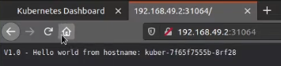
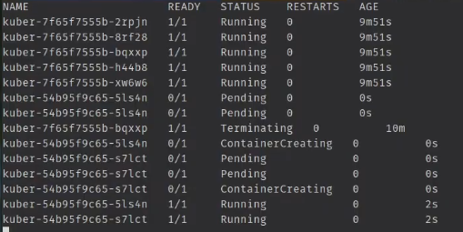
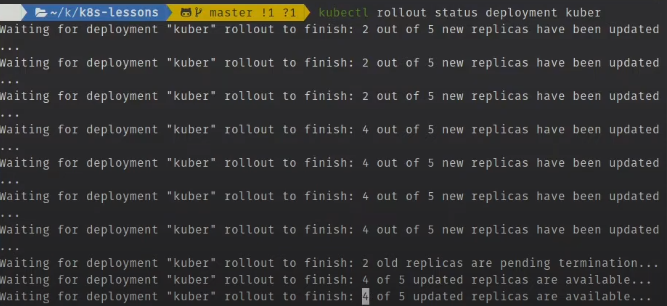
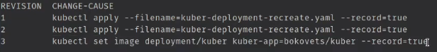
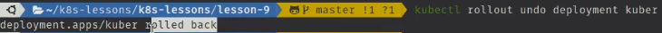
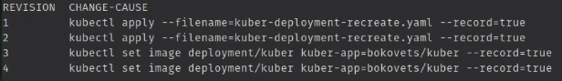

# Deployment в Kubernetes. Стратегии обновления приложений

## Deployment

Deployment ресурс высокого уровня предназначенный для развертывания приложений и их обновления, под капотом он
использует ReplicaSet для управления подами, фактически осуществляя управление ReplicaSet объектами, которая в свою
очередь управляет подами.

Создадим базовый деплоймент при помощи командной строки

    kubectl create deployment kuber-ctl-app --image=bakavets/kuber --port=8000 --replicas=3

Поменяем тег для контейнера который используют наши поды, как бы подсунув ему новую версию приложения

    kubectl set image deployment/kuber-ctl-app kuber=bakavets/kuber:0.1 --record
                                                 ^
                           название контейнера его можно посмотреть выполнив 
                           команду "kubectl get deployment kuber-ctl-app -o yaml"           
                           и проверить поле | spec:          |  
                                            |  containers:   |
                                            |    name: kuber |

    --record - создаст историю ревизий это нужно для того чтобы потом можно было 
               посмотреть причину перезапуска контейнеров например выполнив команду.
               
    kubectl rollout hisory deployment kuber - подробнее про нее ниже.

При перезапуске deployment произойдет следующее:

- Deployment создаст новую ReplicaSet с новой версией приложения
- Старая ReplicaSet начнет постепенно останавливаться и ее поды удаляться, но старая ReplicaSet удалена не будет, а
  останется в системе, это нужно для механизма отката по ревизиям если потребуется (про это в конце файла).
- Поды новой ReplicaSet будут создаваться в нужном количестве

Создадим простой деплоймент

```yaml
apiVersion: apps/v1
kind: Deployment
metadata:
  name: kuber
  labels:
    app: kuber
spec:
  replicas: 5
  minReadySeconds: 10 # Через сколько секунд запущенный под будет считаться доступным
  strategy: # Стратегия обновления по умолчания RollingUpdate 
    rollingUpdate: # Настройки стратегии 
      maxSurge: 1  # Сколько подов будет создаваться дополнительно 
      maxUnavailable: 1 # Количество подов которые будут выводиться из эксплуатации
    type: RollingUpdate
  selector: # Селектор меток, метки в котором должны совпадать с нашим шаблоном ниже
    matchLabels:
      app: http-server
  template: # Шаблон 
    metadata:
      labels:
        app: http-server
    spec:
      containers:
        - name: kuber-app
          image: bokovets/kuber:v2.0
          ports:
            - containerPort: 8000

```

Теперь запустим деплоймент из файла выше

    kubectl apply -f kuber-deployment.yaml --record

Посмотрим что возвращают наши поды при помощи другого объекта Kubernetes - Service

```yaml
apiVersion: v1
kind: Service
metadata:
  name: kuber-service
spec:
  selector: # Указываем какие поды будет регистрировать в себе сервис
    app: http-server # Указываем значение метки из деплоймента
  ports:
    - protocol: TCP
      port: 80 # Порт по которому будет отвечать сам Сервис
      targetPort: 8000 # Порт который слушают контейнеры внутри подов которые сервис регистрирует 
  type: NodePort # Подробней потом. Но суть в том что на каждой машине где будет запущен 
  # сервис он выберет порт из диапазона 30000-32767 который будет открыт для доступа из вне,
  # его так же можно указать в ручную дописав в раздел ports, nodePort: 30313.
```

Запустим сервис

    kubectl apply -f kuber-service.yaml 

Для того чтобы посмотреть данные из вне узнаем ip адрес кластера, в нашем случае minikube

    minikube ip

И так же посмотрим какой порт для доступа из вне сервис занял для себя

    kubectl describe kuber-service.yaml 

В нашем случае так как мы не указывали в ручную порт это значение 31064. А дальше перейдя в браузер по ip кластера и
номеру порта мы увидим ответ от подов



## Стратегии обновления RollingUpdate, Recreate

### RollingUpdate

Стратегия обновления для деплоймента задается в секции strategy

```yaml
strategy: # Стратегия обновления по умолчания RollingUpdate 
  rollingUpdate: # Настройки стратегии 
    maxSurge: 1  # Сколько подов будет создаваться дополнительно 
    maxUnavailable: 1 # Количество подов которые будут выводиться из эксплуатации
  type: RollingUpdate
```

И так вызовем обновление нашего приложения изменив версию в шаблоне в файле "kuber-deployment.yaml"

```yaml
  template: # Шаблон 
    metadata:
      labels:
        app: http-server
    spec:
      containers:
        - name: kuber-app
          image: bokovets/kuber:v3.0 # Меняем версию с 2 на 3
          ports:
            - containerPort: 8000
```

Применим изменения

    kubectl apply -f kuber-deployment.taml --record

Пронаблюдаем внесение изменений в поды отфильтровав их по метке нашего приложения, чтобы убрать вывод служебных, или
других подов

    kubectl get pods -l app=http-server --watch



Как видим часть начала удаляться, часть создаваться

Так же статус обновления можно просмотреть командой

    kubectl rollout status deployment kuber



### Recreate

При этой стратегии все поды перезапускаются разом. Все шаги для просмотра изменения те же что и выше

```yaml
strategy: # 
  type: Recreate 
```

## Просмотр истории ревизий --record

Для этого выполним команду

    kubectl rollout hisory deployment kuber

Вывод команды "kubectl rollout hisory deployment kuber"



## Откат изменений к нужной версии

Выполним команду

    kubectl rollout undo deployment kuber



А теперь попробуем откатиться к конкретной ревизии. Для этого еще раз посмотрим список ревизий

    kubectl rollout history deployment kuber



И откатимся к первой

    kubectl rollout undo deployment kuber --to-revision=1

Для отката по ревизиям Deployment использует предыдущие ReplicaSet где каждой ревизии соответствует свой объект
ReplicaSet, поэтому их лучше не трогать, при удалении Deployment он позаботится чтобы все объекты ReplicaSet были
удалены.


