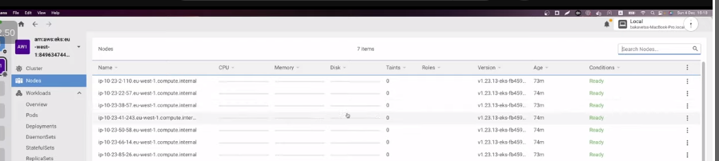
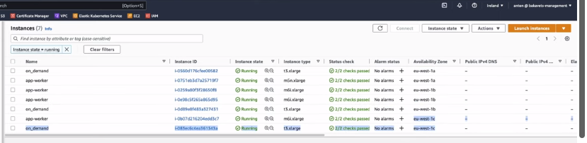
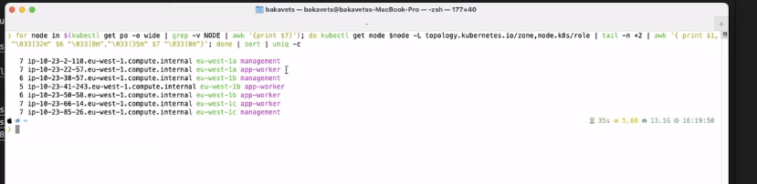
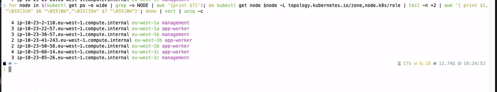

# Topology Spread Constraints. Запуск Pods в Highly Available. Local cluster, используя Kind

Topology Spread Constraints помогают нам распределить поды таким образом, что если они вышли из строя в одной
availability зоне то в других зонах они оставались доступными.

Кластер представляет собой 3 ondemand ноды и 4 спотовые.



Распределение по availability зонам



Теперь рассмотрим первый пример k8s/example-1 который представляет собой самый простой деплоймент без дополнительных
настроек.

```yaml
apiVersion: apps/v1
kind: Deployment
metadata:
  name: az-spread
  labels:
    app: kuber
spec:
  replicas: 45
  selector:
    matchLabels:
      app: http-server
  template:
    metadata:
      labels:
        app: http-server
    spec:
      containers:
        - name: kuber-app
          image: bakavets/kuber
          ports:
            - containerPort: 8000
```

    kubectl apply -f k8s/example-1/az-spread.yaml

Затем при помощи команды ниже посмотрим на распределение по availability зонам и хостам.

```for node in $(kubectl get po -o wide | grep -v NODE | awk '{print $7}'); do kubectl get node $node -L topology.kubernetes.io/zone,node.k8s/role | tail -n +2 | awk '{ print $1, "\033[32m" $6 "\033[0m","\033[35m" $7 "\033[0m"}'; done | sort | uniq -c```



Как мы видим распределение далеко от равномерного. Так что перейдем ко второму примеру, в нем мы уже будем использовать
nodeAffinity, а так же podAntiAffinity для распределения подов по разным availability зонам.

```yaml
apiVersion: apps/v1
kind: Deployment
metadata:
  name: az-spread-pod-anti-affinity
  labels:
    app: kuber
spec:
  replicas: 5
  selector:
    matchLabels:
      app: http-server
  template:
    metadata:
      labels:
        app: http-server
    spec:
      containers:
        - name: kuber-app
          image: bakavets/kuber
          ports:
            - containerPort: 8000
      affinity:
        nodeAffinity:
          requiredDuringSchedulingIgnoredDuringExecution:
            nodeSelectorTerms:
              - matchExpressions:
                  - key: node.k8s/role
                    operator: In
                    values:
                      - management
                      - app-worker
        podAntiAffinity:
          requiredDuringSchedulingIgnoredDuringExecution:
            - labelSelector:
                matchExpressions:
                  - key: app
                    operator: In
                    values:
                      - http-server
              topologyKey: topology.kubernetes.io/zone
```

Это так же не решает нашу проблему так как мы хотим поднять 5 подов, а availability зон у нас всего 3 то и поднимется
всего 3 пода из-за использования hardLimit.

В 3 примере мы будем использовать softLimit для podAntiAffinity и постараемся развернуть 21 реплику.

```yaml
apiVersion: apps/v1
kind: Deployment
metadata:
  name: az-spread-pod-anti-affinity-soft
  labels:
    app: kuber
spec:
  replicas: 21
  selector:
    matchLabels:
      app: http-server
  template:
    metadata:
      labels:
        app: http-server
        version: v1
    spec:
      containers:
        - name: kuber-app
          image: bakavets/kuber
          ports:
            - containerPort: 8000
          resources:
            limits:
              cpu: 400m
              memory: 256Mi
            requests:
              cpu: 400m
              memory: 256Mi
      affinity:
        nodeAffinity:
          requiredDuringSchedulingIgnoredDuringExecution:
            nodeSelectorTerms:
              - matchExpressions:
                  - key: node.k8s/role
                    operator: In
                    values:
                      - management
                      - app-worker
        podAntiAffinity:
          preferredDuringSchedulingIgnoredDuringExecution:
            - weight: 100
              podAffinityTerm:
                labelSelector:
                  matchExpressions:
                    - key: app
                      operator: In
                      values:
                        - http-server
                topologyKey: topology.kubernetes.io/zone
```

Как видим результаты по availability зонам стал намного лучше, в каждой по 7 реплик.




